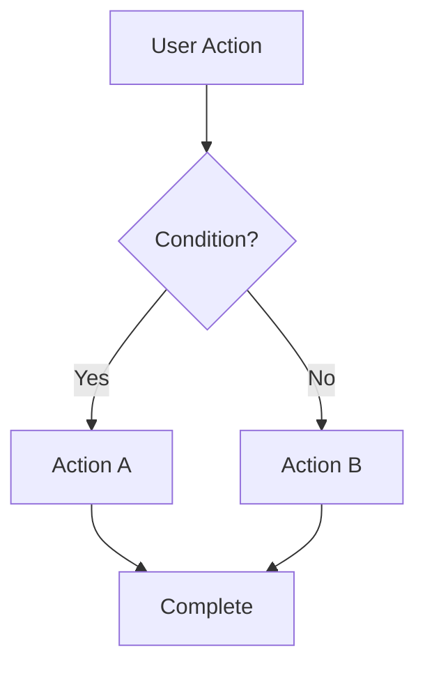

# Requirements Prompt

## Purpose
Create Requirements.md that expands Scope into detailed functional requirements, user stories, business rules, data entities, and technical specifications. Works for both new and existing projects.

---

## Prerequisites

**Required Input:**
- Scope.md (created using scope.prompt.md)
- PRD.md (for reference if needed)

**Note:** For existing projects, Requirements.md documents BOTH existing functionality AND new planned features.

---

## Process

### Step 1: Read Complete Context

Read in this order:
1. **Scope.md** - Complete (all sections)
   - Focus on §4 (In-Scope Features) - these become detailed requirements
   - Note §7 (Target Users) - these inform user stories
   - Note §11 (Technical Constraints) - these affect requirements

2. **PRD.md** - Quick reference
   - Use if more detail is needed
   - Use for feature descriptions

### Step 2: Generate Requirements Document

Follow the template structure and populate each section:

---

## Template to Generate

```markdown
# Requirements Document

> **Purpose:** Define WHAT the system must do through detailed functional requirements.  
> **Created After:** Scope.md (read it completely first)  
> **Estimated Time:** 6-10 hours  
> **Next Document:** Design.md (will define HOW to build this)

---

## ⚠️ CRITICAL: Document Type

**For NEW Projects:**
- All requirements describe PLANNED functionality
- Use future tense: "The system will..."

**For EXISTING Projects:**
- Sections 1-7: Document EXISTING functionality (use present tense: "The system does...")
- Section 8: NEW requirements for upcoming work (use future tense: "The system will...")

---

## 1. FUNCTIONAL REQUIREMENTS

[Expand each feature from Scope.md §4 into detailed requirements]

### 1.1 [Feature Category 1]

**FR-001: [Requirement Title]**
- **Description:** [Detailed description of what the system must do]
- **Priority:** [Must Have / Should Have / Could Have]
- **Source:** [Scope.md §4, PRD §X, User feedback, etc.]
- **Acceptance Criteria:**
  - [Criterion 1: Specific, testable condition]
  - [Criterion 2: Specific, testable condition]
  - [Criterion 3: Specific, testable condition]

**FR-002: [Requirement Title]**
- **Description:** [Detailed description]
- **Priority:** [Must Have / Should Have / Could Have]
- **Source:** [Reference]
- **Acceptance Criteria:**
  - [Criterion 1]
  - [Criterion 2]

### 1.2 [Feature Category 2]

[Continue pattern for all features...]

### 1.3 Reporting & Analytics (if applicable)

**FR-0XX: [Reporting Requirement]**
- **Description:** [What reports/analytics are needed]
- **Priority:** [Level]
- **Acceptance Criteria:**
  - [What data must be reported]
  - [What format]
  - [What frequency]

---

## 2. BUSINESS RULES

[Extract from Scope and define business logic constraints]

### 2.1 Core Business Rules

**BR-001: [Business Rule Name]**
- **Description:** [The rule that governs how the system behaves]
- **Rationale:** [Why this rule exists]
- **Scope:** [Where this rule applies]
- **Example:** [Concrete example of the rule in action]

**BR-002: [Business Rule Name]**
- **Description:** [Rule description]
- **Rationale:** [Why]
- **Scope:** [Where]
- **Example:** [Example]

### 2.2 Validation Rules

[Rules for data validation]

**VR-001: [Validation Rule]**
- **Field:** [Which field this validates]
- **Rule:** [The validation logic]
- **Error Message:** [What to show user if validation fails]

**VR-002: [Validation Rule]**
- **Field:** [Field]
- **Rule:** [Logic]
- **Error Message:** [Message]

### 2.3 Workflow Rules

[Rules for process flows]

**WR-001: [Workflow Rule]**
- **Trigger:** [What initiates this workflow]
- **Steps:** [What happens in sequence]
- **Completion:** [What marks this workflow complete]
- **Rollback:** [What happens if workflow fails]

---

## 3. DATA ENTITIES

[Define the domain model from a functional perspective]

### 3.1 Core Entities

**Entity: [EntityName]**
- **Description:** [What this entity represents in the business domain]
- **Attributes:**
  - `[attribute1]` (Type): [Description, constraints]
  - `[attribute2]` (Type): [Description, constraints]
  - `[attribute3]` (Type): [Description, constraints]
- **Business Rules:**
  - [Any rules specific to this entity]
- **Lifecycle:** [How instances are created, updated, deleted]

**Entity: [EntityName]**
[Repeat for each entity...]

### 3.2 Entity Attributes (Detailed)

For each entity, document attributes in detail:

| Attribute | Type | Required | Constraints | Description |
|-----------|------|----------|-------------|-------------|
| [attr1] | [type] | Yes/No | [constraints] | [description] |
| [attr2] | [type] | Yes/No | [constraints] | [description] |

### 3.3 Entity Relationships

[Define how entities relate to each other]

```
[Entity1] ---< relationship >--- [Entity2]

Example:
User ---< creates >--- Order (one-to-many)
Order ---< contains >--- Product (many-to-many)
```

**Relationships:**
- **[Entity1] ←→ [Entity2]:** [Type: one-to-one, one-to-many, many-to-many]
  - **Description:** [How they relate]
  - **Business Rule:** [Any rules governing this relationship]

---

## 4. USER STORIES (Optional but Recommended)

[Convert functional requirements into user stories]

### 4.1 Epic 1: [Epic Name]

**As a** [user type from Scope.md §7]  
**I want** [capability from FR-XXX]  
**So that** [business value]

**User Story US-001: [Story Title]**
- **As a** [user type]
- **I want to** [action]
- **So that** [benefit]
- **Priority:** [Must/Should/Could Have]
- **Acceptance Criteria:**
  - **Given** [context]
  - **When** [action]
  - **Then** [expected result]
  - **And** [additional result]

**User Story US-002: [Story Title]**
[Repeat pattern...]

### 4.2 Epic 2: [Epic Name]

[Continue for all epics...]

### 4.3 Acceptance Criteria Template

For consistency, use this format for all user stories:

```
**Given** [the initial context/state]
**When** [the user performs this action]
**Then** [this is the expected outcome]
**And** [any additional outcomes]
```

---

## 5. USER FLOWS (Optional)

[Document critical user journeys]

### 5.1 Critical User Journeys

**Flow 1: [Flow Name]**
1. User [action]
2. System [response]
3. User [action]
4. System [response]
5. Result: [outcome]

**Alternative Paths:**
- **Path A:** If [condition], then [alternate flow]
- **Path B:** If [condition], then [alternate flow]

**Error Paths:**
- **Error 1:** If [error condition], then [error handling]

### 5.2 Flow Diagrams

[Optional: Include Mermaid diagrams for complex flows]



---

## 6. UI/UX CONSIDERATIONS (Optional)

[High-level UI/UX requirements - NOT detailed mockups]

### 6.1 Design Principles

[Based on Scope.md §7 user types and their technical levels]

- **Principle 1:** [e.g., "Mobile-first for field technicians"]
- **Principle 2:** [e.g., "Minimal clicks for common tasks"]
- **Principle 3:** [e.g., "Accessible to WCAG 2.1 AA standards"]

### 6.2 Accessibility Requirements

[Define accessibility standards]

- **WCAG Level:** [A / AA / AAA]
- **Screen Reader Support:** [Yes/No - which ones]
- **Keyboard Navigation:** [Required/Optional]
- **Color Contrast:** [Minimum ratio]

### 6.3 Responsive Behavior

[Define responsive requirements]

- **Desktop:** [Resolution, capabilities]
- **Tablet:** [Resolution, capabilities]
- **Mobile:** [Resolution, capabilities]

### 6.4 Component Guidelines

[High-level component requirements]

- **Forms:** [Validation inline, error messaging approach]
- **Tables:** [Pagination, sorting, filtering requirements]
- **Navigation:** [Primary nav structure]
- **Notifications:** [Toast, modal, banner requirements]

---

## 7. INTEGRATION REQUIREMENTS

[From Scope.md §13 Dependencies]

### 7.1 External Integrations

**Integration: [External System Name]**
- **Purpose:** [Why we integrate]
- **Type:** [API, Webhook, File Transfer, etc.]
- **Direction:** [Inbound / Outbound / Bidirectional]
- **Data Exchanged:** [What data flows]
- **Frequency:** [Real-time / Batch / Scheduled]
- **Authentication:** [Method required]
- **Error Handling:** [What happens on failure]

**Integration: [System 2]**
[Repeat...]

### 7.2 Internal Integrations

**Integration: [Internal System Name]**
- **Purpose:** [Why we integrate]
- **Type:** [Type]
- **Data Exchanged:** [What data]
- **Frequency:** [How often]

---

## 8. NEW REQUIREMENTS (For Existing Projects Only)

[For existing projects: new functionality to be added]

This section contains NEW requirements for upcoming work:

### 8.1 New Functional Requirements

**NFR-001: [New Requirement Title]**
- **Description:** [What new capability]
- **Priority:** [Must/Should/Could Have]
- **Depends On:** [Existing FR-XXX or other NFR]
- **Acceptance Criteria:**
  - [Criterion 1]
  - [Criterion 2]

### 8.2 Enhancements to Existing Features

**Enhancement to FR-XXX:**
- **Current State:** [How it works now]
- **Desired State:** [How it should work]
- **Rationale:** [Why the change]
- **Impact:** [What else is affected]

---

## 9. NON-FUNCTIONAL REQUIREMENTS

[From Scope.md §6 Success Metrics and §11 Technical Constraints]

### 9.1 Performance Requirements

- **Response Time:** [Target, e.g., < 200ms for API calls]
- **Throughput:** [Target, e.g., 10,000 requests/second]
- **Concurrent Users:** [Target, e.g., support 5,000 concurrent users]
- **Data Volume:** [Target, e.g., handle 10M records]

### 9.2 Security Requirements

- **Authentication:** [Method required, e.g., JWT, OAuth]
- **Authorization:** [RBAC, ABAC, etc.]
- **Data Encryption:** [At rest, in transit]
- **Compliance:** [Standards to meet, e.g., SOC 2, GDPR]

### 9.3 Reliability Requirements

- **Availability:** [Target, e.g., 99.9% uptime]
- **Backup:** [Frequency, retention]
- **Disaster Recovery:** [RPO, RTO targets]

### 9.4 Scalability Requirements

- **Vertical Scaling:** [Can scale up resources]
- **Horizontal Scaling:** [Can add more instances]
- **Auto-scaling:** [Based on what metrics]

### 9.5 Maintainability Requirements

- **Code Coverage:** [Target, e.g., > 80%]
- **Documentation:** [What must be documented]
- **Monitoring:** [What must be monitored]

---

## TRACEABILITY MATRIX

[Optional: Map requirements back to Scope features]

| Requirement ID | Scope Feature | Priority | Status |
|----------------|---------------|----------|--------|
| FR-001 | Scope.md §4.1 | Must Have | Planned |
| FR-002 | Scope.md §4.1 | Must Have | Planned |
| FR-003 | Scope.md §4.2 | Should Have | Planned |

---

## NEXT STEPS

Once Requirements.md is approved:

1. **Create Design.md** (6-10 hours)
   - Use design.prompt.md
   - Read this Requirements.md completely
   - Read Scope.md for constraints
   - Decide HOW to build these requirements

---

## CHANGE LOG

| Version | Date | Author | Changes |
|---------|------|--------|---------|
| 1.0 | [Date] | [Name] | Initial requirements from Scope |
```

---

## Validation Checklist

Before finalizing Requirements.md:

- [ ] All features from Scope.md §4 are detailed
- [ ] Each FR has clear acceptance criteria
- [ ] Business rules are explicit and testable
- [ ] Data entities cover the domain model
- [ ] User stories (if included) follow Given-When-Then
- [ ] Integration requirements are complete
- [ ] Non-functional requirements are measurable
- [ ] For existing projects: §8 separates new from existing

---

## Tips for Writing Good Requirements

1. **Be Specific:** "User can filter by date" not "User can search"
2. **Be Testable:** Each acceptance criterion should be verifiable
3. **Be Complete:** Cover happy path, edge cases, errors
4. **Be Consistent:** Use same terminology throughout
5. **Be Prioritized:** Not everything is "Must Have"

---

## Special Instructions

### For New Projects:
- All requirements are prospective (future tense)
- Focus on MVP features from Scope
- Document what WILL be built

### For Existing Projects:
- Sections 1-7: Document what EXISTS today
- Section 8: Document what WILL be added
- Be honest about current limitations

---

## CHANGE LOG

| Version | Date | Changes |
|---------|------|---------|
| 1.0 | 2026-01-15 | Initial prompt created |
