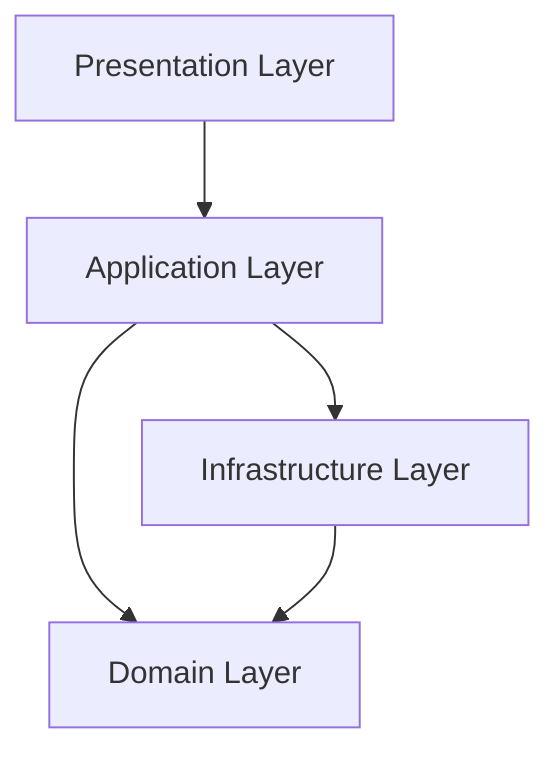

# Design Prompt

## Purpose
Create Design.md that defines HOW the system will be built. For new projects, this means deciding architecture. For existing projects, this means documenting current state (AS-IS) + proposing improvements (TO-BE) with migration plan.

---

## Prerequisites

**Required Input:**
- Requirements.md (created using requirements.prompt.md)
- Scope.md (for constraints)
- PRD.md (for reference)

---

## Context Detection

Ask user: **"Is this a new project or existing codebase?"**

---

## NEW PROJECT FLOW: Decide Architecture

### Step 1: Read Complete Strategy Context

Read in this order:
1. **Requirements.md** (complete) - What we need to build
2. **Scope.md** (complete) - Boundaries and constraints
   - Especially §10 Constraints
   - Especially §11 Technical Constraints

### Step 2: Analyze Requirements

Identify key architectural drivers:
- **Scale:** How many users? How much data?
- **Complexity:** Simple CRUD or complex business logic?
- **Integration:** Many external systems?
- **Team:** Size and skill level?
- **Timeline:** How fast do we need to deliver?

### Step 3: Propose Architecture Options

Present 2-3 architectural options with pros/cons:

**Option A: [Architecture Pattern 1]**
- **Pros:** [Benefits]
- **Cons:** [Trade-offs]
- **Best for:** [When to use this]
- **Example stack:** [Technologies]

**Option B: [Architecture Pattern 2]**
- **Pros:** [Benefits]
- **Cons:** [Trade-offs]
- **Best for:** [When to use this]
- **Example stack:** [Technologies]

### Step 4: Recommend and Get Approval

Recommend the best option based on:
- Requirements complexity
- Scope constraints
- Team capabilities

**Wait for user approval before proceeding to generate Design.md**

###Step 5: Generate Design.md (Prospective)

[Use template from Step 6 with prospective language: "We will use..."]

---

## EXISTING PROJECT FLOW: Document + Improve

### Step 1: Read Complete Strategy Context

Read in this order:
1. **Design.md** (if it exists - to understand documented decisions)
2. **Requirements.md** (complete) - Current + future functionality
3. **Scope.md** (complete) - Current boundaries

### Step 2: Gather Current State Information

Ask user to provide:
- **Folder structure** (tree output or screenshot)
- **Key files** (package.json, .csproj, requirements.txt, main entry files)
- **README or existing docs** (if any)
- **Known issues** (technical debt, pain points)

### Step 3: Analyze Current Architecture (AS-IS)

Identify from provided information:

**Tech Stack:**
- Language(s) and version(s)
- Framework(s) and version(s)
- Database(s) and version(s)
- Key libraries/dependencies

**Architecture Pattern:**
- Monolithic? Microservices? Layered? Clean Architecture?
- Identify pattern from folder structure and dependencies

**Project Structure:**
- Folder organization
- Module separation
- Naming conventions

**Existing Standards:**
- Code style (if evident)
- Testing approach (if tests exist)
- Documentation level

### Step 4: Identify Problems (Gap Analysis)

Based on code structure and user input, identify:

**Architecture Issues:**
- Tight coupling?
- Missing layers/abstractions?
- SOLID violations?

**Performance Issues:**
- Known bottlenecks?
- Inefficient patterns?

**Security Gaps:**
- Authentication/authorization issues?
- Vulnerable dependencies?

**Maintainability Problems:**
- Code duplication?
- Lack of tests?
- Poor documentation?

**Scalability Limitations:**
- Monolithic bottlenecks?
- Database constraints?

Rate each: Impact (High/Med/Low), Effort (High/Med/Low), Priority (P0/P1/P2)

### Step 5: Propose Improvements (TO-BE)

Based on gap analysis and Requirements.md needs, propose:

**Target Architecture:**
```
Current:  [e.g., Monolithic MVC]
          ↓
Target:   [e.g., Clean Architecture with CQRS]

Rationale: [Why this improves current state]
Benefits:
- [Benefit 1]
- [Benefit 2]
```

**Target Tech Stack:**
```
Current Stack:
- Framework: [Current version]
- Database: [Current version]

Proposed Stack:
- Framework: [Target version] - [Why upgrade]
- Database: [Keep/upgrade]

Migration Strategy: [Gradual vs Big Bang]
```

**Migration Phases:**
Break improvements into phases:
- Phase 1: Foundation (4-6 weeks)
- Phase 2: Architecture Refactoring (8-10 weeks)
- Phase 3: Feature Migration (12-16 weeks)
- Phase 4: Optimization (4-6 weeks)

### Step 6: Generate Design.md (AS-IS + TO-BE)

[Use template below with both current state AND improvements]

---

## Template to Generate

```markdown
# Design Document

> **Purpose:** Define HOW the system will be built through architecture, technical decisions, and standards.  
> **Created After:** Requirements.md (read it completely first)  
> **Estimated Time:** 6-10 hours  
> **Next Document:** Tracker.md (implementation planning based on this design)

---

## ⚠️ CRITICAL: READ THIS FIRST

### AI Presentation Order (When Generating Code)

**IMPORTANT:** When using AI assistants to generate code or plans, always present documents in this order:

1. **design.md FIRST** ← Technical constraints are non-negotiable
2. **scope.md SECOND** ← Project boundaries and goals
3. **requirements.md THIRD** ← Detailed features and user stories

### Why This Matters

AI models give more weight to information they read first. If AI reads requirements before design, it may suggest solutions that violate your architectural decisions.

**Example:**
- ❌ Wrong: "Read requirements: need chat" → AI suggests Firebase
- ✅ Right: "Read design: FastAPI+PostgreSQL only. Then requirements: need chat" → AI suggests Server-Sent Events

---

## 📋 TABLE OF CONTENTS

1. PROJECT OVERVIEW [REQUIRED]
2. ARCHITECTURE [REQUIRED]
3. TECH STACK [REQUIRED]
4. PROJECT STRUCTURE [REQUIRED]
5. DEVELOPMENT WORKFLOW [REQUIRED]
6. CORE PRINCIPLES [REQUIRED]
7. CODING STANDARDS [REQUIRED]
8. SECURITY GUIDELINES [REQUIRED]
9. PERFORMANCE STANDARDS [REQUIRED]
10. TESTING STRATEGY [REQUIRED]
11. EXTERNAL INTEGRATIONS [OPTIONAL]
12. ARCHITECTURE DECISION RECORDS (ADRs) [REQUIRED]

[For Existing Projects Only:]
13. TECHNICAL DEBT ANALYSIS [REQUIRED for existing]
14. ARCHITECTURE EVOLUTION PLAN [REQUIRED for existing]

---

## 1. PROJECT OVERVIEW

**Project Name:** [Name]
**Tech Stack Summary:** [e.g., .NET 8, PostgreSQL, React]
**Architecture Pattern:** [e.g., Clean Architecture, Monolithic MVC]
**Deployment Environment:** [e.g., Azure App Service, AWS ECS]

[For NEW projects: brief overview of planned system]
[For EXISTING projects: brief overview of current system]

---

## 2. ARCHITECTURE

[For NEW: Describe chosen architecture]
[For EXISTING: Describe current architecture]

### 2.1 Architecture Pattern

[Detailed description of the architecture pattern]

**Pattern:** [Clean Architecture / Layered / Microservices / etc.]

**Layers:**
1. **[Layer 1 Name]:** [Purpose and responsibilities]
2. **[Layer 2 Name]:** [Purpose and responsibilities]
3. **[Layer 3 Name]:** [Purpose and responsibilities]

**Dependency Rules:**
[How layers can depend on each other]

### 2.2 Architecture Diagram

[Include Mermaid diagram or description]



### 2.3 Key Design Patterns

[List patterns to be used]
- **[Pattern 1]:** [When to use, example]
- **[Pattern 2]:** [When to use, example]

---

## 3. TECH STACK

[For NEW: Decided stack]
[For EXISTING: Current stack]

### 3.1 Backend
- **Language:** [e.g., C# 12]
- **Framework:** [e.g., ASP.NET Core 8]
- **API Style:** [REST / GraphQL / gRPC]

### 3.2 Database
- **Primary Database:** [e.g., PostgreSQL 15]
- **ORM/Data Access:** [e.g., Entity Framework Core 8]
- **Migration Tool:** [e.g., EF Migrations]

### 3.3 Frontend (if applicable)
- **Language:** [e.g., TypeScript 5]
- **Framework:** [e.g., React 18, Next.js 14]
- **State Management:** [e.g., Redux, Zustand]

### 3.4 Infrastructure
- **Hosting:** [e.g., Azure App Service]
- **Container:** [e.g., Docker]
- **Orchestration:** [e.g., Kubernetes, Docker Compose]

### 3.5 External Services
- **Authentication:** [e.g., Auth0, Azure AD]
- **Email:** [e.g., SendGrid]
- **Storage:** [e.g., Azure Blob Storage]
- **Monitoring:** [e.g., Application Insights]

---

## 4. PROJECT STRUCTURE

[For NEW: Planned structure]
[For EXISTING: Current structure]

### 4.1 Folder Organization

```
project-root/
├── src/
│   ├── [Layer1]/
│   ├── [Layer2]/
│   ├── [Layer3]/
│   └── [Layer4]/
├── tests/
│   ├── Unit/
│   ├── Integration/
│   └── E2E/
├── docs/
└── scripts/
```

### 4.2 Module Organization

[How code is organized within each layer]

### 4.3 Naming Conventions

**Files:**
- [Convention for file names]

**Classes:**
- [Convention for class names]

**Methods:**
- [Convention for method names]

---

## 5. DEVELOPMENT WORKFLOW

### 5.1 Version Control

**Strategy:** [Git Flow / GitHub Flow / Trunk-Based]

**Branch Naming:**
- `main` - [Purpose]
- `develop` - [Purpose]
- `feature/*` - [Purpose]
- `bugfix/*` - [Purpose]

### 5.2 Development Environment

**Required Tools:**
- [Tool 1]: [Version]
- [Tool 2]: [Version]

**Setup Steps:**
1. [Step 1]
2. [Step 2]

### 5.3 Build Process

**Build Tool:** [e.g., dotnet CLI, npm]

**Build Commands:**
```bash
[build command]
[test command]
[run command]
```

### 5.4 CI/CD Pipeline

**CI Tool:** [e.g., GitHub Actions, Azure DevOps]

**Pipeline Stages:**
1. **Build** - [What happens]
2. **Test** - [What's tested]
3. **Deploy** - [Where deployed]

---

## 6. CORE PRINCIPLES

[Guiding principles for all development]

1. **[Principle 1]:** [Description and why it matters]
2. **[Principle 2]:** [Description and why it matters]
3. **[Principle 3]:** [Description and why it matters]

**Examples:**
- "SOLID principles for all classes"
- "DRY - Don't Repeat Yourself"
- "Fail fast with clear error messages"

---

## 7. CODING STANDARDS

### 7.1 Code Style

**Linting:** [Tool and config]
**Formatting:** [Tool and config]

### 7.2 Documentation Standards

**Code Comments:**
- [When to use inline comments]
- [XML/JSDoc requirements]

**README Requirements:**
- [What each README must contain]

### 7.3 Error Handling

[How errors should be handled]

### 7.4 Logging

**Logging Levels:**
- **ERROR:** [When to use]
- **WARN:** [When to use]
- **INFO:** [When to use]
- **DEBUG:** [When to use]

---

## 8. SECURITY GUIDELINES

### 8.1 Authentication

[How authentication is implemented]

### 8.2 Authorization

[How authorization is implemented]

### 8.3 Data Protection

**Encryption:**
- At rest: [How]
- In transit: [How]

**Sensitive Data:**
- [How PII is handled]
- [How secrets are stored]

### 8.4 Security Checklist

- [ ] [Security requirement 1]
- [ ] [Security requirement 2]

---

## 9. PERFORMANCE STANDARDS

### 9.1 Performance Targets

From Requirements.md §9:
- **Response Time:** [Target]
- **Throughput:** [Target]
- **Concurrent Users:** [Target]

### 9.2 Performance Patterns

[Patterns to achieve targets]
- **Caching:** [Strategy]
- **Database:** [Indexing strategy]
- **Async Processing:** [When to use]

---

## 10. TESTING STRATEGY

### 10.1 Test Pyramid

```
        /\
       /E2E\
      /------\
     /  Integ \
    /----------\
   /    Unit    \
  /--------------\
```

### 10.2 Unit Tests

**Coverage Target:** [e.g., > 80%]
**Framework:** [e.g., xUnit, Jest]
**Naming:** [Convention]

### 10.3 Integration Tests

**What to Test:** [Scope]
**Framework:** [Tool]

### 10.4 E2E Tests

**What to Test:** [Critical paths]
**Framework:** [e.g., Playwright, Cypress]

---

## 11. EXTERNAL INTEGRATIONS (Optional)

[Only if integrations exist from Requirements.md §7]

### 11.1 [Integration Name]

**Purpose:** [Why]
**Type:** [API / Webhook / etc.]
**Authentication:** [Method]
**Error Handling:** [Strategy]

---

## 12. ARCHITECTURE DECISION RECORDS (ADRs)

[For NEW: Prospective ADRs]
[For EXISTING: Retrospective ADRs documenting past decisions]

### ADR-001: [Decision Title]

**Date:** YYYY-MM-DD
**Status:** [Proposed / Accepted / Superseded]
**Context:** [What problem or question needs addressing]
**Decision:** [What was decided]
**Consequences:**
- **Positive:** [Benefits]
- **Negative:** [Trade-offs]
- **Neutral:** [Other impacts]

**Alternatives Considered:**
- [Alternative 1]: [Why not chosen]
- [Alternative 2]: [Why not chosen]

### ADR-002: [Decision Title]

[Repeat pattern...]

---

[EXISTING PROJECTS ONLY - Sections 13-14]

## 13. TECHNICAL DEBT ANALYSIS

[Document current problems]

### 13.1 Architecture Issues

| Issue | Impact | Effort | Priority | Notes |
|-------|--------|--------|----------|-------|
| [Issue 1] | High/Med/Low | High/Med/Low | P0/P1/P2 | [Description] |
| [Issue 2] | High/Med/Low | High/Med/Low | P0/P1/P2 | [Description] |

### 13.2 Performance Issues

[List performance problems]

### 13.3 Security Gaps

[List security issues]

### 13.4 Maintainability Problems

[List maintainability issues]

### 13.5 Scalability Limitations

[List scaling issues]

---

## 14. ARCHITECTURE EVOLUTION PLAN

[Roadmap for improvements]

### 14.1 Target Architecture

```
Current:  [AS-IS architecture]
          ↓
Target:   [TO-BE architecture]

Rationale: [Why this improvement]
Benefits:
- [Benefit 1]
- [Benefit 2]
- [Benefit 3]
```

### 14.2 Target Tech Stack

```
Current Stack:
- Framework: [Version]
- Database: [Version]

Proposed Stack:
- Framework: [Version] - [Why]
- Database: [Version] - [Why]

Migration Strategy: [Approach]
```

### 14.3 Improvement ADRs (Prospective)

### ADR-010: [Proposed Improvement]

**Date:** YYYY-MM-DD
**Status:** PROPOSED
**Context:** [Current pain point]
**Decision:** [Proposed change]
**Consequences:**
- **Positive:** [Benefits]
- **Negative:** [Effort required]

**Alternatives Considered:**
- [Alternative]: [Why not]

**Implementation:** [High-level plan]

### ADR-011: [Proposed Improvement]

[Repeat...]

### 14.4 Migration Phases

**Phase 1: Foundation** (4-6 weeks)
- [Task 1]
- [Task 2]
- Deliverable: [What's ready]

**Phase 2: Architecture Refactoring** (8-10 weeks)
- [Task 1]
- [Task 2]
- Deliverable: [What's ready]

**Phase 3: Feature Migration** (12-16 weeks)
- [Task 1]
- [Task 2]
- Deliverable: [What's ready]

**Phase 4: Optimization** (4-6 weeks)
- [Task 1]
- [Task 2]
- Deliverable: [What's ready]

### 14.5 Risk Mitigation

**Risks During Migration:**
- **Risk 1:** [Description]
  - **Mitigation:** [Strategy]
- **Risk 2:** [Description]
  - **Mitigation:** [Strategy]

---

## NEXT STEPS

Once Design.md is approved:

1. **Generate Tracker.md**
   - Use tracker.prompt.md
   - Reads Design + Scope + Requirements
   - Generates complete task list
   - [For existing: includes 4 task categories]

2. **Begin Development Sessions**
   - Use session.prompt.md
   - Follow architecture defined here

---

## CHANGE LOG

| Version | Date | Author | Changes |
|---------|------|--------|---------|
| 1.0 | [Date] | [Name] | Initial architecture definition |
```

---

## Validation Checklist

**For All Projects:**
- [ ] All 12 required sections complete
- [ ] Tech stack is fully specified
- [ ] Architecture pattern is clear
- [ ] ADRs document key decisions
- [ ] Testing strategy is defined
- [ ] Security guidelines present

**For Existing Projects:**
- [ ] Sections 13-14 present
- [ ] Current state (AS-IS) documented
- [ ] Gap analysis complete
- [ ] Target state (TO-BE) proposed
- [ ] Migration phases defined
- [ ] Risks identified and mitigated

---

## Tips

**For New Projects:**
- Be opinionated but flexible
- Document the "why" behind decisions
- Consider future growth
- Don't over-engineer for MVP

**For Existing Projects:**
- Be honest about current state
- Don't judge past decisions
- Propose realistic improvements
- Phase changes to minimize risk
- Balance new features with refactoring

---

## CHANGE LOG

| Version | Date | Changes |
|---------|------|---------|
| 1.0 | 2026-01-15 | Initial prompt created |
