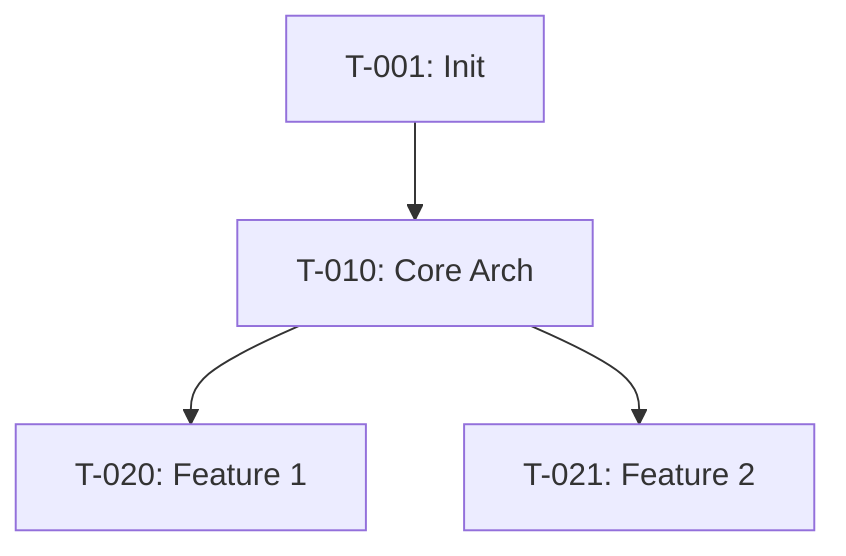

# Tracker Prompt

## Purpose
Generate Tracker.md - the global task registry derived from strategy layer documents. Adapts for both new and existing projects, and handles updates after each session.

---

## Prerequisites

**Required Input:**
- Design.md (complete)
- Scope.md (complete)
- Requirements.md (complete)

**For Updates:**
- Current Tracker.md
- Proposed updates from session Closing Report

---

## Context Detection

Detect project type and action:

**IF user says:** "Generate Tracker" OR "Create Tracker.md"
→ Read Design.md to detect:
  - IF Design.md has §14 (Architecture Evolution Plan) → **Existing project**
  - ELSE → **New project**

**IF user says:** "Update Tracker" OR provides Closing Report
→ **Update mode** (apply session changes)

---

## PART 1: GENERATE TRACKER (Initial Creation)

### Step 1: Read Complete Strategy Layer

**CRITICAL:** Read ALL three documents COMPLETELY in this order:

1. **Design.md** - Read COMPLETE document (all sections)
   - Architecture patterns and layers
   - Tech stack decisions
   - Standards and principles
   - For existing: §13 Technical Debt + §14 Evolution Plan

2. **Scope.md** - Read COMPLETE document (all sections)
   - Vision and goals
   - §4 In-Scope Features (these become tasks)
   - Success metrics
   - Constraints

3. **Requirements.md** - Read COMPLETE document (all sections)
   - §1 Functional Requirements (detailed tasks source)
   - §2 Business Rules
   - §3 Data Entities
   - §7 Integration Requirements
   - For existing: §8 New Requirements

**Do NOT skip any sections. Full context is essential.**

---

### Step 2A: Generate Tracker for NEW PROJECT

### Task Categories:

1. **Infrastructure Setup**
2. **Core Architecture Implementation**
3. **Feature Development** (from Requirements)
4. **Testing Infrastructure**
5. **CI/CD Pipeline**
6. **Documentation**
7. **Deployment**

### Process:

**A) Infrastructure Tasks**
From Design.md §4 (Project Structure):
```
T-001: Initialize project structure
- Description: Create folder structure per Design.md §4.1
- Category: Infrastructure
- Priority: Must Have
- Dependencies: None
- Estimated Effort: 1 hour
- Acceptance Criteria:
  - All folders from Design.md §4.1 created
  - Base configuration files present
  - README.md created
```

**B) Core Architecture Tasks**
From Design.md §2 (Architecture):
```
T-010: Implement [Layer Name] layer
- Description: Create base structure for [layer]
- Category: Core Architecture
- Priority: Must Have
- Dependencies: T-001
- Estimated Effort: [hours]
- Acceptance Criteria:
  - [Layer] folder structure created
  - Base interfaces defined per Design.md §2.1
  - Dependency injection configured
```

**C) Feature Development Tasks**
From Requirements.md §1 (Functional Requirements):

For EACH functional requirement (FR-XXX):
```
T-0XX: Implement [FR-XXX Title]
- Description: [From FR description]
- Category: Feature Development
- Priority: [From FR priority]
- Feature: [Feature category from Requirements]
- Dependencies: [Core architecture tasks]
- Estimated Effort: [Based on complexity]
- Acceptance Criteria:
  - [All criteria from FR-XXX]
  - Unit tests with >80% coverage
  - Integration tests pass
```

**D) Other Tasks**
- Testing setup (from Design.md §10)
- CI/CD (from Design.md §5.4)
- Documentation (from Design.md §7.2)

### Dependencies:
```
Infrastructure → Core Architecture → Features → Deployment
```

---

### Step 2B: Generate Tracker for EXISTING PROJECT

### Task Categories (4 types):

1. **Feature Development** (new functionality)
2. **Architecture Improvement** (refactoring)
3. **Technical Debt** (fixes)
4. **Migration** (upgrade tasks)

### Process:

**A) Feature Development Tasks**
From Requirements.md §8 (New Requirements):
```
T-001: Implement [NFR-XXX Title]
- Description: [From NFR description]
- Category: Feature Development
- Priority: [From NFR priority]
- Dependencies: [May depend on architecture improvements]
- Estimated Effort: [hours]
- Acceptance Criteria:
  - [From NFR-XXX criteria]
```

**B) Architecture Improvement Tasks**
From Design.md §14.3 (Improvement ADRs):
```
T-050: [ADR-01X Proposed Improvement]
- Description: Implement improvement from ADR-01X
- Category: Architecture Improvement
- Priority: [Based on ADR impact]
- Phase: [From Design.md §14.4 Migration Phases]
- Dependencies: [May depend on migration tasks]
- Estimated Effort: [hours]
- Acceptance Criteria:
  - ADR-01X implementation complete
  - Tests updated
  - Documentation updated
```

**C) Technical Debt Tasks**
From Design.md §13 (Technical Debt Analysis):
```
T-100: Fix [Issue from §13]
- Description: [Issue description]
- Category: Technical Debt
- Priority: [P0/P1/P2 from §13]
- Impact: [High/Med/Low from §13]
- Effort: [High/Med/Low from §13]
- Dependencies: [None or other debt]
- Estimated Effort: [hours]
- Acceptance Criteria:
  - Issue resolved
  - Validation tests pass
```

**D) Migration Tasks**
From Design.md §14.4 (Migration Phases):
```
T-150: [Phase 1 Task]
- Description: [From migration phase]
- Category: Migration
- Phase: Phase 1 - Foundation
- Priority: Must Have
- Dependencies: [Sequential within phase]
- Estimated Effort: [hours]
- Acceptance Criteria:
  - [Phase deliverable met]
  - No breaking changes to existing features
```

### Dependencies:
```
Migration → Architecture Improvements → Features
Technical Debt → May block Features
```

### Phase Alignment:
Group tasks by Design.md §14.4 phases:
- Phase 1: Foundation (T-150 to T-159)
- Phase 2: Refactoring (T-050 to T-069)
- Phase 3: Features (T-001 to T-030)
- Phase 4: Optimization (T-070 to T-089)

---

## PART 2: UPDATE TRACKER (After Session)

### Step 1: Read Update Request

From session Closing Report, extract:
- Tasks worked on
- Status changes (⚪ → 🟡 → ✅)
- Actual effort vs estimated
- Evidence/links
- Completion notes

### Step 2: Apply Updates

For each task in the update request:

**Update Status:**
```
Before: T-003: Design database schema [⚪ Not Started]
After:  T-003: Design database schema [✅ Complete]
```

**Add Evidence:**
```
Evidence:
- Tests: Migration scripts tested locally
- Documentation: ERD created (docs/erd.png)
- CI: N/A (infrastructure task)
- Completion Date: 2026-01-15
```

**Update Effort:**
```
Estimated Effort: 2 hours
Actual Effort: 1.5 hours
Efficiency: 133%
```

**Add Notes:**
```
Notes:
- Used UUID for primary keys (ADR-002)
- Separate audit schema for better performance
```

### Step 3: Update Dependent Tasks

```
T-004 depends on T-003:
Before: [⏸️ Blocked by T-003]
After:  [⚪ Ready to start]
```

### Step 4: Recalculate Metrics

```
Project Progress:
- Tasks Complete: 2 → 3
- Progress: 4% → 6%

Velocity:
- Last 3 sessions: 1.5 tasks/session average
- Efficiency: 120% (completing faster than estimates)
```

### Step 5: Confirm with User

```markdown
## Proposed Tracker Updates

**Do you want me to update Tracker.md with these changes?**

Changes to apply:
- T-003: ⚪ → ✅ Complete
- T-004: ⏸️ → ⚪ Ready
- Progress: 4% → 6%
- Velocity updated

Reply "Yes" to apply, or "No" to update manually.
```

**IF Yes:** Apply changes and confirm
**IF No:** Acknowledge and provide manual instructions

---

## Template Structure

```markdown
# Tracker - Global Task Registry

> **Purpose:** Complete roadmap of all development tasks.  
> **Generated From:** Design.md + Scope.md + Requirements.md  
> **Updated:** After every session  
> **Used By:** session.prompt.md to plan work

---

## TASK REGISTRY

### Legend
- ⚪ Not Started - Ready to begin
- 🟡 In Progress - Currently being worked
- ✅ Complete - Finished and validated
- ⏸️ Blocked - Cannot start (dependency)
- 🚫 Cancelled - No longer needed

---

[FOR NEW PROJECTS]

### Infrastructure Setup (7 tasks)

**T-001: Initialize project structure** [✅ Complete]
- **Category:** Infrastructure
- **Priority:** Must Have
- **Dependencies:** None
- **Estimated Effort:** 1 hour
- **Actual Effort:** 45 minutes
- **Acceptance Criteria:**
  - ✅ All folders created per Design.md §4.1
  - ✅ Base config files present
- **Evidence:** [Links]
- **Completed:** 2026-01-15

[Continue for all tasks...]

---

[FOR EXISTING PROJECTS]

### Feature Development Tasks (10 tasks)

[Tasks from Requirements §8]

### Architecture Improvement Tasks (8 tasks)

[Tasks from Design §14.3]

### Technical Debt Tasks (12 tasks)

[Tasks from Design §13]

### Migration Tasks (15 tasks)

[Tasks from Design §14.4, grouped by phase]

**Phase 1: Foundation**
- T-150 to T-159

**Phase 2: Refactoring**
- T-050 to T-069

---

## DEPENDENCIES



---

## PROGRESS METRICS

**Overall Progress:** X/Y tasks complete (Z%)

**By Category:**
- Infrastructure: X/Y complete
- Features: X/Y complete
- Testing: X/Y complete

**Velocity:**
- Last 3 sessions: X tasks/session
- Average efficiency: X%

---

## RETROSPECTIVE (Updated Monthly)

**What's Working:**
- [Item 1]

**What's Not:**
- [Item 1]

**Action Items:**
- [Item 1]

---

## CHANGE LOG

| Date | Changes | Updated By |
|------|---------|------------|
| [Date] | Initial tracker generated | AI |
| [Date] | T-003 completed, T-004 unblocked | Session #003 |
```

---

## Validation Checklist

**For New Projects:**
- [ ] Read Design, Scope, Requirements COMPLETELY
- [ ] All features from Scope §4 have tasks
- [ ] All FRs from Requirements have tasks
- [ ] Dependencies are logical
- [ ] Priorities align with Scope goals
- [ ] All 7 categories represented

**For Existing Projects:**
- [ ] Read Design, Scope, Requirements COMPLETELY
- [ ] All 4 task categories present
- [ ] Tasks aligned with Migration Phases (Design §14.4)
- [ ] Technical debt rated by priority
- [ ] Dependencies account for migration order

**For Updates:**
- [ ] All status changes applied
- [ ] Evidence links added
- [ ] Dependent tasks unblocked
- [ ] Metrics recalculated
- [ ] User confirmation received

---

## Tips

1. **Be Comprehensive:** Every feature needs tasks
2. **Be Realistic:** Estimate effort conservatively
3. **Be Clear:** Acceptance criteria must be testable
4. **Track Dependencies:** Visualize with Mermaid
5. **Update Regularly:** After every session

---

## CHANGE LOG

| Version | Date | Changes |
|---------|------|---------|
| 1.0 | 2026-01-15 | Initial prompt created |
