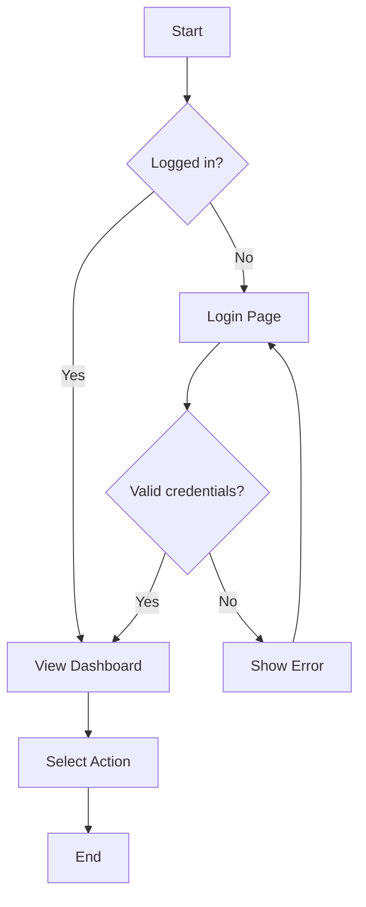

# Requirements Document Template

> **Purpose:** Detail WHAT the system must do through functional requirements, business rules, data entities, user stories, and UI/UX specifications.  
> **Created After:** Scope.md (read it completely first)  
> **Estimated Time:** 6-10 hours  
> **Next Document:** Design.md (defines HOW to implement these requirements)

---

## Instructions

1. **Read Scope.md first** - This document expands on the features defined in Scope
2. **Mark sections as [REQUIRED] or [OPTIONAL]** - Required sections must be completed; optional sections depend on project needs
3. **Use the approved feature list from Scope** - Do not add out-of-scope features here
4. **Focus on WHAT, not HOW** - Implementation details go in Design.md
5. **Be specific and measurable** - Requirements should be testable and verifiable
6. **Remove unused optional sections** - If a section doesn't apply, delete it

---

## Document Information

| Field | Value |
|-------|-------|
| **Project Name** | [Project name from Scope.md] |
| **Version** | 1.0 |
| **Last Updated** | [Date] |
| **Author(s)** | [Name(s)] |
| **Status** | Draft / In Review / Approved |
| **Based On** | Scope.md v[X.X] |

---

## 1. FUNCTIONAL REQUIREMENTS [REQUIRED]

> **Purpose:** Define what features the system must provide and their detailed behavior.

### 1.1 Feature List

Reference the approved feature list from Scope.md:

| Feature ID | Feature Name | Priority | Source (Scope) |
|------------|--------------|----------|----------------|
| F-001 | [Feature name] | Must-have | Section X.X |
| F-002 | [Feature name] | Should-have | Section X.X |
| F-003 | [Feature name] | Could-have | Section X.X |

### 1.2 Detailed Requirements by Feature

#### Feature F-001: [Feature Name]

**Description:**  
[Detailed description of what this feature does and why it's needed]

**Functional Requirements:**

| Req ID | Requirement | Acceptance Criteria | Priority |
|--------|-------------|---------------------|----------|
| F-001.1 | The system shall allow users to [action] | - User can [action]<br>- System validates [condition]<br>- Error message displays if [condition] | Must-have |
| F-001.2 | The system shall display [data] when [condition] | - [Data] is visible<br>- Format is [specification]<br>- Updates in real-time | Must-have |
| F-001.3 | The system shall prevent [action] when [condition] | - [Action] is blocked<br>- User sees [message]<br>- Alternative [action] is suggested | Should-have |

**Behavior:**
- **Normal Flow:**
  1. User navigates to [screen]
  2. System displays [elements]
  3. User performs [action]
  4. System validates [condition]
  5. System saves [data] and shows confirmation

- **Alternative Flows:**
  - If [condition], then system [behavior]
  - If [condition], then user can [action]

- **Edge Cases:**
  - What happens if [unusual condition]?
  - How does system handle [extreme scenario]?

**Dependencies:**
- Requires F-002 to be implemented first
- Depends on integration with [external system]

---

#### Feature F-002: [Feature Name]

[Repeat structure for each feature]

---

### 1.3 Reporting & Analytics (if applicable)

**Reports Required:**

| Report ID | Report Name | Description | Frequency | Users |
|-----------|-------------|-------------|-----------|-------|
| R-001 | [Report name] | Shows [metrics] for [purpose] | Daily / Weekly | [Role] |
| R-002 | [Report name] | Shows [data] filtered by [criteria] | On-demand | [Role] |

**Analytics Requirements:**
- Track [metric] to measure [goal]
- Dashboard must display [KPIs]
- Export capability for [data] in [format]

---

## 2. BUSINESS RULES [REQUIRED]

> **Purpose:** Define the business logic that governs system behavior.

### 2.1 Core Business Rules

| Rule ID | Rule Name | Description | Impact |
|---------|-----------|-------------|--------|
| BR-001 | [Rule name] | [Entity] can only [action] if [condition] | Blocks F-001, F-003 |
| BR-002 | [Rule name] | When [event], system must [action] within [timeframe] | Affects performance requirements |
| BR-003 | [Rule name] | [Data field] must be [condition] before [action] | Validation in F-002 |

**Example:**
- **BR-001: Order Approval Limit**
  - **Rule:** Orders over $10,000 require manager approval
  - **Logic:** 
    - IF order.total > 10000 THEN order.status = "Pending Approval"
    - ELSE order.status = "Approved"
  - **Applies To:** Order submission workflow (F-001)

### 2.2 Validation Rules

| Field/Entity | Validation Rule | Error Message | Enforced Where |
|--------------|----------------|---------------|----------------|
| Email | Must match pattern `^[a-z0-9._%+-]+@[a-z0-9.-]+\.[a-z]{2,}$` | "Invalid email format" | User registration, profile update |
| Phone | Must be 10 digits for US/Canada | "Phone number must be 10 digits" | Contact forms |
| Date Range | End date must be after start date | "End date cannot be before start date" | Date pickers |
| [Field] | [Validation logic] | "[Error message]" | [Where enforced] |

**Examples:**
- **Product Code Validation:**
  - Format: `[2-letter category]-[4-digit number]` (e.g., "EL-0123")
  - Must be unique across system
  - Cannot be changed once created

### 2.3 Workflow Rules

**Workflow:** [Workflow Name (e.g., "Order Processing")]

| Step | Action | Condition to Proceed | Who Can Perform | Next Step |
|------|--------|---------------------|-----------------|-----------|
| 1 | Create order | All required fields completed | Customer, Sales Rep | Step 2 |
| 2 | Review order | Order total validated | System (auto) | Step 3 or Step 5 |
| 3 | Manager approval | Order > $10,000 | Manager | Step 4 |
| 4 | Final approval | Manager approved | System (auto) | Step 5 |
| 5 | Process order | Payment received | System (auto) | Complete |

**State Transitions:**
```
Draft → Submitted → [Under Review] → Approved → Processing → Completed
                  ↓                  ↓
                Rejected          Cancelled
```

---

## 3. DATA ENTITIES [REQUIRED]

> **Purpose:** Define the core data structures and their relationships.

### 3.1 Core Entities

| Entity Name | Description | Key Attributes | Relationships |
|-------------|-------------|----------------|---------------|
| User | System user account | ID, email, role, status | Has many Orders |
| Order | Customer order | ID, number, date, total, status | Belongs to User, has many OrderItems |
| Product | Catalog item | ID, name, SKU, price, category | Has many OrderItems |
| OrderItem | Line item in order | ID, quantity, unit_price | Belongs to Order and Product |

### 3.2 Entity Attributes

#### Entity: User

| Attribute | Type | Required | Default | Constraints | Description |
|-----------|------|----------|---------|-------------|-------------|
| id | UUID | Yes | Generated | Unique, Primary Key | Unique identifier |
| email | String(255) | Yes | - | Unique, Valid email format | User's email address |
| first_name | String(100) | Yes | - | Max 100 chars | User's first name |
| last_name | String(100) | Yes | - | Max 100 chars | User's last name |
| role | Enum | Yes | "Customer" | One of: Customer, Manager, Admin | User's role in system |
| status | Enum | Yes | "Active" | One of: Active, Inactive, Suspended | Account status |
| created_at | DateTime | Yes | Current timestamp | - | Account creation date |
| updated_at | DateTime | Yes | Current timestamp | Auto-updated | Last modification date |

#### Entity: Order

| Attribute | Type | Required | Default | Constraints | Description |
|-----------|------|----------|---------|-------------|-------------|
| id | UUID | Yes | Generated | Unique, Primary Key | Unique identifier |
| order_number | String(20) | Yes | Generated | Unique, Format: ORD-YYYYMMDD-#### | Human-readable order number |
| user_id | UUID | Yes | - | Foreign Key to User | Customer who placed order |
| order_date | DateTime | Yes | Current timestamp | - | Date order was placed |
| status | Enum | Yes | "Draft" | One of: Draft, Submitted, Approved, Processing, Completed, Cancelled | Order status |
| subtotal | Decimal(10,2) | Yes | 0.00 | >= 0 | Sum of line items before tax |
| tax_amount | Decimal(10,2) | Yes | 0.00 | >= 0 | Calculated tax |
| total | Decimal(10,2) | Yes | 0.00 | >= 0 | Subtotal + Tax |
| notes | Text | No | NULL | Max 5000 chars | Additional notes or instructions |
| created_at | DateTime | Yes | Current timestamp | - | Record creation date |
| updated_at | DateTime | Yes | Current timestamp | Auto-updated | Last modification date |

[Repeat for each entity]

### 3.3 Entity Relationships

**Entity Relationship Diagram (ERD):**

```
User (1) ──────< (M) Order
                      ↓
                    (1)
                      │
                      │
                    (M)
                 OrderItem
                      ↓
                    (M)
                      │
                      │
                    (1)
                  Product
```

**Relationship Details:**

| Parent Entity | Relationship | Child Entity | Cardinality | Delete Behavior |
|--------------|--------------|--------------|-------------|-----------------|
| User | has many | Orders | 1:M | Prevent delete if has orders |
| Order | has many | OrderItems | 1:M | Cascade delete order items |
| Product | has many | OrderItems | 1:M | Prevent delete if in orders |

**Key Relationships:**
1. **User → Order:** One user can place many orders
   - Foreign Key: `order.user_id` references `user.id`
   - On Delete: RESTRICT (cannot delete user with orders)

2. **Order → OrderItem:** One order contains many line items
   - Foreign Key: `order_item.order_id` references `order.id`
   - On Delete: CASCADE (delete items when order is deleted)

3. **Product → OrderItem:** One product can appear in many orders
   - Foreign Key: `order_item.product_id` references `product.id`
   - On Delete: RESTRICT (cannot delete product that's been ordered)

---

## 4. USER STORIES [OPTIONAL]

> **Purpose:** Describe features from the user's perspective with acceptance criteria.  
> **Note:** Remove this section if you prefer to use only functional requirements (Section 1).

### 4.1 Epic 1: [Epic Name]

**Epic Description:**  
As a [role], I want to [goal] so that [benefit].

#### Story 4.1.1: [Story Title]

**User Story:**  
As a [role], I want to [action] so that I can [benefit].

**Acceptance Criteria:**
- [ ] Given [precondition], when [action], then [expected result]
- [ ] Given [precondition], when [action], then [expected result]
- [ ] Given [edge case], when [action], then [expected result]

**Priority:** Must-have / Should-have / Could-have

**Story Points:** [Estimation in Fibonacci: 1, 2, 3, 5, 8, 13]

**Dependencies:**
- Requires Story 4.2.1 to be completed first
- Blocks Story 4.1.3

**Notes:**
- [Additional context or technical notes]

---

#### Story 4.1.2: [Story Title]

[Repeat structure]

---

### 4.2 Epic 2: [Epic Name]

[Repeat structure for each epic]

---

### 4.3 Acceptance Criteria Template

Use this template for consistency across all user stories:

```
Given [initial context or state]
When [action is taken or event occurs]
Then [expected outcome or result]
And [additional expected outcome, if applicable]
```

**Example:**
- Given I am a logged-in customer
- When I add an item to my cart
- Then the item appears in my cart with correct quantity and price
- And the cart total is updated to reflect the new item

---

## 5. USER FLOWS [OPTIONAL]

> **Purpose:** Map out critical user journeys through the system.  
> **Note:** Remove this section if workflows are already well-documented in Section 1 or 2.

### 5.1 Critical User Journeys

#### Flow 1: [Flow Name - e.g., "Complete Purchase"]

**Actors:** Customer, System, Payment Gateway

**Preconditions:**
- User is logged in
- User has items in cart
- Payment method is configured

**Steps:**

| Step | Actor | Action | System Response | Alternative/Error Path |
|------|-------|--------|-----------------|------------------------|
| 1 | Customer | Clicks "Checkout" | Navigates to checkout page | If cart is empty, show error |
| 2 | System | Displays order summary | Shows items, quantities, prices, total | - |
| 3 | Customer | Reviews order, enters shipping info | - | Can edit cart at this stage |
| 4 | Customer | Clicks "Place Order" | Validates all required fields | If validation fails, show errors |
| 5 | System | Submits payment to gateway | Waits for payment confirmation | If payment fails, show error + retry |
| 6 | System | Receives payment confirmation | Creates order, sends confirmation email | - |
| 7 | System | Displays order confirmation page | Shows order number, details, tracking info | - |

**Postconditions:**
- Order is created in database with status "Processing"
- Customer receives confirmation email
- Inventory is reduced by ordered quantities
- Cart is cleared

**Flow Diagram:**
```
[Start] → View Cart → Checkout → Enter Shipping → 
Review Order → Submit Payment → [Payment Success?]
    ↓                                      ↓ No
Confirmation                        Error + Retry
    ↓
[End]
```

---

#### Flow 2: [Flow Name]

[Repeat structure for each critical flow]

---

### 5.2 Flow Diagrams

For complex workflows, include visual diagrams using Mermaid or similar:



---

## 6. UI/UX CONSIDERATIONS [OPTIONAL]

> **Purpose:** Define user interface and experience requirements.  
> **Note:** This is NOT visual design (mockups, colors, fonts). Focus on functionality and behavior.

### 6.1 Design Principles

**Core Principles for this Project:**
1. **Simplicity:** Minimize clicks to complete common tasks
2. **Consistency:** Use standard patterns for navigation, forms, and actions
3. **Feedback:** Provide immediate visual feedback for all user actions
4. **Error Prevention:** Validate inputs and prevent errors before they occur
5. **[Principle]:** [Description]

### 6.2 Accessibility Requirements

| Requirement | Standard | Implementation |
|-------------|----------|----------------|
| Keyboard Navigation | WCAG 2.1 AA | All interactive elements must be keyboard accessible (Tab, Enter, Esc) |
| Screen Reader Support | WCAG 2.1 AA | Semantic HTML, ARIA labels, proper heading hierarchy |
| Color Contrast | WCAG 2.1 AA | Minimum 4.5:1 ratio for text, 3:1 for large text |
| Text Resize | WCAG 2.1 AA | Support text resize up to 200% without loss of functionality |
| [Requirement] | [Standard] | [How to implement] |

**Specific Requirements:**
- All images must have alt text
- Forms must have proper labels and error messages
- Error states must not rely on color alone
- Interactive elements must have visible focus indicators

### 6.3 Responsive Behavior

**Breakpoints:**
- **Desktop:** >= 1024px (full layout)
- **Tablet:** 768px - 1023px (adjusted layout)
- **Mobile:** < 768px (single column, simplified navigation)

**Mobile-Specific Requirements:**
- Touch targets must be at least 44x44 pixels
- Forms should use appropriate input types (tel, email, date)
- Navigation should collapse to hamburger menu
- Data tables should scroll horizontally or stack vertically

### 6.4 Component Guidelines

#### Forms

**Required Behavior:**
- Required fields must be marked with asterisk (*)
- Validation should occur on blur (when user leaves field)
- Error messages should appear inline below the field
- Submit button should be disabled until form is valid
- Success confirmation should be shown after successful submission

**Example:**
```
[Label] *
[Input field]
[Error message if invalid] ← Red text, below field
```

#### Data Tables

**Required Features:**
- Sortable columns (click header to sort)
- Pagination (show X items per page)
- Search/filter capability
- Row selection (checkboxes)
- Responsive behavior (stack or scroll on mobile)

#### Modals/Dialogs

**Required Behavior:**
- Must have visible close button (X in top right)
- Must close on Esc key press
- Must trap focus (Tab key stays within modal)
- Must dim background to indicate modal state
- Must return focus to trigger element when closed

---

## 7. INTEGRATION REQUIREMENTS [OPTIONAL]

> **Purpose:** Define how the system interacts with external systems and services.

### 7.1 External Systems

| System Name | Purpose | Integration Type | Frequency | Critical? |
|-------------|---------|------------------|-----------|-----------|
| Payment Gateway (e.g., Stripe) | Process payments | REST API | Real-time | Yes |
| Email Service (e.g., SendGrid) | Send transactional emails | REST API | Asynchronous | Yes |
| Analytics Platform | Track user behavior | JavaScript SDK | Real-time | No |
| [System Name] | [Purpose] | [Type] | [Frequency] | [Yes/No] |

### 7.2 APIs to Consume

#### Integration 1: Payment Gateway

**API:** Stripe Payment Intent API

**Endpoints Used:**
- `POST /v1/payment_intents` - Create payment intent
- `GET /v1/payment_intents/{id}` - Retrieve payment status
- `POST /v1/payment_intents/{id}/confirm` - Confirm payment

**Authentication:**
- API Key (Secret Key in backend only)
- Never expose secret key to frontend

**Data Exchange:**
```json
// Request
{
  "amount": 5000,
  "currency": "usd",
  "payment_method": "pm_1234567890"
}

// Response
{
  "id": "pi_1234567890",
  "status": "succeeded",
  "amount_received": 5000
}
```

**Error Handling:**
- Network timeout: Retry up to 3 times with exponential backoff
- Payment declined: Show user-friendly error message, allow retry
- API error: Log error, notify admin, show generic error to user

---

#### Integration 2: [System Name]

[Repeat structure for each integration]

---

### 7.3 Data Sync Requirements

**Sync Type:** One-way (pull from external system) / Two-way (bidirectional)

| Data Entity | Source System | Target System | Sync Frequency | Conflict Resolution |
|-------------|---------------|---------------|----------------|---------------------|
| Products | ERP System | Our System | Hourly | Source system wins |
| Orders | Our System | ERP System | Real-time | Manual resolution |
| [Entity] | [Source] | [Target] | [Frequency] | [Strategy] |

**Sync Process:**
1. System polls external API every [frequency]
2. Compares timestamps to identify changed records
3. Updates local database with changes
4. Logs all sync operations for audit

### 7.4 Authentication/Authorization

**Integration Authentication:**

| System | Auth Method | Credentials Storage | Token Refresh |
|--------|-------------|---------------------|---------------|
| Payment Gateway | API Key | Environment variable | N/A |
| Email Service | API Key | Encrypted in database | N/A |
| OAuth Provider | OAuth 2.0 | Encrypted refresh token | Every 60 minutes |

**User Authentication (if applicable):**
- SSO via [Provider] (e.g., Azure AD, Okta)
- Multi-factor authentication required for admin roles
- Session timeout after 30 minutes of inactivity

---

## 8. LOCALIZATION [OPTIONAL]

> **Purpose:** Define requirements for multi-language and multi-region support.

### 8.1 Supported Languages

**Launch Languages:**
- English (US) - Default
- Spanish (ES)
- [Language] ([Code])

**Future Languages (Post-Launch):**
- French (FR)
- German (DE)

**Translation Requirements:**
- All UI text must be externalized (no hardcoded strings)
- Use i18n/l10n library (e.g., i18next, react-intl)
- Translations stored in JSON files per language
- Date/time formats must adapt to locale

### 8.2 Regional Formats

| Format | US | EU | Example |
|--------|----|----|---------|
| Date | MM/DD/YYYY | DD/MM/YYYY | 01/15/2024 vs 15/01/2024 |
| Time | 12-hour | 24-hour | 2:30 PM vs 14:30 |
| Numbers | 1,234.56 | 1.234,56 | Comma vs decimal separator |
| Currency | $1,234.56 | 1.234,56 € | Symbol position |

### 8.3 Currency Handling

**Supported Currencies:**
- USD (US Dollar) - Default
- EUR (Euro)
- [Currency] ([Code])

**Requirements:**
- Store all monetary values in cents/smallest unit (avoid floating point errors)
- Display currency symbol according to locale
- Support currency conversion via external API (e.g., exchangerate-api.com)
- Allow users to select preferred display currency

---

## 9. NON-FUNCTIONAL REQUIREMENTS [REQUIRED]

> **Purpose:** Define quality attributes and system-wide constraints.  
> **Note:** These requirements apply to ALL features unless stated otherwise.

### 9.1 Performance Requirements

| Metric | Target | Measurement Method | Priority |
|--------|--------|-------------------|----------|
| Page Load Time | < 2 seconds | Initial page render (First Contentful Paint) | Must-have |
| API Response Time | < 500ms (95th percentile) | Server response time for API calls | Must-have |
| Database Query Time | < 100ms (average) | Query execution time | Should-have |
| Concurrent Users | Support 1,000 simultaneous users | Load testing | Must-have |
| [Metric] | [Target] | [How measured] | [Priority] |

**Specific Requirements:**
- Search results must display within 1 second
- File uploads must support files up to 10 MB
- Bulk operations (e.g., export) should process 10,000 records in < 30 seconds

### 9.2 Security Requirements

| Requirement | Implementation | Standard/Framework |
|-------------|----------------|-------------------|
| Authentication | Username/password + MFA | OWASP ASVS Level 2 |
| Password Policy | Min 12 chars, complexity rules, no reuse of last 5 | NIST 800-63B |
| Data Encryption | At rest: AES-256, In transit: TLS 1.3+ | FIPS 140-2 |
| Session Management | 30-min timeout, secure cookies, CSRF protection | OWASP |
| Input Validation | Whitelist validation, parameterized queries | OWASP |
| Audit Logging | Log all data changes, login attempts, admin actions | ISO 27001 |
| [Requirement] | [Implementation] | [Standard] |

**Sensitive Data:**
- PII (names, emails, addresses) must be encrypted at rest
- Payment data (credit cards) must never be stored (use tokenization)
- Access to sensitive data requires role-based authorization

### 9.3 Scalability Requirements

**Current Scale:**
- Users: [Number]
- Transactions per day: [Number]
- Database size: [GB/TB]

**Growth Projections (12 months):**
- Users: [Number] (X% growth)
- Transactions per day: [Number] (X% growth)
- Database size: [GB/TB] (X% growth)

**Scalability Strategy:**
- Horizontal scaling for application servers (add more instances)
- Database read replicas for reporting queries
- Caching layer (Redis) for frequently accessed data
- CDN for static assets

### 9.4 Reliability Requirements

| Metric | Target | Measurement |
|--------|--------|-------------|
| Uptime | 99.9% (max 8.7 hours downtime/year) | Uptime monitoring service |
| Recovery Time Objective (RTO) | < 4 hours | Time to restore service after failure |
| Recovery Point Objective (RPO) | < 1 hour | Maximum acceptable data loss |
| Error Rate | < 0.1% of requests | Error monitoring (e.g., Sentry) |

**Backup and Recovery:**
- Database backups: Daily full backup + hourly incremental
- Backup retention: 30 days
- Disaster recovery plan: Documented and tested quarterly

---

## NEXT STEPS

Once this Requirements document is approved:

1. **Create Design.md** (6-10 hours)
   - Read this Requirements document completely
   - Define technical architecture
   - Document non-negotiable architectural constraints
   - Create architecture decision records (ADRs)
   - Define technology stack
   - Create data models and API contracts

2. **Return to this document as development progresses**
   - Requirements may need clarification or refinement
   - New requirements may emerge during implementation
   - Keep this as a living document, not a static specification

---

## APPROVAL

| Role | Name | Signature | Date | Notes |
|------|------|-----------|------|-------|
| Product Manager | | | | |
| Engineering Lead | | | | |
| Business Owner | | | | |
| [Stakeholder] | | | | |

---

## CHANGE LOG

| Version | Date | Author | Changes |
|---------|------|--------|---------|
| 1.0 | [Date] | [Name] | Initial version |
| 1.1 | [Date] | [Name] | [Description of changes] |
