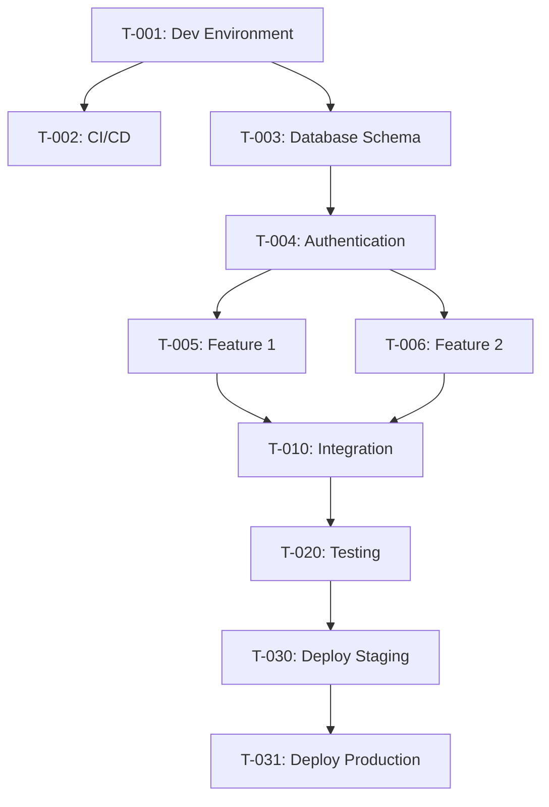

# Tracker Document Template

> **Purpose:** Global task registry containing all implementation tasks derived from strategy documents.  
> **Generated From:** Design.md + Scope.md + Requirements.md (AI reads all three)  
> **Updated:** Continuously as work progresses  
> **Owner:** AI-generated, human-maintained

---

## ⚠️ CRITICAL: How to Generate This Document

This document should be **generated by AI**, not filled manually.

**AI Prompt:**
```
Read Design.md, Scope.md, and Requirements.md completely.

Generate Tracker.md with ALL tasks needed to build this system according to:
- Technical architecture and constraints from Design.md
- Project boundaries and goals from Scope.md  
- Functional requirements and features from Requirements.md

Each task must have:
- Unique ID (T-001, T-002, etc.)
- Clear acceptance criteria
- References to source documents (e.g., "per Design.md §3.2")
- Estimated effort
- Dependencies

Order tasks logically based on dependencies and implementation sequence.
```

**Order of Reading for AI:**
1. **Design.md FIRST** - Understand technical constraints
2. **Scope.md SECOND** - Understand project goals and boundaries
3. **Requirements.md THIRD** - Understand features and user stories
4. **Generate tasks** that satisfy all three documents

---

## Project Metadata

| Field | Value |
|-------|-------|
| **Project Name** | [Project name] |
| **Last Updated** | [Date and time] |
| **Total Tasks** | [Number] |
| **Completed** | [Number] ([Percentage]%) |
| **In Progress** | [Number] |
| **Not Started** | [Number] |
| **Blocked** | [Number] |

---

## Status Legend

| Symbol | Status | Description |
|--------|--------|-------------|
| ⚪ | Not Started | Task has not begun |
| 🟡 | In Progress | Task is actively being worked on |
| ✅ | Complete | Task is finished with evidence of completion |
| 🚫 | Blocked | Task cannot proceed due to blocker |

---

## Task Format Template

Use this format for each task:

```markdown
### T-XXX: [Task Title]

**Owner:** [Name/Team/Role]  
**Status:** [⚪ Not started | 🟡 In progress | ✅ Complete | 🚫 Blocked]  
**Priority:** [Critical | High | Medium | Low]  
**Estimated Effort:** [Time estimate - e.g., 0.5 day, 2 days, 1 week]  
**Actual Effort:** [Time taken - filled when complete]  
**Dependencies:** [T-YYY, T-ZZZ] (list task IDs this depends on)  
**Blockers:** [Description if blocked, or "None"]  
**References:** 
- Design.md §X.Y - [Specific constraint or decision]
- Scope.md §Z - [Specific goal or boundary]
- Requirements.md §W - [Specific feature or requirement]

**Acceptance Criteria:**
- [ ] Criterion 1 with measurable outcome
- [ ] Criterion 2 with measurable outcome
- [ ] Criterion 3 with measurable outcome

**Evidence of Completion:**
- [ ] Link to PR: [URL]
- [ ] Link to commit: [URL]
- [ ] Test results: [URL or description]
- [ ] Screenshot/Demo: [URL if applicable]

**Notes:**
- [Any additional context, decisions made during implementation, or lessons learned]
```

---

## Tasks Grouped by Status

### ✅ Completed Tasks

| Task ID | Title | Completed Date | Owner |
|---------|-------|----------------|-------|
| T-001 | [Task title] | YYYY-MM-DD | [Owner] |
| T-002 | [Task title] | YYYY-MM-DD | [Owner] |

### 🟡 In Progress

| Task ID | Title | Started Date | Owner | Progress |
|---------|-------|--------------|-------|----------|
| T-005 | [Task title] | YYYY-MM-DD | [Owner] | 60% |
| T-006 | [Task title] | YYYY-MM-DD | [Owner] | 30% |

### ⚪ Not Started

| Task ID | Title | Priority | Estimated Effort | Dependencies |
|---------|-------|----------|------------------|--------------|
| T-010 | [Task title] | High | 2 days | T-005 |
| T-011 | [Task title] | Medium | 1 day | None |

### 🚫 Blocked

| Task ID | Title | Blocker | Owner |
|---------|-------|---------|-------|
| T-015 | [Task title] | Waiting for API documentation | [Owner] |

---

## Tasks Grouped by Category

> **Note:** This grouping is optional. Use categories that make sense for your project.

### Infrastructure & Setup

- T-001: Set up development environment
- T-002: Configure CI/CD pipeline
- T-003: Set up staging environment
- [More tasks...]

### Database & Data Layer

- T-010: Design database schema
- T-011: Create migration scripts
- T-012: Implement repository layer
- [More tasks...]

### Backend Development

- T-020: Implement authentication
- T-021: Create user management endpoints
- T-022: Implement business logic for [feature]
- [More tasks...]

### Frontend Development

- T-030: Set up frontend project structure
- T-031: Implement authentication UI
- T-032: Create [feature] components
- [More tasks...]

### API Integration

- T-040: Integrate with [external system]
- T-041: Implement webhook handling
- T-042: Create API client for [service]
- [More tasks...]

### Testing & QA

- T-050: Write unit tests for [component]
- T-051: Create integration test suite
- T-052: Perform load testing
- [More tasks...]

### Documentation

- T-060: Write API documentation
- T-061: Create user guide
- T-062: Document deployment process
- [More tasks...]

### Deployment & DevOps

- T-070: Deploy to staging
- T-071: Configure monitoring and alerting
- T-072: Deploy to production
- [More tasks...]

---

## Complete Task List

> **Note:** Tasks below are ordered by logical implementation sequence based on dependencies.

---

### T-001: Set up development environment

**Owner:** Dev Team  
**Status:** ⚪ Not started  
**Priority:** Critical  
**Estimated Effort:** 0.5 day  
**Actual Effort:** -  
**Dependencies:** None  
**Blockers:** None  
**References:** 
- Design.md §3 - Tech stack requirements
- Design.md §4 - Development workflow

**Acceptance Criteria:**
- [ ] Programming language and version installed per Design.md §3.2
- [ ] Framework and dependencies installed
- [ ] Linter configured per Design.md §6.3
- [ ] Code formatter configured
- [ ] Local database running
- [ ] All developers can clone repo and run project

**Evidence of Completion:**
- [ ] README.md with setup instructions
- [ ] Screenshot of running application
- [ ] All team members confirmed working environment

**Notes:**
- [Additional context as work progresses]

---

### T-002: Configure CI/CD pipeline

**Owner:** DevOps Team  
**Status:** ⚪ Not started  
**Priority:** Critical  
**Estimated Effort:** 1 day  
**Actual Effort:** -  
**Dependencies:** T-001  
**Blockers:** None  
**References:** 
- Design.md §4.3 - Deployment pipeline
- Design.md §4.4 - Quality gates
- Design.md §9.4 - CI/CD integration

**Acceptance Criteria:**
- [ ] Automated tests run on every commit
- [ ] Code coverage reports generated
- [ ] Linting runs automatically
- [ ] Build artifacts created
- [ ] Deployment to test environment automated
- [ ] All quality gates from Design.md §4.4 enforced

**Evidence of Completion:**
- [ ] Link to CI/CD configuration file
- [ ] Screenshot of successful pipeline run
- [ ] Documentation of pipeline stages

**Notes:**
- [Additional context as work progresses]

---

### T-003: Design database schema

**Owner:** Backend Team  
**Status:** ⚪ Not started  
**Priority:** High  
**Estimated Effort:** 2 days  
**Actual Effort:** -  
**Dependencies:** T-001  
**Blockers:** None  
**References:** 
- Design.md §3.3 - Database specifications
- Requirements.md §3 - Data entities
- Requirements.md §3.2 - Entity attributes
- Requirements.md §3.3 - Entity relationships

**Acceptance Criteria:**
- [ ] All entities from Requirements.md §3.1 included
- [ ] Relationships properly defined with foreign keys
- [ ] Indexes created for frequently queried fields per Design.md §8.2
- [ ] Database migration scripts created
- [ ] Schema reviewed and approved by team

**Evidence of Completion:**
- [ ] ERD diagram
- [ ] Migration scripts
- [ ] Peer review approval

**Notes:**
- [Additional context as work progresses]

---

### T-004: Implement authentication

**Owner:** Backend Team  
**Status:** ⚪ Not started  
**Priority:** Critical  
**Estimated Effort:** 2 days  
**Actual Effort:** -  
**Dependencies:** T-003  
**Blockers:** None  
**References:** 
- Design.md §7.1 - Authentication method
- Design.md §11 - ADR-001 (JWT with RS256) [if applicable]
- Requirements.md §9.2 - Security requirements

**Acceptance Criteria:**
- [ ] Authentication endpoint implemented per Design.md §7.1
- [ ] Token generation follows ADR-001 specifications
- [ ] Token expiration configured (access: 15 min, refresh: 7 days)
- [ ] Password hashing implemented per Requirements.md §9.2
- [ ] Unit tests with ≥80% coverage per Design.md §9.2
- [ ] Integration tests for login flow

**Evidence of Completion:**
- [ ] PR with authentication code
- [ ] Test results showing coverage
- [ ] Postman/API test results

**Notes:**
- [Additional context as work progresses]

---

### T-005: Implement [Feature Name from Requirements]

**Owner:** [Team]  
**Status:** ⚪ Not started  
**Priority:** [Priority]  
**Estimated Effort:** [Estimate]  
**Actual Effort:** -  
**Dependencies:** [Task IDs]  
**Blockers:** None  
**References:** 
- Requirements.md §1.2 - F-XXX feature details
- Design.md §Y - Technical approach
- Scope.md §Z - Business goal

**Acceptance Criteria:**
- [ ] Feature F-XXX implemented per Requirements.md §1.2
- [ ] All acceptance criteria from Requirements.md met
- [ ] Follows architectural constraints from Design.md
- [ ] Unit tests written with adequate coverage
- [ ] Integration tests pass
- [ ] Code review completed

**Evidence of Completion:**
- [ ] PR link
- [ ] Test results
- [ ] Demo/screenshot

**Notes:**
- [Additional context as work progresses]

---

[... Continue with all remaining tasks in logical order ...]

---

### T-XXX: Deploy to production

**Owner:** DevOps Team  
**Status:** ⚪ Not started  
**Priority:** Critical  
**Estimated Effort:** 0.5 day  
**Actual Effort:** -  
**Dependencies:** [All previous development tasks]  
**Blockers:** None  
**References:** 
- Design.md §4.3 - Deployment pipeline
- Scope.md §4 - Success metrics to verify

**Acceptance Criteria:**
- [ ] All tests passing in staging environment
- [ ] Database migrations tested and ready
- [ ] Environment variables configured
- [ ] Monitoring and alerts set up per Design.md §8.4
- [ ] Rollback plan documented and tested
- [ ] Deployment checklist from Design.md §4.3 completed
- [ ] Post-deployment smoke tests pass
- [ ] Success metrics from Scope.md §4 being tracked

**Evidence of Completion:**
- [ ] Production URL
- [ ] Monitoring dashboard
- [ ] Post-deployment test results
- [ ] Success metrics baseline captured

**Notes:**
- [Additional context as work progresses]

---

## Task Dependencies Graph

> **Optional:** Visual representation of task dependencies



---

## How to Update This Document

**When starting a task:**
1. Change status from ⚪ Not started to 🟡 In progress
2. Add started date
3. Update "Tasks by Status" section

**When completing a task:**
1. Change status to ✅ Complete
2. Fill in actual effort
3. Add all evidence of completion (PRs, tests, demos)
4. Add notes about any important decisions or learnings
5. Update completion metadata at top of document
6. Move to "Completed Tasks" section

**When blocked:**
1. Change status to 🚫 Blocked
2. Document the blocker clearly
3. Notify team of the blocker
4. Create a plan to resolve the blocker

**When adding new tasks:**
1. Assign next sequential ID (T-XXX)
2. Fill all required fields
3. Place in appropriate category
4. Update total task count in metadata
5. Update dependencies if needed

---

## Progress Metrics

**Velocity Tracking:**

| Week | Tasks Completed | Total Effort (days) | Notes |
|------|----------------|---------------------|-------|
| Week 1 | T-001, T-002 | 1.5 | Setup week |
| Week 2 | T-003, T-004 | 4 | [Notes] |
| [Continue...] | | | |

**Burndown Chart Data:**

| Date | Remaining Tasks | Remaining Effort (days) |
|------|----------------|------------------------|
| Start | [Total] | [Total estimate] |
| [Date] | [Number] | [Days] |
| [Continue...] | | |

---

## Retrospective Notes

**What went well:**
- [Things that worked effectively]

**What could be improved:**
- [Areas for improvement]

**Action items for next phase:**
- [Specific improvements to implement]

---

## NEXT STEPS

Once Tracker.md is generated and maintained:

1. **Generate ToDo.md for each work session**
   - Select subset of tasks from Tracker
   - Focus on 2-4 tasks per session
   - AI will add Opening Brief and Closing Report

2. **Update Tracker after each session**
   - Mark completed tasks as ✅ Complete
   - Add evidence of completion
   - Update progress metrics
   - Identify blockers

3. **Review progress regularly**
   - Weekly review of completed vs. planned tasks
   - Adjust estimates based on actual effort
   - Re-prioritize tasks if needed
   - Update dependencies if project scope changes

4. **Generate Handoff.md when needed**
   - When developer changes
   - When taking break from project
   - For knowledge transfer
   - For project documentation

---

## CHANGE LOG

| Date | Changes | Updated By |
|------|---------|------------|
| [Date] | Initial tracker generated | AI |
| [Date] | Updated T-001 to complete, added T-050 | [Name] |
| [Date] | Re-prioritized tasks 10-15 based on feedback | [Name] |
