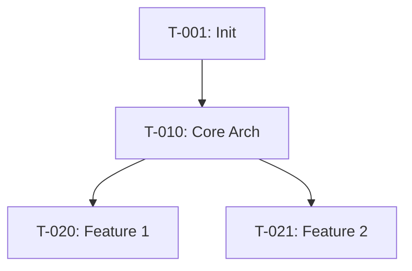

# Tracker Prompt

## Purpose
Generate and update Tracker.md - the global task registry derived from strategy layer documents. Adapts for both new and existing projects, and handles updates after each session.

**Single source of truth for tracker.md changes.**

---

## Prerequisites

**For Generation (Initial Creation):**
- Design.md (complete)
- Scope.md (complete)
- Requirements.md (complete)

**For Updates (After Sessions):**
- Current Tracker.md
- Update command from user

---

## Context Detection

Detect operation mode:

**IF user says:** "Generate Tracker" OR "Create Tracker.md"
→ **GENERATE MODE** (initial creation)
  - Read Design.md to detect project type:
    - IF Design.md has §14 (Architecture Evolution Plan) → **Existing project**
    - ELSE → **New project**

**IF user says:** "Update tracker: [changes]" OR provides update command
→ **UPDATE MODE** (apply session changes)

---

## PART 1: GENERATE TRACKER (Initial Creation)

### Step 1: Read Complete Strategy Layer

**CRITICAL:** Read ALL three documents COMPLETELY in this order:

1. **Design.md** - Read COMPLETE document (all sections)
   - Architecture patterns and layers
   - Tech stack decisions
   - Standards and principles
   - For existing: §13 Technical Debt + §14 Evolution Plan

2. **Scope.md** - Read COMPLETE document (all sections)
   - Vision and goals
   - §4 In-Scope Features (these become tasks)
   - Success metrics
   - Constraints

3. **Requirements.md** - Read COMPLETE document (all sections)
   - §1 Functional Requirements (detailed tasks source)
   - §2 Business Rules
   - §3 Data Entities
   - §7 Integration Requirements
   - For existing: §8 New Requirements

**Do NOT skip any sections. Full context is essential.**

---

### Step 2A: Generate Tracker for NEW PROJECT

### Task Categories:

1. **Infrastructure Setup**
2. **Core Architecture Implementation**
3. **Feature Development** (from Requirements)
4. **Testing Infrastructure**
5. **CI/CD Pipeline**
6. **Documentation**
7. **Deployment**

### Process:

**A) Infrastructure Tasks**
From Design.md §4 (Project Structure):
```
T-001: Initialize project structure
- Description: Create folder structure per Design.md §4.1
- Category: Infrastructure
- Priority: Must Have
- Dependencies: None
- Estimated Effort: 1 hour
- Acceptance Criteria:
  - All folders from Design.md §4.1 created
  - Base configuration files present
  - README.md created
```

**B) Core Architecture Tasks**
From Design.md §2 (Architecture):
```
T-010: Implement [Layer Name] layer
- Description: Create base structure for [layer]
- Category: Core Architecture
- Priority: Must Have
- Dependencies: T-001
- Estimated Effort: [hours]
- Acceptance Criteria:
  - [Layer] folder structure created
  - Base interfaces defined per Design.md §2.1
  - Dependency injection configured
```

**C) Feature Development Tasks**
From Requirements.md §1 (Functional Requirements):

For EACH functional requirement (FR-XXX):
```
T-0XX: Implement [FR-XXX Title]
- Description: [From FR description]
- Category: Feature Development
- Priority: [From FR priority]
- Feature: [Feature category from Requirements]
- Dependencies: [Core architecture tasks]
- Estimated Effort: [Based on complexity]
- Acceptance Criteria:
  - [All criteria from FR-XXX]
  - Unit tests with >80% coverage
  - Integration tests pass
```

**D) Other Tasks**
- Testing setup (from Design.md §10)
- CI/CD (from Design.md §5.4)
- Documentation (from Design.md §7.2)

### Dependencies:
```
Infrastructure → Core Architecture → Features → Deployment
```

---

### Step 2B: Generate Tracker for EXISTING PROJECT

### Task Categories (4 types):

1. **Feature Development** (new functionality)
2. **Architecture Improvement** (refactoring)
3. **Technical Debt** (fixes)
4. **Migration** (upgrade tasks)

### Process:

**A) Feature Development Tasks**
From Requirements.md §8 (New Requirements):
```
T-001: Implement [NFR-XXX Title]
- Description: [From NFR description]
- Category: Feature Development
- Priority: [From NFR priority]
- Dependencies: [May depend on architecture improvements]
- Estimated Effort: [hours]
- Acceptance Criteria:
  - [From NFR-XXX criteria]
```

**B) Architecture Improvement Tasks**
From Design.md §14.3 (Improvement ADRs):
```
T-050: [ADR-01X Proposed Improvement]
- Description: Implement improvement from ADR-01X
- Category: Architecture Improvement
- Priority: [Based on ADR impact]
- Phase: [From Design.md §14.4 Migration Phases]
- Dependencies: [May depend on migration tasks]
- Estimated Effort: [hours]
- Acceptance Criteria:
  - ADR-01X implementation complete
  - Tests updated
  - Documentation updated
```

**C) Technical Debt Tasks**
From Design.md §13 (Technical Debt Analysis):
```
T-100: Fix [Issue from §13]
- Description: [Issue description]
- Category: Technical Debt
- Priority: [P0/P1/P2 from §13]
- Impact: [High/Med/Low from §13]
- Effort: [High/Med/Low from §13]
- Dependencies: [None or other debt]
- Estimated Effort: [hours]
- Acceptance Criteria:
  - Issue resolved
  - Validation tests pass
```

**D) Migration Tasks**
From Design.md §14.4 (Migration Phases):
```
T-150: [Phase 1 Task]
- Description: [From migration phase]
- Category: Migration
- Phase: Phase 1 - Foundation
- Priority: Must Have
- Dependencies: [Sequential within phase]
- Estimated Effort: [hours]
- Acceptance Criteria:
  - [Phase deliverable met]
  - No breaking changes to existing features
```

### Dependencies:
```
Migration → Architecture Improvements → Features
Technical Debt → May block Features
```

### Phase Alignment:
Group tasks by Design.md §14.4 phases:
- Phase 1: Foundation (T-150 to T-159)
- Phase 2: Refactoring (T-050 to T-069)
- Phase 3: Features (T-001 to T-030)
- Phase 4: Optimization (T-070 to T-089)

---

## PART 2: UPDATE TRACKER (After Session)

### Purpose
Apply changes to tracker.md based on user command. This is the ONLY way tracker.md should be updated.

### Input Format

User provides update command:

**Format:** "Update tracker: [changes]"

**Examples:**
```
"Update tracker: T-003 ⚪→✅, T-004 ⚪→🟡"
"Update tracker: T-005 ⚪→✅, T-029 new task"
"Update tracker: T-012 completed, unblock T-015"
```

### Step 1: Parse Update Command

Extract from command:
- Task IDs mentioned
- Status changes (⚪ → 🟡 → ✅)
- New tasks to add
- Dependencies to update

### Step 2: Read Current Tracker

Read tracker.md completely to:
- Find tasks mentioned in update
- Identify dependent tasks
- Get current metrics

### Step 3: Apply Status Changes

For each task with status change:

**Update Status:**
```markdown
Before:
**T-003: Design database schema** [⚪ Not Started]

After:
**T-003: Design database schema** [✅ Complete]
```

**Add Completion Details:**
```markdown
- **Actual Effort:** [From session if provided]
- **Completion Date:** [Today's date]
- **Evidence:** 
  - [Links from session Closing Report if provided]
- **Notes:**
  - [Any notes from session if provided]
```

### Step 4: Update Dependencies

If a task changed to ✅ Complete:

```markdown
Find tasks with:
- **Dependencies:** T-003

Update those tasks:
Before: [⏸️ Blocked by T-003]
After:  [⚪ Ready to start]
```

### Step 5: Add New Tasks

If command includes "new task":

```markdown
**T-029: [Task title from command]** [⚪ Not Started]
- **Description:** [From command or ask user]
- **Category:** [Infer or ask]
- **Priority:** [From command or ask]
- **Dependencies:** [From command or None]
- **Estimated Effort:** [From command or ask]
- **Acceptance Criteria:**
  - [Ask user or TBD]
```

### Step 6: Recalculate Metrics

Update progress metrics:

```markdown
**Overall Progress:** X/Y tasks complete (Z%)
(Recalculate based on new statuses)

**By Category:**
- Infrastructure: X/Y complete
- Features: X/Y complete
(Update each category)

**Velocity:**
- Last 3 sessions: X tasks/session
(Calculate from recent completion dates)
```

### Step 7: Update Change Log

Add entry:

```markdown
| Date | Changes | Updated By |
|------|---------|------------|
| 2026-01-22 | T-003→✅, T-004→🟡, T-029 added | Session #005 |
```

### Step 8: Confirm Changes

After applying updates:

```markdown
✅ Tracker.md updated successfully

Changes applied:
- T-003: ⚪ → ✅ Complete
- T-004: ⚪ → 🟡 In Progress  
- T-015: ⏸️ → ⚪ Ready (unblocked by T-003)
- T-029: Added as new task

Progress: 4% → 6%
Velocity: 1.5 tasks/session (last 3 sessions)
```

### Step 9: Validation

Check:
- [ ] All mentioned tasks found and updated
- [ ] Dependencies correctly updated
- [ ] Metrics recalculated
- [ ] Change log entry added
- [ ] No formatting broken

---

## Template Structure

```markdown
# Tracker - Global Task Registry

> **Purpose:** Complete roadmap of all development tasks.  
> **Generated From:** Design.md + Scope.md + Requirements.md  
> **Updated:** After every session via 5-tracker.prompt.md  
> **Used By:** session.prompt.md to plan work

---

## TASK REGISTRY

### Legend
- ⚪ Not Started - Ready to begin
- 🟡 In Progress - Currently being worked
- ✅ Complete - Finished and validated
- ⏸️ Blocked - Cannot start (dependency)
- 🚫 Cancelled - No longer needed

---

[FOR NEW PROJECTS]

### Infrastructure Setup (7 tasks)

**T-001: Initialize project structure** [✅ Complete]
- **Category:** Infrastructure
- **Priority:** Must Have
- **Dependencies:** None
- **Estimated Effort:** 1 hour
- **Actual Effort:** 45 minutes
- **Acceptance Criteria:**
  - ✅ All folders created per Design.md §4.1
  - ✅ Base config files present
- **Evidence:** 
  - Commit: abc123f
- **Completed:** 2026-01-15
- **Notes:** Used cookiecutter template

[Continue for all tasks...]

---

[FOR EXISTING PROJECTS]

### Feature Development Tasks (10 tasks)

[Tasks from Requirements §8]

### Architecture Improvement Tasks (8 tasks)

[Tasks from Design §14.3]

### Technical Debt Tasks (12 tasks)

[Tasks from Design §13]

### Migration Tasks (15 tasks)

[Tasks from Design §14.4, grouped by phase]

**Phase 1: Foundation**
- T-150 to T-159

**Phase 2: Refactoring**
- T-050 to T-069

---

## DEPENDENCIES



---

## PROGRESS METRICS

**Overall Progress:** X/Y tasks complete (Z%)

**By Category:**
- Infrastructure: X/Y complete
- Features: X/Y complete
- Testing: X/Y complete

**Velocity:**
- Last 3 sessions: X tasks/session
- Average efficiency: X%

---

## RETROSPECTIVE (Updated Monthly)

**What's Working:**
- [Item 1]

**What's Not:**
- [Item 1]

**Action Items:**
- [Item 1]

---

## CHANGE LOG

| Date | Changes | Updated By |
|------|---------|------------|
| [Date] | Initial tracker generated | AI |\n| [Date] | T-003 completed, T-004 unblocked | Session #003 |
```

---

## Update Command Examples

### Example 1: Simple Status Change
```
User: "Update tracker: T-003 ⚪→✅"

AI: Parses as:
- T-003 status change: Not Started → Complete
- Check for dependent tasks
- Update metrics
- Confirm
```

### Example 2: Multiple Updates
```
User: "Update tracker: T-005 ⚪→✅, T-006 ⚪→✅, T-007 ⚪→🟡"

AI: Parses as:
- T-005: Not Started → Complete
- T-006: Not Started → Complete  
- T-007: Not Started → In Progress
- Check dependencies for all three
- Update metrics
- Confirm
```

### Example 3: New Task
```
User: "Update tracker: T-029 new task (Priority: High, Effort: 3h)"

AI: Parses as:
- Create T-029
- Set Priority: High
- Set Effort: 3h
- Ask for: Description, Category, Dependencies, Acceptance Criteria
- Add to tracker
- Confirm
```

### Example 4: Complex Update
```
User: "Update tracker: T-012 ⚪→✅ completed, unblock T-015 and T-016"

AI: Parses as:
- T-012: Not Started → Complete
- T-015: Blocked → Ready (remove T-012 dependency)
- T-016: Blocked → Ready (remove T-012 dependency)
- Update metrics
- Confirm
```

---

## Validation Checklist

**For Generation (New Projects):**
- [ ] Read Design, Scope, Requirements COMPLETELY
- [ ] All features from Scope §4 have tasks
- [ ] All FRs from Requirements have tasks
- [ ] Dependencies are logical
- [ ] Priorities align with Scope goals
- [ ] All 7 categories represented

**For Generation (Existing Projects):**
- [ ] Read Design, Scope, Requirements COMPLETELY
- [ ] All 4 task categories present
- [ ] Tasks aligned with Migration Phases (Design §14.4)
- [ ] Technical debt rated by priority
- [ ] Dependencies account for migration order

**For Updates:**
- [ ] Command parsed correctly
- [ ] All mentioned tasks found in tracker
- [ ] Status changes applied
- [ ] Dependencies updated (blocked → ready)
- [ ] New tasks added with required fields
- [ ] Metrics recalculated
- [ ] Change log entry added
- [ ] Changes confirmed to user

---

## Error Handling

**If task ID not found:**
```
❌ Error: T-099 not found in tracker.md

Available tasks: T-001 to T-050
Did you mean one of these?
```

**If command unclear:**
```
⚠️ Cannot parse update command

Expected format:
"Update tracker: T-XXX ⚪→✅, T-YYY new task"

Please clarify your update request.
```

**If dependency conflict:**
```
⚠️ Warning: T-020 depends on T-012, but T-012 is not complete

Cannot mark T-020 as Ready until T-012 is ✅

Proceed anyway? (Yes/No)
```

---

## Tips

**For Generation:**
1. **Be Comprehensive:** Every feature needs tasks
2. **Be Realistic:** Estimate effort conservatively
3. **Be Clear:** Acceptance criteria must be testable
4. **Track Dependencies:** Visualize with Mermaid

**For Updates:**
1. **Parse Carefully:** Extract all task IDs and changes
2. **Update Dependencies:** Always check for blocked tasks
3. **Recalculate Metrics:** Progress and velocity
4. **Confirm Changes:** List what was updated

---

## CRITICAL REMINDERS

1. **Single Source of Truth:** This prompt is the ONLY way to update tracker.md
2. **Session Prompt Proposes:** 6-session.prompt.md only proposes updates
3. **User Invokes:** User explicitly calls this prompt to apply changes
4. **Complete Updates:** Always update dependencies and metrics
5. **Validation Required:** Check all changes before confirming

---

## CHANGE LOG

| Version | Date | Changes |
|---------|------|------------|
| 1.0 | 2026-01-15 | Initial prompt created |
| 1.1 | 2026-01-22 | Added UPDATE MODE for session updates |
