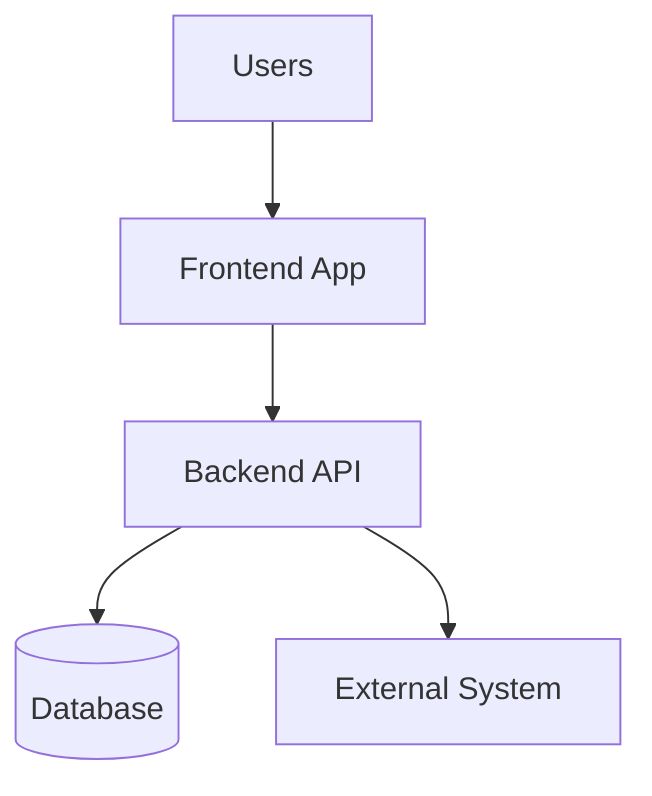

# Design Document Template

> **Purpose:** Define HOW the system will be built through architecture, technical decisions, and development standards.  
> **Created After:** Requirements.md (read it completely first)  
> **Estimated Time:** 6-10 hours  
> **Next Document:** Tracker.md (implementation planning based on this design)

---

## ⚠️ CRITICAL: READ THIS FIRST

### AI Presentation Order (When Generating Code)

**IMPORTANT:** When using AI assistants to generate code or plans, always present documents in this order:

1. **design.md FIRST** ← Technical constraints are non-negotiable
2. **scope.md SECOND** ← Project boundaries and goals
3. **requirements.md THIRD** ← Detailed features and user stories

### Why This Matters

AI models give more weight to information they read first. If AI reads scope.md before design.md, it will suggest "path of least resistance" solutions that may violate your architectural decisions.

**Example:**
- ❌ **Wrong:** "Read scope: need real-time chat app" → AI suggests Firebase/WebSockets (easiest path)
- ✅ **Right:** "Read design: FastAPI + PostgreSQL only. Then read scope: need real-time chat" → AI suggests Server-Sent Events or polling within your constraints

**Always prompt AI like this:**
```
"FIRST read design.md for non-negotiable technical constraints.
THEN read scope.md and requirements.md.
Generate [code/plan] respecting the architectural decisions in design.md."
```

---

## 📋 TABLE OF CONTENTS

1. [PROJECT OVERVIEW](#1-project-overview) [REQUIRED]
2. [ARCHITECTURE](#2-architecture) [REQUIRED]
3. [TECH STACK](#3-tech-stack) [REQUIRED]
4. [DEVELOPMENT WORKFLOW](#4-development-workflow) [REQUIRED]
5. [CORE PRINCIPLES](#5-core-principles) [REQUIRED]
6. [CODING STANDARDS](#6-coding-standards) [REQUIRED]
7. [SECURITY GUIDELINES](#7-security-guidelines) [REQUIRED]
8. [PERFORMANCE STANDARDS](#8-performance-standards) [REQUIRED]
9. [TESTING STRATEGY](#9-testing-strategy) [REQUIRED]
10. [EXTERNAL INTEGRATIONS](#10-external-integrations) [OPTIONAL]
11. [ARCHITECTURE DECISION RECORDS (ADRs)](#11-architecture-decision-records-adrs) [REQUIRED]

---

## Document Information

| Field | Value |
|-------|-------|
| **Project Name** | [Project name from Scope.md] |
| **Version** | 1.0 |
| **Last Updated** | [Date] |
| **Author(s)** | [Name(s)] |
| **Status** | Draft / In Review / Approved |
| **Based On** | Requirements.md v[X.X] |

---

## 1. PROJECT OVERVIEW [REQUIRED]

### 1.1 Project Name

**Official Name:** [Full project name]  
**Internal Codename:** [Codename if different from official name, or N/A]  
**Abbreviation:** [Commonly used short form, if applicable]

### 1.2 Project Type

Select all that apply:

- [ ] **Frontend Only** - User interface application (web, mobile, desktop)
- [ ] **Backend Only** - API, microservices, data processing
- [ ] **Fullstack** - Integrated frontend + backend
- [ ] **System Integration** - Connecting multiple existing systems
- [ ] **Mobile Application** - iOS, Android, or cross-platform
- [ ] **Desktop Application** - Windows, macOS, Linux
- [ ] **CLI Tool** - Command-line utility
- [ ] **Library/SDK** - Reusable component for other systems
- [ ] **Other:** [Specify]

### 1.3 Repository Strategy

Select one:

- [ ] **Monorepo** - All code in a single repository
- [ ] **Polyrepo** - Separate repositories per component/service

**Justification:**  
[Explain why this strategy was chosen. Consider factors like: team size, deployment independence, code sharing needs, build complexity, version management]

**Repository Structure:**  
If monorepo, describe folder organization:
```
/
├── apps/
│   ├── [app1]/
│   └── [app2]/
├── packages/
│   ├── [shared-lib1]/
│   └── [shared-lib2]/
└── [other folders]
```

If polyrepo, list repositories:
- Repository 1: [Name] - [URL] - [Purpose]
- Repository 2: [Name] - [URL] - [Purpose]

### 1.4 Brief Description

**What:** [What the system does in 2-3 sentences]

**Who:** [Who the primary users are]

**Why:** [Core business value or problem being solved]

---

## 2. ARCHITECTURE [REQUIRED]

### 2.1 Architecture Pattern

**Primary Pattern:** [e.g., Clean Architecture, Microservices, Layered Architecture, Hexagonal Architecture, Event-Driven, CQRS, etc.]

**Why This Pattern:**  
[Explain the rationale for choosing this architectural pattern. What problems does it solve? What benefits does it provide for this specific project?]

**Pattern Description:**  
[Describe how the pattern is implemented in this project. What are the key characteristics? How does it differ from a standard implementation of this pattern?]

### 2.2 System Components

List all major components and their responsibilities:

| Component | Responsibility | Dependencies |
|-----------|----------------|--------------|
| [Component 1] | [What it does] | [What it depends on] |
| [Component 2] | [What it does] | [What it depends on] |
| [Component 3] | [What it does] | [What it depends on] |

**Component Interaction:**  
[Describe how components communicate with each other. Synchronous vs asynchronous? APIs? Message queues? Events?]

### 2.3 Component Diagrams

**System Context Diagram:**

Option 1 - Mermaid syntax:


Option 2 - Textual description:
```
[Describe the high-level architecture showing:
- All major components
- External systems
- Data flow direction
- Key integration points]
```

Option 3 - Link to external diagram:  
[Link to draw.io, Lucidchart, or other diagram file]

**Component Diagram:**

[Show internal structure if system has multiple components/services. Include:]
- Component boundaries
- Communication protocols (REST, gRPC, message queue, etc.)
- Data stores
- Caching layers

### 2.4 Layer Separation

Describe architectural layers or boundaries:

**Layer 1: [Name]**
- **Responsibilities:** [What this layer does]
- **Allowed Dependencies:** [What this layer can depend on]
- **Examples:** [Concrete examples from your system]

**Layer 2: [Name]**
- **Responsibilities:** [What this layer does]
- **Allowed Dependencies:** [What this layer can depend on]
- **Examples:** [Concrete examples from your system]

**Layer 3: [Name]**
- **Responsibilities:** [What this layer does]
- **Allowed Dependencies:** [What this layer can depend on]
- **Examples:** [Concrete examples from your system]

**Dependency Rules:**
- Layer X can depend on Layer Y
- Layer A CANNOT depend on Layer B
- [Other critical dependency rules]

---

## 3. TECH STACK [REQUIRED]

### 3.1 Frontend Stack (if applicable)

**Language & Version:**  
- Primary: [e.g., TypeScript 5.3]
- Secondary: [If applicable]

**Framework & Version:**  
- [e.g., React 18.2, Vue 3.4, Angular 17, etc.]

**UI Library/Framework:**  
- [e.g., Material-UI v5, Ant Design, Tailwind CSS 3.4, Bootstrap 5]

**State Management:**  
- [e.g., Redux Toolkit 2.0, Zustand 4.5, Pinia, Context API, etc.]

**Build Tools:**  
- Bundler: [e.g., Vite 5.0, Webpack 5, Parcel]
- Package Manager: [npm 10.x, pnpm 8.x, yarn 4.x]

**Key Dependencies:**

| Package | Version | Purpose |
|---------|---------|---------|
| [Package 1] | [Version] | [What it's used for] |
| [Package 2] | [Version] | [What it's used for] |

### 3.2 Backend Stack (if applicable)

**Language & Version:**  
- [e.g., Python 3.12, Node.js 20 LTS, Java 21, C# .NET 8, Go 1.22]

**Framework & Version:**  
- [e.g., FastAPI 0.109, Express 4.18, Spring Boot 3.2, ASP.NET Core 8.0]

**API Type:**  
- [ ] REST API
- [ ] GraphQL
- [ ] gRPC
- [ ] WebSockets
- [ ] Other: [Specify]

**Authentication:**  
- [e.g., JWT, OAuth 2.0, Session-based, API Keys]

**Key Dependencies:**

| Package | Version | Purpose |
|---------|---------|---------|
| [Package 1] | [Version] | [What it's used for] |
| [Package 2] | [Version] | [What it's used for] |

### 3.3 Database & Storage

**Primary Database:**  
- Type: [e.g., PostgreSQL, MySQL, MongoDB, SQL Server]
- Version: [Specific version number]
- Purpose: [Main application data]

**Secondary Database (if applicable):**  
- Type: [e.g., Redis, Elasticsearch]
- Version: [Specific version number]
- Purpose: [Caching, search, etc.]

**File Storage:**  
- Solution: [e.g., AWS S3, Azure Blob Storage, Local filesystem]
- Purpose: [What types of files are stored]

**Database Design Approach:**  
- [ ] ORM-first (define models in code)
- [ ] Database-first (SQL migrations)
- [ ] Schema versioning: [Tool used, e.g., Alembic, Flyway, EF Migrations]

### 3.4 Infrastructure & Cloud

**Hosting Platform:**  
- [e.g., AWS, Azure, GCP, Heroku, Vercel, Self-hosted]

**Container Strategy:**  
- [ ] Docker
- [ ] Kubernetes
- [ ] No containerization
- [ ] Other: [Specify]

**CI/CD:**  
- Platform: [e.g., GitHub Actions, GitLab CI, Azure DevOps, Jenkins]
- Workflow: [Describe automation: tests, builds, deployments]

**Monitoring & Logging:**  
- Application monitoring: [e.g., Datadog, New Relic, Application Insights]
- Log aggregation: [e.g., ELK stack, Splunk, CloudWatch]
- Error tracking: [e.g., Sentry, Rollbar, Bugsnag]

### 3.5 Key Dependencies

List critical third-party libraries/services that the project cannot function without:

| Dependency | Type | Version | Purpose | Alternative Considered |
|------------|------|---------|---------|----------------------|
| [Name] | [Library/Service] | [Version] | [Why it's critical] | [What else was considered] |

**Dependency Update Policy:**  
[How and when dependencies are updated. e.g., "Monthly review of security patches, quarterly updates of minor versions"]

---

## 4. DEVELOPMENT WORKFLOW [REQUIRED]

### 4.1 Environment Strategy

**Environments:**

| Environment | Purpose | URL/Access | Auto-Deploy? |
|-------------|---------|------------|--------------|
| **Development (dev)** | Local development, rapid testing | localhost:XXXX | No |
| **Testing (test)** | Automated tests, QA validation | [URL] | Yes (on push to test branch) |
| **Staging (staging)** | Pre-production, client review | [URL] | Yes (on push to staging branch) |
| **Production (prod)** | Live system | [URL] | Manual approval required |

**Environment-Specific Configuration:**  
[How configuration differs between environments. Database connections, API keys, feature flags, etc.]

**Access Control:**  
- Development: [Who has access]
- Testing: [Who has access]
- Staging: [Who has access]
- Production: [Who has access]

### 4.2 Branch Strategy

**Primary Branches:**

- **main** (or master): Production-ready code
- **staging**: Pre-production testing
- **develop**: Integration branch for features

**Feature Branches:**  
- Naming: `feature/[ticket-id]-brief-description`
- Created from: `develop`
- Merged into: `develop`

**Release Branches:**  
- Naming: `release/v[X.Y.Z]`
- Created from: `develop`
- Merged into: `main` and `develop`

**Hotfix Branches:**  
- Naming: `hotfix/[ticket-id]-brief-description`
- Created from: `main`
- Merged into: `main` and `develop`

**Branch Protection Rules:**
- `main`: Requires PR approval, passing tests, no direct commits
- `staging`: Requires PR approval, passing tests
- `develop`: Requires passing tests

### 4.3 Deployment Pipeline

**Development → Testing:**
1. Developer pushes to feature branch
2. Automated tests run (unit, integration)
3. Developer merges feature branch to develop
4. Auto-deploy to testing environment
5. Smoke tests run automatically

**Testing → Staging:**
1. Create release branch from develop
2. Deploy to staging environment
3. Run full regression test suite
4. QA team performs manual testing
5. Stakeholder review and approval

**Staging → Production:**
1. Final approval from [role]
2. Merge release branch to main
3. Tag release: `v[X.Y.Z]`
4. Deploy to production (manual trigger)
5. Monitor for errors for [timeframe]
6. Rollback plan: [describe rollback procedure]

**Deployment Checklist:**
- [ ] All tests passing
- [ ] Database migrations reviewed
- [ ] Environment variables verified
- [ ] Monitoring alerts configured
- [ ] Rollback plan documented

### 4.4 Quality Gates

**Code Quality:**
- Code review required: [Number] approvals minimum
- Automated linting: [Tool and rules]
- Code coverage minimum: [Percentage]

**Testing:**
- Unit tests: Must pass 100%
- Integration tests: Must pass 100%
- E2E tests: Must pass [percentage] (may have flaky tests)

**Security:**
- Dependency vulnerability scanning: [Tool]
- SAST (Static Application Security Testing): [Tool, if applicable]
- Maximum critical vulnerabilities: 0

**Performance:**
- Build time: < [X] minutes
- Bundle size (frontend): < [X] MB
- API response time: < [X] ms (95th percentile)

---

## 5. CORE PRINCIPLES [REQUIRED]

### 5.1 Design Philosophy

**Primary Design Principles:**

1. **[Principle 1]**  
   [Describe the principle and why it matters for this project]  
   Example: "Fail fast, validate at boundaries" - Validate all inputs at API entry points rather than deep in business logic

2. **[Principle 2]**  
   [Description]

3. **[Principle 3]**  
   [Description]

**Design Priorities (Ranked):**
1. [e.g., Security]
2. [e.g., Performance]
3. [e.g., Maintainability]
4. [e.g., Scalability]
5. [e.g., Developer Experience]

### 5.2 Trade-offs Accepted

Document known trade-offs and why they're acceptable:

**Trade-off 1: [Name]**
- **Chosen:** [What we chose]
- **Over:** [What we gave up]
- **Rationale:** [Why this trade-off makes sense]
- **Consequences:** [What this means for the project]

Example:
- **Chosen:** Monolithic architecture initially
- **Over:** Microservices from day one
- **Rationale:** Team size is small (3 developers), and early requirements are unclear. Premature microservices would add complexity without benefit.
- **Consequences:** May require significant refactoring if system grows to 10+ developers or needs independent scaling of components.

**Trade-off 2: [Name]**
[Repeat structure]

### 5.3 Non-negotiable Rules

These rules CANNOT be violated without explicit architectural approval:

1. **[Rule 1]**  
   [State the rule clearly]  
   Reason: [Why this rule exists]  
   Enforced by: [How it's enforced - linter, code review, automated test]

   Example:
   - **All database queries must use parameterized queries (no string concatenation)**
   - Reason: Prevent SQL injection vulnerabilities
   - Enforced by: Code review + SAST tools

2. **[Rule 2]**  
   [Description]

3. **[Rule 3]**  
   [Description]

---

## 6. CODING STANDARDS [REQUIRED]

### 6.1 Naming Conventions

**Files:**
- Components: [e.g., PascalCase.tsx, kebab-case.component.ts]
- Utilities: [e.g., camelCase.ts, snake_case.py]
- Tests: [e.g., ComponentName.test.ts, test_function_name.py]

**Variables:**
- Constants: [e.g., UPPER_SNAKE_CASE, ALL_CAPS]
- Local variables: [e.g., camelCase, snake_case]
- Private members: [e.g., _prefixedCamelCase, __private]

**Functions/Methods:**
- Public: [e.g., camelCase, snake_case]
- Private: [e.g., _prefixedCamelCase]
- Async functions: [Prefix convention, if any]

**Classes:**
- [e.g., PascalCase for all languages]
- Interfaces: [e.g., IPascalCase, PascalCase]
- Abstract classes: [Prefix/suffix convention]

**Database:**
- Tables: [e.g., snake_case, PascalCase]
- Columns: [e.g., snake_case, camelCase]
- Indexes: [Naming pattern]
- Foreign keys: [Naming pattern]

### 6.2 File/Folder Structure

**Frontend Structure (if applicable):**
```
src/
├── components/
│   ├── common/
│   ├── layout/
│   └── features/
├── pages/
├── services/
├── hooks/
├── utils/
├── types/
└── [other folders]
```

**Backend Structure (if applicable):**
```
src/
├── api/
│   ├── routes/
│   ├── controllers/
│   └── middleware/
├── domain/
│   ├── models/
│   └── services/
├── infrastructure/
│   ├── database/
│   └── external/
└── [other folders]
```

**Folder Organization Rules:**
- [e.g., "Group by feature, not by file type"]
- [e.g., "Shared code goes in common/ or shared/"]
- [e.g., "Maximum 3 levels of nesting"]

### 6.3 Code Style

**Style Guide:**  
[Reference to official style guide being followed, e.g., "Airbnb JavaScript Style Guide", "PEP 8 for Python", "Google Java Style Guide"]

**Linter Configuration:**  
- Tool: [e.g., ESLint, Pylint, RuboCop]
- Config file: [Path to config file, e.g., .eslintrc.json]
- Rules enabled/disabled: [Notable customizations]

**Formatter:**  
- Tool: [e.g., Prettier, Black, Gofmt]
- Config file: [Path to config file]
- Auto-format on save: Yes/No

**Language-Specific Conventions:**

**JavaScript/TypeScript:**
- Use semicolons: Yes/No
- Quote style: Single/Double
- Trailing commas: Required in multiline
- Arrow functions: Preferred over function keyword
- [Other conventions]

**Python:**
- Line length: [e.g., 88 characters (Black default), 79 characters (PEP 8)]
- Type hints: Required for all public functions
- Docstrings: [Format - Google, NumPy, reStructuredText]
- [Other conventions]

**[Other Language]:**
[Language-specific conventions]

### 6.4 Documentation Standards

**Code Comments:**
- When to comment: [e.g., "Comment WHY, not WHAT. Explain non-obvious decisions."]
- When NOT to comment: [e.g., "Don't comment obvious code. Use clear naming instead."]

**Function/Method Documentation:**
- Required for: [e.g., "All public APIs, complex algorithms"]
- Format: [e.g., JSDoc, Python docstrings, XML comments]
- Must include: [e.g., "Description, parameters, return value, exceptions"]

**Example:**
```
/**
 * Calculates the total cost including tax and shipping.
 * 
 * @param subtotal - Base price before tax and shipping
 * @param taxRate - Tax rate as decimal (e.g., 0.08 for 8%)
 * @param shippingCost - Fixed shipping cost
 * @returns Total cost rounded to 2 decimal places
 * @throws Error if subtotal or taxRate is negative
 */
```

**README Requirements:**
- Every module/package must have a README
- Must include: Purpose, installation, usage examples, API reference
- Format: Markdown

**Architecture Documentation:**
- Maintained in: [e.g., "This design.md file + ADRs"]
- Updated when: [e.g., "When making significant architectural changes"]

---

## 7. SECURITY GUIDELINES [REQUIRED]

### 7.1 Authentication & Authorization

**Authentication Method:**  
- [e.g., JWT with RS256, OAuth 2.0, SAML, Session-based]

**Token/Session Management:**
- Token expiration: [e.g., Access tokens: 15 minutes, Refresh tokens: 7 days]
- Storage: [e.g., "Access tokens in memory, refresh tokens in httpOnly cookies"]
- Rotation: [Policy for rotating secrets/keys]

**Authorization Model:**  
- [e.g., RBAC (Role-Based Access Control), ABAC (Attribute-Based), Claims-based]

**Roles & Permissions:**

| Role | Permissions | Description |
|------|-------------|-------------|
| [Role 1] | [List of permissions] | [Who has this role] |
| [Role 2] | [List of permissions] | [Who has this role] |

**Enforcement:**
- API level: [How authorization is enforced]
- UI level: [How features are hidden/disabled]
- Database level: [Row-level security, if applicable]

### 7.2 Data Protection

**Data Classification:**

| Classification | Examples | Protection Required |
|----------------|----------|---------------------|
| **Public** | Marketing content, public docs | None |
| **Internal** | Employee directory, internal docs | Authentication required |
| **Confidential** | Customer data, financial records | Encryption + access control |
| **Restricted** | Passwords, payment details, PII | Encryption + strict access + audit logging |

**Encryption:**
- **At Rest:** [Algorithm, key management]
  - Database: [Encryption method]
  - File storage: [Encryption method]
  - Backups: [Encryption method]

- **In Transit:** [TLS version, cipher suites]
  - API calls: TLS 1.3 minimum
  - Database connections: [Encrypted? Certificate validation?]
  - Internal service communication: [Encrypted?]

**Sensitive Data Handling:**
- PII (Personally Identifiable Information): [Storage policy, retention, deletion]
- Payment information: [Never stored / Tokenized / Encrypted]
- Passwords: [Hashing algorithm, e.g., bcrypt with cost factor 12]
- API keys/secrets: [Storage method, rotation policy]

### 7.3 API Security

**Rate Limiting:**
- Authenticated users: [X] requests per [timeframe]
- Unauthenticated users: [X] requests per [timeframe]
- By IP: [X] requests per [timeframe]

**Input Validation:**
- Validate all inputs against strict schemas
- Reject requests with unexpected fields
- Sanitize all user input before processing
- Use allowlists, not denylists

**CORS (Cross-Origin Resource Sharing):**
- Allowed origins: [List of allowed domains]
- Credentials: Allowed/Not allowed
- Exposed headers: [List]

**API Versioning:**
- Strategy: [e.g., URL versioning /api/v1/, header-based]
- Deprecation policy: [How old versions are sunset]

**Security Headers:**
- Content-Security-Policy: [Policy]
- X-Frame-Options: DENY
- X-Content-Type-Options: nosniff
- Strict-Transport-Security: [Policy]
- [Other headers]

### 7.4 Secrets Management

**Secrets Storage:**
- Development: [e.g., .env file (gitignored), local vault]
- Testing/Staging/Production: [e.g., Azure Key Vault, AWS Secrets Manager, HashiCorp Vault]

**Secret Rotation:**
- Frequency: [e.g., Every 90 days for production, annually for dev]
- Process: [How secrets are rotated]

**Access Control:**
- Who can view secrets: [Roles/individuals]
- Who can modify secrets: [Roles/individuals]
- Audit logging: Required/Not required

**Never Commit:**
- Secrets, API keys, passwords
- Private keys, certificates
- Database connection strings with credentials
- OAuth client secrets

**Detection:**
- Tool: [e.g., git-secrets, truffleHog, GitHub secret scanning]
- Pre-commit hook: Yes/No

---

## 8. PERFORMANCE STANDARDS [REQUIRED]

### 8.1 Performance Targets (SLIs/SLOs)

**Service Level Indicators (SLIs):**

| Metric | Target (SLO) | Measurement Method | Priority |
|--------|--------------|-------------------|----------|
| **Uptime** | 99.9% | Uptime monitoring service | Critical |
| **API Response Time** | < 500ms (p95) | APM tool | Critical |
| **Page Load Time** | < 2s (First Contentful Paint) | Real User Monitoring | High |
| **Database Query Time** | < 100ms (avg) | Query performance logs | High |
| **Error Rate** | < 0.1% of requests | Error tracking service | Critical |
| [Metric] | [Target] | [Method] | [Priority] |

**Latency Budget:**
- Frontend rendering: < [X] ms
- API processing: < [X] ms
- Database queries: < [X] ms
- External API calls: < [X] ms
- Total end-to-end: < [X] ms

### 8.2 Optimization Requirements

**Required Optimizations:**

1. **Database:**
   - All queries must have appropriate indexes
   - N+1 query pattern is prohibited (use joins or batch loading)
   - Connection pooling required
   - Query result caching for expensive read operations

2. **Frontend:**
   - Code splitting for routes/large components
   - Lazy loading for images and below-the-fold content
   - Minification and compression enabled
   - CDN for static assets

3. **API:**
   - Response compression (gzip/brotli)
   - Pagination required for list endpoints (max [X] items per page)
   - Filtering and sorting on server-side, not client-side
   - Field selection (return only requested fields)

4. **Background Jobs:**
   - Long-running operations (> [X] seconds) must be asynchronous
   - Progress tracking for jobs > [X] minutes
   - Job retry mechanism with exponential backoff

### 8.3 Caching Strategy

**Cache Layers:**

| Layer | Technology | TTL | Use Cases |
|-------|-----------|-----|-----------|
| **Browser Cache** | HTTP headers | [Time] | Static assets, images |
| **CDN** | [e.g., CloudFront] | [Time] | Static files, API responses |
| **Application Cache** | [e.g., Redis] | [Time] | Session data, computed results |
| **Database Cache** | [DB-specific] | [Time] | Query results |

**Cache Invalidation Strategy:**
- [e.g., "Time-based expiration", "Event-based invalidation", "Manual purge"]

**What to Cache:**
- [e.g., "Reference data (rarely changes)"]
- [e.g., "Expensive computations"]
- [e.g., "Aggregated data"]

**What NOT to Cache:**
- [e.g., "User-specific sensitive data"]
- [e.g., "Rapidly changing data"]
- [e.g., "Large binary files"]

### 8.4 Monitoring & Alerting

**Monitoring Tools:**
- Application Performance Monitoring (APM): [Tool name]
- Infrastructure monitoring: [Tool name]
- Log aggregation: [Tool name]
- Uptime monitoring: [Tool name]
- Real User Monitoring (RUM): [Tool name]

**Key Metrics to Track:**
- Request rate (requests per second)
- Error rate (percentage)
- Response time (p50, p95, p99)
- CPU usage
- Memory usage
- Database connection pool utilization
- Queue depth (if applicable)

**Alerting Rules:**

| Alert | Condition | Severity | Action |
|-------|-----------|----------|--------|
| **High Error Rate** | Error rate > 1% for 5 minutes | Critical | Page on-call engineer |
| **Slow Response Time** | p95 > 2s for 10 minutes | High | Slack notification |
| **Service Down** | Uptime check fails 3 times | Critical | Page on-call engineer |
| [Alert] | [Condition] | [Severity] | [Action] |

**On-Call Rotation:**
- [Describe on-call schedule and escalation policy]

---

## 9. TESTING STRATEGY [REQUIRED]

### 9.1 Testing Levels

**Test Pyramid:**

```
      /\
     /  \    E2E Tests (5-10%)
    /____\   
   /      \  Integration Tests (20-30%)
  /________\ 
 /          \ Unit Tests (60-70%)
/____________\
```

**Unit Tests:**
- **Scope:** Individual functions, methods, classes
- **Isolation:** Mocked dependencies
- **Coverage Target:** ≥ [X]% of code
- **Run Frequency:** On every commit

**Integration Tests:**
- **Scope:** Multiple components working together
- **Isolation:** Real dependencies (database, external APIs may be mocked)
- **Coverage Target:** All critical workflows
- **Run Frequency:** On PR, before merge

**End-to-End (E2E) Tests:**
- **Scope:** Complete user workflows through UI
- **Isolation:** Full system (staging environment)
- **Coverage Target:** Critical user journeys only
- **Run Frequency:** Nightly, before production deployment

**Performance Tests:**
- **Scope:** Load testing, stress testing, spike testing
- **Tool:** [e.g., k6, JMeter, Gatling]
- **Frequency:** [e.g., Weekly on staging, before major releases]

### 9.2 Coverage Requirements

**Minimum Coverage Targets:**
- Overall code coverage: ≥ [X]%
- Critical business logic: ≥ 90%
- New code (in PRs): ≥ [X]%
- Changed code (in PRs): ≥ [X]%

**Exclusions from Coverage:**
- Generated code
- Configuration files
- Test files themselves
- [Other exclusions]

**Coverage Tool:**  
[e.g., Jest coverage, pytest-cov, JaCoCo]

**Coverage Reports:**
- Generated on: [e.g., Every PR, every commit]
- Visible in: [e.g., CI/CD pipeline, SonarQube]

### 9.3 Testing Tools

**Frontend Testing:**
- Unit/Integration: [e.g., Jest, Vitest, Jasmine]
- Component testing: [e.g., React Testing Library, Vue Test Utils]
- E2E: [e.g., Playwright, Cypress, Selenium]

**Backend Testing:**
- Unit: [e.g., pytest, JUnit, xUnit, Mocha]
- API testing: [e.g., Postman, REST Assured, Supertest]
- Database testing: [e.g., Test containers, in-memory database]

**Performance Testing:**
- [e.g., k6, JMeter, Locust, Artillery]

**Security Testing:**
- SAST: [e.g., SonarQube, Checkmarx]
- DAST: [e.g., OWASP ZAP, Burp Suite]
- Dependency scanning: [e.g., Snyk, Dependabot, npm audit]

### 9.4 CI/CD Integration

**Automated Test Execution:**

**On Commit:**
- Run unit tests
- Run linters
- Run security scans
- Generate coverage report

**On Pull Request:**
- All commit checks +
- Run integration tests
- Run E2E tests (smoke tests only)
- Check coverage thresholds

**Before Merge:**
- All PR checks must pass
- Manual approval required
- No merge if coverage decreases by > [X]%

**On Deploy to Staging:**
- Full E2E test suite
- Performance tests
- Security scans

**On Deploy to Production:**
- Smoke tests after deployment
- Monitor error rates for [timeframe]
- Automatic rollback if error rate > [threshold]

**Test Data Management:**
- Test data: [How test data is generated/maintained]
- Database state: [How database is seeded/cleaned between tests]
- External dependencies: [How external APIs are mocked]

---

## 10. EXTERNAL INTEGRATIONS [OPTIONAL]

> **Note:** This section is optional. Include it if your system integrates with external APIs, services, or systems. Remove this section if not applicable.

### 10.1 Third-party APIs

**Integration 1: [Service Name]**

- **Provider:** [Company name]
- **Purpose:** [What this integration is used for]
- **API Type:** [REST, GraphQL, SOAP, etc.]
- **Documentation:** [Link to API docs]
- **Authentication:** [Method - API key, OAuth, etc.]
- **Rate Limits:** [X requests per Y timeframe]
- **Cost:** [Free tier limits, pricing model]
- **Endpoints Used:**
  - `GET /endpoint1` - [Purpose]
  - `POST /endpoint2` - [Purpose]

**Integration 2: [Service Name]**
[Repeat structure]

### 10.2 External Services

**Service Dependencies:**

| Service | Purpose | Critical? | Fallback Strategy |
|---------|---------|-----------|-------------------|
| [Service 1] | [Purpose] | Yes/No | [What happens if unavailable] |
| [Service 2] | [Purpose] | Yes/No | [What happens if unavailable] |

**Examples of External Services:**
- Payment processors (Stripe, PayPal)
- Email providers (SendGrid, Mailgun)
- SMS providers (Twilio, Vonage)
- Cloud storage (AWS S3, Azure Blob)
- Analytics (Google Analytics, Mixpanel)
- Monitoring (Datadog, New Relic)

### 10.3 Integration Patterns

**Synchronous Integrations:**
- Used for: [When to use synchronous calls]
- Timeout: [X seconds]
- Retry strategy: [How retries are handled]
- Error handling: [What happens on failure]

**Asynchronous Integrations:**
- Used for: [When to use async/background jobs]
- Message queue: [Technology - RabbitMQ, SQS, etc.]
- Retry strategy: [Backoff policy]
- Dead letter queue: [How failed messages are handled]

**Webhook Integrations:**
- Endpoint security: [How webhooks are authenticated]
- Idempotency: [How duplicate webhooks are handled]
- Payload validation: [How payloads are verified]

### 10.4 Dependency Constraints

**API Version Locking:**
- [Service name]: API version [X.Y] (do not upgrade without testing)
- Reason: [Why this version is locked]

**Known Issues:**
- [Service name]: [Known limitation or bug]
- Workaround: [How we're working around it]

**Deprecation Timeline:**
- [Service name]: [API version] will be deprecated on [date]
- Action required: [What needs to be done]

**Backup Providers:**
- Primary: [Service 1]
- Backup: [Service 2] (if primary fails)
- Switching criteria: [When to switch]

---

## 11. ARCHITECTURE DECISION RECORDS (ADRs) [REQUIRED]

> **Purpose:** Document significant architectural decisions with context, rationale, and consequences. Each ADR should be numbered sequentially and immutable once accepted (create new ADRs to supersede old ones rather than editing).

---

### ADR-001: [Title of First Decision]

**Date:** YYYY-MM-DD  
**Status:** Accepted / Deprecated / Superseded by ADR-XXX  
**Deciders:** [Names or roles of people who made this decision]

#### Context

[Describe the architectural context and the problem that needs a decision]

- What forces are at play? (technical, business, organizational)
- What constraints exist?
- What requirements must this decision meet?
- Why does this matter?

#### Decision

[State the decision clearly and concisely in 1-2 sentences]

Example: "We will use PostgreSQL as our primary database instead of MongoDB."

#### Rationale

[Explain WHY this decision was made]

- What makes this the best option?
- What specific benefits does it provide?
- What problems does it solve?
- How does it align with project constraints and requirements?

#### Consequences

**Positive:**
- [Benefit 1]
- [Benefit 2]
- [Benefit 3]

**Negative:**
- [Downside 1]
- [Downside 2]

**Neutral:**
- [Consideration or implication that's neither clearly positive nor negative]

#### Alternatives Considered

**Alternative 1: [Name]**
- Description: [Brief description]
- Rejected because: [Reason it wasn't chosen]

**Alternative 2: [Name]**
- Description: [Brief description]
- Rejected because: [Reason it wasn't chosen]

#### Implementation Notes

[Any specific guidance for developers implementing this decision]
- Configuration required
- Migration steps
- Coding patterns to follow
- Common pitfalls to avoid

#### Related Decisions

- Builds on: ADR-XXX (if this decision depends on another)
- Conflicts with: None / ADR-YYY
- Supersedes: None / ADR-ZZZ (if this replaces an older decision)

---

### ADR-002: [Title of Second Decision]

[Repeat the same structure for each architectural decision]

---

### ADR-XXX: [Title of Additional Decision]

[Continue adding ADRs as significant architectural decisions are made]

---

## Example ADRs

### ADR-001: Use JWT with RS256 for Authentication

**Date:** 2024-01-15  
**Status:** Accepted  
**Deciders:** Backend team lead, Security architect

#### Context

We need a stateless authentication mechanism that allows:
- Horizontal scaling without session storage
- Key rotation without user re-authentication
- Token verification by multiple services
- Short-lived access tokens with refresh capability

#### Decision

We will use JWT tokens with RS256 (asymmetric encryption) for authentication instead of session-based auth or JWT with HS256 (symmetric encryption).

#### Rationale

- **Stateless:** Tokens are self-contained, eliminating need for session storage
- **Scalable:** Any service can verify tokens with the public key
- **Key Rotation:** Can rotate private keys without invalidating existing tokens
- **Security:** Asymmetric keys prevent token forgery even if public key is leaked
- **Standard:** JWT is an industry standard with extensive library support

#### Consequences

**Positive:**
- Horizontal scaling without sticky sessions or shared session storage
- Independent services can verify tokens without database calls
- Improved performance (no session lookup on every request)

**Negative:**
- Tokens cannot be immediately revoked (must wait for expiration)
- Slightly larger payload than session IDs (200-500 bytes vs 32 bytes)
- Requires key management infrastructure

**Neutral:**
- Need to implement refresh token mechanism for long-lived sessions
- Must set short expiration (15 minutes) for access tokens

#### Alternatives Considered

**Alternative 1: Session-based authentication**
- Rejected because: Requires sticky sessions or shared session storage (Redis), limiting scalability

**Alternative 2: JWT with HS256 (symmetric)**
- Rejected because: All services would need the secret key, increasing security risk

**Alternative 3: OAuth 2.0 with external provider**
- Rejected because: Adds external dependency and doesn't meet requirement for internal authentication

#### Implementation Notes

- Access tokens: 15-minute expiration
- Refresh tokens: 7-day expiration, stored in httpOnly cookies
- Private key: Stored in Azure Key Vault, rotated every 90 days
- Token claims: `sub` (user ID), `role`, `exp`, `iat`
- Use `jsonwebtoken` library (Node.js) or `PyJWT` (Python)

#### Related Decisions

- Builds on: None
- Conflicts with: None
- Supersedes: None

---

## NEXT STEPS

Once this Design document is approved:

1. **Use this as the foundation for all implementation work**
   - Reference specific sections in code comments (e.g., "per Design.md §3.2")
   - When AI generates code, always present Design.md FIRST

2. **Create Tracker.md** (tactical planning)
   - Break down implementation into vertical slices
   - Use Design.md constraints to guide technical approach

3. **Keep this document updated** (but infrequently)
   - Update when making architectural decisions → Add new ADRs
   - Update when changing tech stack or patterns
   - Version control all changes (Git history is your friend)

4. **Reference in code reviews**
   - "Does this PR follow Design.md §6.2 folder structure?"
   - "This violates non-negotiable rule §5.3.1"

---

## APPROVAL

| Role | Name | Signature | Date | Notes |
|------|------|-----------|------|-------|
| Technical Lead | | | | |
| Software Architect | | | | |
| Security Lead | | | | |
| Engineering Manager | | | | |
| [Stakeholder] | | | | |

---

## CHANGE LOG

| Version | Date | Author | Changes |
|---------|------|--------|---------|
| 1.0 | [Date] | [Name] | Initial version |
| 1.1 | [Date] | [Name] | [Description of changes] |
