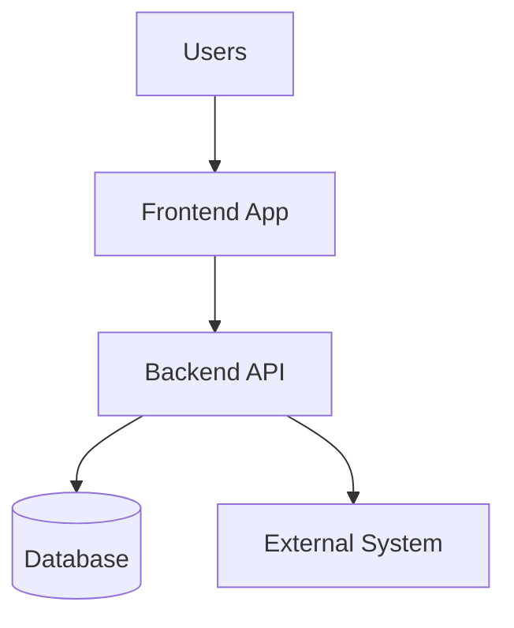

# Design Document Template

> **Purpose:** Define HOW the system will be built through architecture, technical decisions, and development standards.
> **Created After:** Scope.md (read it completely first)
> **Estimated Time:** 6-10 hours
> **Next Document:** Tracker.md (implementation planning based on this design)

---

## ⚠️ IMPORTANT: HOW TO USE THIS DOCUMENT

### AI Presentation Order (When Generating Code)

**CRITICAL:** When using AI assistants to generate code or plans, always present documents in this order:

1. **design.md FIRST** ← Technical constraints are non-negotiable
2. **scope.md SECOND** ← Project boundaries, goals and features at high level

**Why This Matters:**

AI models give more weight to information they read first. If AI reads scope.md before design.md, it will suggest "path of least resistance" solutions that may violate your architectural decisions.

**Example:**
- ❌ **Wrong:** "Read scope: need real-time chat app" → AI suggests Firebase/WebSockets (easiest path)
- ✅ **Right:** "Read design: FastAPI + PostgreSQL only. Then read scope: need real-time chat" → AI suggests Server-Sent Events or polling within your constraints

**Always prompt AI like this:**
```
"FIRST read design.md for non-negotiable technical constraints.
THEN read scope.md
Generate [code/plan] respecting the architectural decisions in design.md."
```

### Using Diagrams

**Diagrams are encouraged throughout this document.** Use Mermaid (embedded), textual descriptions, or external links (draw.io, Lucidchart) to clarify:
- Architecture & components (§2)
- Workflows & pipelines (§4)
- Security & data flows (§7, §8)
- Integration patterns (§10)

Prefer visual explanation for complex concepts, multi-step processes, and component interactions.

---

## 📋 TABLE OF CONTENTS

1. [PROJECT OVERVIEW](#1-project-overview) [REQUIRED]
2. [ARCHITECTURE](#2-architecture) [REQUIRED]
3. [TECH STACK](#3-tech-stack) [REQUIRED]
4. [DEVELOPMENT WORKFLOW](#4-development-workflow) [REQUIRED]
5. [CORE PRINCIPLES](#5-core-principles) [REQUIRED]
6. [CODING STANDARDS](#6-coding-standards) [REQUIRED]
7. [SECURITY GUIDELINES](#7-security-guidelines) [REQUIRED]
8. [PERFORMANCE STANDARDS](#8-performance-standards) [REQUIRED]
9. [TESTING STRATEGY](#9-testing-strategy) [REQUIRED]
10. [EXTERNAL INTEGRATIONS](#10-external-integrations) [OPTIONAL]
11. [ARCHITECTURE DECISION RECORDS (ADRs)](#11-architecture-decision-records-adrs) [REQUIRED]

---

## Document Information

| Field | Value |
|-------|-------|
| **Project Name** | [Project name from Scope.md] |
| **Version** | 1.0 |
| **Last Updated** | [Date] |
| **Author(s)** | [Name(s)] |
| **Status** | Draft / In Review / Approved |
| **Based On** | Scope.md v[X.X] |

---

## 1. PROJECT OVERVIEW [REQUIRED]

### 1.1 Project Identity

**Name:** [Project name]
**Type:** [e.g., Frontend Only / Backend Only / Fullstack / Mobile / Desktop / CLI / Library / MCP Server / System Integration]

### 1.2 Repository Strategy

**Strategy:** [ ] Monorepo  /  [ ] Polyrepo

**Rationale:**
[Explain why this strategy was chosen considering: team size, deployment independence, code sharing needs]

**Structure:**
[Describe folder organization or list repositories with purpose. Link to `/docs/architecture/` for detailed structure]

### 1.3 Brief Description

**What:** [What the system does in 2-3 sentences]

**Who:** [Who the primary users are]

**Why:** [Core business value or problem being solved]

---

## 2. ARCHITECTURE [REQUIRED]

> **For MCP Server Projects:** If your project type (§1.1) is "MCP Server", use this section to document your MCP architecture:
> - In §2.1 Pattern Description: Describe tools/resources exposed, protocol transport (stdio/SSE/HTTP), integration with external systems
> - In §2.2 System Components: Document MCP tools/resources as components (e.g., "GitHub Tool", "Database Query Resource")
> - In §2.2 Component Interaction: Explain how MCP protocol handler routes requests to tools/resources and handles responses

### 2.1 Architecture Pattern

**Primary Pattern:** [e.g., Clean Architecture, Microservices, Layered Architecture, Hexagonal Architecture, Event-Driven, CQRS, MCP Server Architecture, etc.]

**Why This Pattern:**
[Explain the rationale for choosing this architectural pattern. What problems does it solve? What benefits does it provide for this specific project?]

**Pattern Description:**
[Describe how the pattern is implemented in this project. What are the key characteristics? How does it differ from a standard implementation of this pattern?]

### 2.2 System Components

List all major components and their responsibilities:

| Component | Responsibility | Dependencies |
|-----------|----------------|--------------|
| [Component 1] | [What it does] | [What it depends on] |
| [Component 2] | [What it does] | [What it depends on] |
| [Component 3] | [What it does] | [What it depends on] |

**Component Interaction:**
[Describe how components communicate with each other. Synchronous vs asynchronous? APIs? Message queues? Events?]

### 2.3 Component Diagrams

**System Context Diagram:**

Option 1 - Mermaid syntax:

```mermaid
graph TD
    User[Users] --> FE[Frontend App]
    FE --> API[Backend API]
    API --> DB[(Database)]
    API --> ExtSys[External System]
```

Option 2 - Textual description:
```
[Describe the high-level architecture showing:
- All major components
- External systems
- Data flow direction
- Key integration points]
```

Option 3 - Link to external diagram:  
[Link to draw.io, Lucidchart, or other diagram file]

**Component Diagram:**

[Show internal structure if system has multiple components/services. Include:]
- Component boundaries
- Communication protocols (REST, gRPC, message queue, etc.)
- Data stores
- Caching layers

### 2.4 Layer Separation

Describe architectural layers or boundaries:

**Layer 1: [Name]**
- **Responsibilities:** [What this layer does]
- **Allowed Dependencies:** [What this layer can depend on]
- **Examples:** [Concrete examples from your system]

**Layer 2: [Name]**
- **Responsibilities:** [What this layer does]
- **Allowed Dependencies:** [What this layer can depend on]
- **Examples:** [Concrete examples from your system]

**Layer 3: [Name]**
- **Responsibilities:** [What this layer does]
- **Allowed Dependencies:** [What this layer can depend on]
- **Examples:** [Concrete examples from your system]

**Dependency Rules:**
- Layer X can depend on Layer Y
- Layer A CANNOT depend on Layer B
- [Other critical dependency rules]

---

## 3. TECH STACK [REQUIRED]

### 3.1 Frontend Stack (if applicable)

> **For Mobile Projects:** Use §3.6 Mobile Stack instead of this section.

**Language & Version:**
- Primary: [e.g., TypeScript 5.3]
- Secondary: [If applicable]

**Framework & Version:**
- [e.g., React 18.2, Vue 3.4, Angular 17, etc.]

**UI Library/Framework:**  
- [e.g., Material-UI v5, Ant Design, Tailwind CSS 3.4, Bootstrap 5]

**State Management:**  
- [e.g., Redux Toolkit 2.0, Zustand 4.5, Pinia, Context API, etc.]

**Build Tools:**  
- Bundler: [e.g., Vite 5.0, Webpack 5, Parcel]
- Package Manager: [npm 10.x, pnpm 8.x, yarn 4.x]

**Key Dependencies:**

| Package | Version | Purpose |
|---------|---------|---------|
| [Package 1] | [Version] | [What it's used for] |
| [Package 2] | [Version] | [What it's used for] |

### 3.2 Backend Stack (if applicable)

**Language & Version:**  
- [e.g., Python 3.12, Node.js 20 LTS, Java 21, C# .NET 8, Go 1.22]

**Framework & Version:**  
- [e.g., FastAPI 0.109, FastMCP, Express 4.18, Spring Boot 3.2, ASP.NET Core 8.0]

**API Type:**
- [ ] REST API
- [ ] GraphQL
- [ ] gRPC
- [ ] WebSockets
- [ ] MCP Protocol (stdio/SSE/HTTP)
- [ ] Other: [Specify]

**Authentication:**
- See §7.1 Authentication & Authorization for detailed authentication/authorization strategy

**Key Dependencies:**

| Package | Version | Purpose |
|---------|---------|---------|
| [Package 1] | [Version] | [What it's used for] |
| [Package 2] | [Version] | [What it's used for] |

### 3.3 Database & Storage

**Primary Database:**  
- Type: [e.g., PostgreSQL, MySQL, MongoDB, SQL Server]
- Version: [Specific version number]
- Purpose: [Main application data]

**Secondary Database (if applicable):**  
- Type: [e.g., Redis, Elasticsearch]
- Version: [Specific version number]
- Purpose: [Caching, search, etc.]

**File Storage:**  
- Solution: [e.g., AWS S3, Azure Blob Storage, Local filesystem]
- Purpose: [What types of files are stored]

**Database Design Approach:**
- [ ] ORM-first (define models in code)
- [ ] Database-first (SQL migrations)
- [ ] Schema versioning: [Tool used, e.g., Alembic, Flyway, EF Migrations]

**Data Migration Strategy:**
- **Backward Compatibility:** [How many versions back are supported]
- **Migration Approach:**
  - [ ] Expand-Contract pattern (add new → migrate data → remove old)
  - [ ] Dual-write period (write to both old and new schemas)
  - [ ] Big-bang migration (scheduled downtime)
- **Rollback Strategy:** [How to revert migrations if deployment fails]
- **Zero-downtime:** [Yes/No] - [Explain approach if yes]
- **Data Validation:** [How to verify migration success]

### 3.4 Infrastructure & Cloud

**Hosting Platform:**
- **Provider:** [e.g., AWS, Azure, GCP, Heroku, Vercel, Self-hosted]
- **Region(s):** [Primary region + any additional regions for DR/multi-region]
- **Compute:**
  - Type: [e.g., VMs, Serverless (Lambda/Functions), Managed containers (ECS/Cloud Run)]
  - Scaling: [e.g., Auto-scaling based on CPU/memory, Manual, Fixed capacity]
  - Instance types: [e.g., t3.medium, Standard_D2s_v3]

**Container Strategy:**
- [ ] Docker (containerized application)
- [ ] Kubernetes (orchestration)
- [ ] Managed container service (ECS, Cloud Run, App Service)
- [ ] No containerization
- [ ] Other: [Specify]

**Container Details (if applicable):**
- Base images: [e.g., node:20-alpine, python:3.12-slim]
- Registry: [e.g., Docker Hub, ECR, ACR, GCR]
- Orchestration: [If using K8s: cluster size, node pools, autoscaling config]

**Networking:**
- **Load Balancer:** [Type and configuration, e.g., Application Load Balancer, SSL termination]
- **CDN:** [e.g., CloudFront, Azure CDN, Cloudflare] - [Purpose: static assets, API caching]
- **DNS:** [Provider, e.g., Route 53, Azure DNS, Cloudflare]
- **VPC/Network:** [Public/private subnets, security groups, firewall rules]

**CI/CD:**
- **Platform:** [e.g., GitHub Actions, GitLab CI, Azure DevOps, Jenkins]
- **Build Triggers:**
  - Development: [e.g., Auto-deploy on push to develop branch]
  - Staging: [e.g., Auto-deploy on push to staging branch]
  - Production: [e.g., Manual approval after tag creation]
- **Pipeline Stages:**
  1. [e.g., Lint & format check]
  2. [e.g., Unit tests]
  3. [e.g., Build container image]
  4. [e.g., Integration tests]
  5. [e.g., Security scan]
  6. [e.g., Deploy to environment]
  7. [e.g., Smoke tests]
- **Deployment Strategy:** [e.g., Blue-green, Rolling update, Canary]
- **Rollback:** [Automated on failure / Manual / Time-based automatic rollback]

**Infrastructure as Code (IaC):**
- **Tool:** [e.g., Terraform, CloudFormation, Pulumi, ARM templates, none]
- **State Management:** [e.g., Terraform Cloud, S3 backend, Azure Storage]
- **Directory:** [e.g., `/infrastructure`, `/terraform`]

**Monitoring & Logging:**
- **Application Monitoring (APM):** [e.g., Datadog, New Relic, Application Insights]
- **Log Aggregation:** [e.g., ELK stack, Splunk, CloudWatch Logs]
- **Error Tracking:** [e.g., Sentry, Rollbar, Bugsnag]
- **Uptime Monitoring:** [e.g., Pingdom, UptimeRobot, StatusCake]
- **Dashboards:** [Location of operational dashboards]
- **Retention:** [Log retention period, e.g., 90 days hot, 1 year archive]

### 3.5 Key Dependencies

> **Note:** This section is for **code-level dependencies** (npm packages, pip packages, NuGet packages, etc.). For **external service integrations** (APIs, SaaS platforms), see §10 External Integrations.

List critical third-party libraries/services that the project cannot function without:

| Dependency | Type | Version | Purpose | Alternative Considered |
|------------|------|---------|---------|----------------------|
| [Name] | [Library/Service] | [Version] | [Why it's critical] | [What else was considered] |

**Dependency Update Policy:**
[How and when dependencies are updated. e.g., "Monthly review of security patches, quarterly updates of minor versions"]

### 3.6 Mobile Stack (if applicable)

> **Note:** Only fill this section if Project Type (§1.1) is "Mobile". Otherwise remove this section.

**Platform Strategy:** [ ] Native iOS (Swift/SwiftUI) | [ ] Native Android (Kotlin/Jetpack Compose) | [ ] Cross-platform (React Native/Flutter) | [ ] Hybrid (Ionic/Capacitor)

**Platform Details:**

| Platform | Language/Ver | Min Version | UI Framework | Key Dependencies |
|----------|-------------|-------------|--------------|------------------|
| iOS | [Swift 5.9] | [iOS 15+] | [SwiftUI/UIKit] | [Package 1, Package 2] |
| Android | [Kotlin 1.9] | [API 26+] | [Compose/XML] | [Package 1, Package 2] |
| Cross-platform | [Framework/Ver] | [Min versions] | [Shared ~85%] | [Bridge modules if any] |

**Mobile Considerations:**
- **Offline:** Strategy: [Offline-first/Online-only] | Storage: [SQLite/Realm/AsyncStorage] | Sync: [Bi-directional/Push]
- **Push Notifications:** iOS: [APNs/FCM] | Android: [FCM] | Types: [Transactional/Marketing/In-app]
- **Distribution:** iOS: [App Store, TestFlight] | Android: [Play Store, Internal track] | Signing: [Cert/keystore mgmt] | CI/CD: [Fastlane/App Center]
- **Performance:** Startup < [X]s | Interactive < [X]s | FPS ≥ 60 | Memory < [X]MB | Battery: [optimization strategies] | Network: [batching, compression]
- **Platform Features:** iOS-only: [Widgets, Live Activities, App Clips] | Android-only: [Widgets, Quick Settings] | Shared: [Deep linking, Share extensions, Biometric auth]

---

## 4. DEVELOPMENT WORKFLOW [REQUIRED]

### 4.1 Environments & Deployment

**Environments:**

| Environment | Purpose | Deploy Trigger |
|-------------|---------|----------------|
| **Development** | Local testing | Manual |
| **Staging** | Pre-production validation | Auto (on staging branch push) |
| **Production** | Live system | Manual approval required |

**Environment Configuration:**
[How configuration differs: database connections, API keys, feature flags, etc.]

### 4.2 Branch & Release Strategy

**Branch Strategy:** [Choose one and document specifics]

- **Option A: Git Flow** (feature branches + develop + main)
  - `main`: Production-ready code
  - `develop`: Integration branch for features
  - `feature/[id]-[description]`: Feature development
  - `hotfix/[id]-[description]`: Production fixes

- **Option B: GitHub Flow** (feature branches + main only)
  - `main`: Always deployable
  - `feature/[id]-[description]`: Short-lived feature branches

- **Option C: Trunk-Based Development** (main only + feature flags)
  - `main`: Single branch, all commits
  - Feature flags control rollout

- **Option D: Custom** - [Describe your approach]

**Chosen Strategy:** [State which option above]

**Branch Protection:**
- `main`: Requires PR approval + passing tests + no direct commits
- [Other protected branches and rules]

**Release Process:**
[Describe how releases are created, tagged, and deployed. Include versioning strategy (e.g., semver) and rollback procedure]

### 4.3 Quality Gates

**Code Quality:**
- Code review: [N] approval(s) required
- Linting: [Tool + config location]
- Code coverage: ≥ [X]%

**Testing:**
- Unit tests: 100% passing
- Integration tests: 100% passing
- E2E tests: ≥ [X]% passing

**Security:**
- Vulnerability scanning: [Tool]
- SAST: [Tool, if applicable]
- Critical vulnerabilities: 0 allowed

**Performance:**
- Build time: < [X] min
- Bundle size (frontend): < [X] MB
- API response (p95): < [X] ms

---

## 5. CORE PRINCIPLES [REQUIRED]

### 5.1 Design Philosophy

**Primary Design Principles:**

1. **[Principle 1]**  
   [Describe the principle and why it matters for this project]  
   Example: "Fail fast, validate at boundaries" - Validate all inputs at API entry points rather than deep in business logic

2. **[Principle 2]**  
   [Description]

**Design Priorities (Ranked):**
1. [e.g., Security]
2. [e.g., Performance]
3. [e.g., Maintainability]
4. [e.g., Scalability]
5. [e.g., Developer Experience]

### 5.2 Trade-offs Accepted

Document known trade-offs and why they're acceptable:

**Trade-off 1: [Name]**
- **Chosen:** [What we chose]
- **Over:** [What we gave up]
- **Rationale:** [Why this trade-off makes sense]
- **Consequences:** [What this means for the project]

Example:
- **Chosen:** Monolithic architecture initially
- **Over:** Microservices from day one
- **Rationale:** Team size is small (3 developers), and early requirements are unclear. Premature microservices would add complexity without benefit.
- **Consequences:** May require significant refactoring if system grows to 10+ developers or needs independent scaling of components.

> **Note:** Add additional trade-offs as needed. Most projects have 3-5 significant trade-offs. Document all major architectural compromises.

### 5.3 Non-negotiable Rules

These rules CANNOT be violated without explicit architectural approval:

1. **[Rule 1]**  
   [State the rule clearly]  
   Reason: [Why this rule exists]  
   Enforced by: [How it's enforced - linter, code review, automated test]

   Example:
   - **All database queries must use parameterized queries (no string concatenation)**
   - Reason: Prevent SQL injection vulnerabilities
   - Enforced by: Code review + SAST tools

2. **[Rule 2]**  
   [Description]

---

## 6. CODING STANDARDS [REQUIRED]

### 6.1 Code Style

**Style Guide:**
[e.g., "Airbnb JavaScript Style Guide", "PEP 8 for Python", "Google Java Style Guide"]

**Linter & Formatter:**
- Linter: [Tool + config file location]
- Formatter: [Tool + config file location]
- Auto-format on save: [Yes/No]

**Project-Specific Naming Exceptions:**
[Only document deviations from the style guide. If following the guide completely, write "None - following [style guide] conventions"]

### 6.2 File Organization

**Structure Principle:**
[e.g., "Group by feature, not by file type" / "Layer-based architecture"]

**Organization Rules:**
- [Rule 1, e.g., "Shared code in common/ or shared/"]
- [Rule 2, e.g., "Maximum 3 levels of nesting"]
- [Rule 3]

**Folder Structure:**

Example using vertical slice architecture (organized by feature):

```
/
├── src/
│   ├── features/
│   │   ├── authentication/
│   │   │   ├── auth.controller.ts
│   │   │   ├── auth.service.ts
│   │   │   ├── auth.repository.ts
│   │   │   ├── auth.types.ts
│   │   │   └── auth.test.ts
│   │   ├── users/
│   │   │   ├── user.controller.ts
│   │   │   ├── user.service.ts
│   │   │   ├── user.repository.ts
│   │   │   └── user.test.ts
│   │   └── orders/
│   │       ├── order.controller.ts
│   │       ├── order.service.ts
│   │       └── order.test.ts
│   ├── shared/
│   │   ├── config/
│   │   ├── utils/
│   │   └── types/
│   └── infrastructure/
│       ├── database/
│       └── http/
├── tests/
│   └── integration/
├── docs/
└── config/
```

**Key Directories:**
- `src/features/`: Each feature is a self-contained vertical slice with all layers (controller, service, repository, tests)
- `src/shared/`: Code shared across multiple features (utilities, types, common logic)
- `src/infrastructure/`: Technical infrastructure (database, HTTP, external integrations)
- `tests/integration/`: Cross-feature integration and E2E tests

**Alternative:** For horizontal layered architecture, organize by technical layer instead (e.g., `/controllers`, `/services`, `/repositories`). Choose based on your architecture pattern (§2.1).

### 6.3 Documentation Requirements

**Code:** Comment WHY not WHAT | Explain non-obvious decisions | Clear naming over comments
**Functions/Methods:** Required for public APIs & complex algorithms | Format: [JSDoc/docstrings/XML comments] | Include: description, params, return, exceptions
**Modules:** Every module/package needs README (purpose, install, usage examples)
**Architecture:** Maintained in this design.md + ADRs | Update on significant changes

**API Documentation (if applicable):**
Format: [OpenAPI/Swagger 3.0/GraphQL schema] | Location: [/docs/api or Swagger UI] | Content: All endpoints (request/response examples, auth, errors, rate limits) | Auto-gen: [Yes/No - Tool] | Versioning: [Method]

**Operational Documentation:**

| Type | Location | Content | Update | Owner |
|------|----------|---------|--------|-------|
| Runbooks | [/docs/runbooks, Wiki] | Deployment, rollback, DB migration, backup/restore, certs, scaling | [With every change] | [DevOps, Tech Lead] |
| Troubleshooting | [/docs/troubleshooting] | Error messages/solutions, performance diagnosis, integration failures, workarounds (format: Problem→Symptoms→Diagnosis→Solution) | [As issues discovered] | [Team] |
| Onboarding | [/docs/onboarding] | Dev setup (prereqs, local setup, tests, deploy, common issues), Architecture overview (link to design.md, optional video, key concepts), Contributing (code review, PRs, standards, testing) | [Quarterly review] | [Tech Lead] |

### 6.4 Accessibility Standards (if applicable)

> **Note:** Skip this section if project has no user interface. Required for web, mobile, and desktop applications.

**Compliance Level:**
- [ ] WCAG 2.1 Level A (minimum legal requirement)
- [ ] WCAG 2.1 Level AA (recommended, required for government/enterprise)
- [ ] WCAG 2.1 Level AAA (aspirational, rarely required)
- [ ] ADA compliance (US)
- [ ] Section 508 (US federal)
- [ ] EN 301 549 (EU)

**Accessibility Requirements:**

**Keyboard Navigation:**
- All interactive elements must be keyboard accessible
- Visible focus indicators on all focusable elements
- Logical tab order
- Keyboard shortcuts documented

**Screen Reader Support:**
- Semantic HTML (headings, landmarks, lists)
- ARIA labels for interactive elements
- ARIA live regions for dynamic content
- Alt text for all images

**Visual Accessibility:**
- Color contrast ratio: ≥ 4.5:1 for normal text, ≥ 3:1 for large text
- Text resizable up to 200% without loss of functionality
- No information conveyed by color alone
- Support for high contrast mode

**Testing & Validation:**
- **Tools:** [e.g., axe DevTools, WAVE, Lighthouse accessibility audit]
- **Screen Readers Tested:** [e.g., NVDA, JAWS, VoiceOver]
- **Manual Testing:** [Keyboard-only navigation, screen reader walkthroughs]
- **Frequency:** [e.g., Every PR for critical flows, quarterly full audit]

**Resources:**
- WCAG Quick Reference: https://www.w3.org/WAI/WCAG21/quickref/
- Accessibility checklist: [Link to internal checklist]

### 6.5 Internationalization (if applicable)

> **Note:** Skip this section if product supports only one language/locale.

**Supported Locales:**
- **Launch:** [e.g., en-US, es-ES, fr-FR]
- **Planned:** [e.g., de-DE, ja-JP, zh-CN]

**Translation Management:**
- **Approach:** [e.g., Key-based (i18next), ICU MessageFormat, gettext]
- **Storage:** [e.g., JSON files, PO files, Translation Management System]
- **Fallback Language:** [e.g., en-US]
- **Who translates:** [Professional translators / Community / Machine translation + review]

**Localization Requirements:**

**Text:**
- All user-facing strings externalized (no hardcoded text)
- Support for pluralization rules (1 item vs 2 items)
- Support for gendered text (if applicable to target languages)
- Right-to-left (RTL) languages: [Supported/Not supported]

**Formats:**
- **Dates:** [Library + format, e.g., date-fns with locale-specific formats]
- **Numbers:** [e.g., 1,234.56 (US) vs 1.234,56 (EU)]
- **Currency:** [e.g., $1,234.56 vs 1.234,56 €]
- **Time zones:** [How time zones are handled]

**Content:**
- Images with text: [Strategy - separate images per locale / text overlays]
- Legal/terms of service: [Per-country versions required]
- Dynamic content length: [UI designed to handle text expansion (German ~30% longer than English)]

**Testing:**
- **Pseudo-localization:** [Yes/No] - Test with pseudo-translated strings (e.g., [Ṗśéûðö Ṫéẋţ])
- **Translation testing:** [Process for validating translations]
- **RTL testing:** [If applicable]

---

## 7. SECURITY GUIDELINES [REQUIRED]

### 7.1 Authentication & Authorization

**Authentication Method:**
[e.g., JWT with RS256, OAuth 2.0, SAML, Session-based]

**Token/Session Management:**
- Expiration: [e.g., Access: 15 min, Refresh: 7 days]
- Storage: [e.g., "Access in memory, refresh in httpOnly cookies"]
- Rotation: [Key rotation policy]

**Authorization Model:**
[e.g., RBAC / ABAC / Claims-based]

**Roles & Permissions:**

| Role | Permissions | Description |
|------|-------------|-------------|
| [Role 1] | [Key permissions] | [Who has this role] |
| [Role 2] | [Key permissions] | [Who has this role] |

### 7.2 Data Protection

**Encryption:**
- **In Transit:** TLS 1.3 minimum for all external communication
- **At Rest:** [Algorithm + key management solution, e.g., "AES-256 with Azure Key Vault"]

**Sensitive Data Handling:**
- **PII:** [Storage policy, retention, deletion requirements]
- **Passwords:** [Hashing algorithm, e.g., "bcrypt cost factor 12"]
- **Payment Info:** [Never stored / Tokenized / Encrypted]
- **API Keys/Secrets:** [Storage method, rotation frequency]

### 7.3 API Security

**Input Validation:**
- Validate all inputs against strict schemas (allowlists only)
- Reject requests with unexpected fields
- Sanitize user input before processing

**Rate Limiting:**
- Authenticated: [X] requests per [timeframe]
- Unauthenticated: [X] requests per [timeframe]

**CORS Policy:**
[List allowed origins or state policy]

**Security Headers:**
- Content-Security-Policy, X-Frame-Options: DENY, X-Content-Type-Options: nosniff, Strict-Transport-Security
- [Additional headers]

### 7.4 Secrets Management

**Storage:**
- Development: [e.g., .env (gitignored)]
- Production: [e.g., Azure Key Vault, AWS Secrets Manager]

**Rotation:**
[Frequency and process]

**Detection:**
- Tool: [e.g., git-secrets, truffleHog]
- Pre-commit hook: [Yes/No]

**Never commit:** Secrets, API keys, passwords, private keys, credentials

---

## 8. PERFORMANCE STANDARDS [REQUIRED]

### 8.1 Performance Targets (SLOs)

| Metric | Target | Priority |
|--------|--------|----------|
| **Uptime** | 99.9% | Critical |
| **API Response (p95)** | < 500ms | Critical |
| **Page Load (FCP)** | < 2s | High |
| **Error Rate** | < 0.1% | Critical |
| [Metric] | [Target] | [Priority] |

**Measurement:**
[APM tool, uptime monitoring service, RUM tool]

### 8.2 Required Optimizations

**Database:**
- All queries must have appropriate indexes
- N+1 pattern prohibited (use joins/batch loading)
- Connection pooling required
- Caching for expensive read operations

**Frontend (if applicable):**
- Code splitting for routes/large components
- Lazy loading for images
- CDN for static assets
- Minification and compression

**Mobile (if applicable):**
- App bundle size: < [X] MB (download size)
- Image optimization: WebP format, appropriate resolutions for device
- Code minification and tree shaking
- Lazy loading of non-critical modules
- Network request minimization (batching, caching)
- Background task optimization (battery efficiency)

**API:**
- Response compression (gzip/brotli)
- Pagination for list endpoints (max [X] items per page)
- Server-side filtering/sorting
- Field selection

**Background Jobs:**
- Operations > [X]s must be asynchronous
- Retry mechanism with exponential backoff

### 8.3 Caching Strategy

**Cache Layers:**

| Layer | Technology | TTL | Use Cases |
|-------|-----------|-----|-----------|
| Browser/CDN | [e.g., CloudFront, Service Worker] | [1-24h] | Static assets, public API responses |
| Application | [e.g., Redis, Memcached] | [5-60min] | Session data, API responses, computed results |
| Database | [e.g., Query cache, materialized views] | [Varies] | Frequently queried data, aggregations |

**Patterns:** Cache-Aside (read-through), Write-Through, Write-Behind, Refresh-Ahead
**Invalidation:** TTL-based (< 5min / 5-60min / > 1h), Event-based (on data updates), Manual (admin tools)
**Key Design:** Namespace format `{service}:{entity}:{id}`, include schema version, parameterize queries

**Cache Guidelines:**
- ✅ **Do cache:** Reference data, expensive computations, external API responses, rendered content
- ❌ **Don't cache:** PII/passwords, rapidly changing data, strict consistency requirements

**Metrics:** Hit rate ≥ [X]%, latency < [X]ms, monitor eviction rate & memory usage

### 8.4 Monitoring & Alerting

**Tools:**
- APM: [Tool]
- Logs: [Tool]
- Uptime: [Tool]

**Alerting Rules:**

| Alert | Condition | Severity | Action |
|-------|-----------|----------|--------|
| [Alert name] | [Threshold + duration] | [Critical/High/Medium] | [Response action] |

### 8.5 Disaster Recovery & Business Continuity

**Recovery Objectives:**

| Metric | Target | Notes |
|--------|--------|-------|
| **RTO** (Recovery Time Objective) | [X hours/minutes] | Max time to restore service |
| **RPO** (Recovery Point Objective) | [X hours/minutes] | Max acceptable data loss |
| **MTTR** (Mean Time To Recovery) | [X hours] | Average recovery time |

**Backup Strategy:**

| Component | Frequency | Retention | Storage | Encryption | Test Frequency |
|-----------|-----------|-----------|---------|------------|----------------|
| Database | [Full daily, incremental 6h] | [30d hot, 1y cold] | [AWS S3 cross-region] | [Yes/Method] | [Monthly restore] |
| Config files | [On change] | [90 days] | [Git + backup service] | [Yes/Method] | [Quarterly] |
| User files/media | [Continuous/Daily] | [Per compliance req] | [Cloud storage] | [Yes/Method] | [Quarterly] |
| Logs | [Real-time] | [30-90 days] | [Log aggregation service] | [Yes/Method] | [N/A] |

**Disaster Scenarios & Response:**

| Scenario | Detection | Response | Recovery Time |
|----------|-----------|----------|---------------|
| Database failure | [Health checks, alerts] | [Failover to replica, restore from backup] | [RTO target] |
| Region/DC outage | [Multi-region health checks] | [DNS failover to secondary region] | [X minutes/hours] |
| Data corruption/Ransomware | [Integrity checks, anomaly detection] | [Isolate, restore from clean backup] | [RPO + restore time] |

**Failover & High Availability:**
Multi-region: [Yes/No - active-active or active-passive] | Load Balancer: [Tool + health checks] | DB Replication: [Sync/Async, X replicas] | Auto-failover: [Enabled/conditions]

**Business Continuity Plan:**
Communication: [User notification method] | Escalation: [On-call → Manager → Executive] | Runbooks: [Location of detailed procedures]

---

## 9. TESTING STRATEGY [REQUIRED]

### 9.1 Testing Levels

**Test Pyramid:** More unit tests (fast, isolated) → Fewer integration tests (slower, integrated) → Minimal E2E tests (slowest, full system). Ratios vary by project type.

| Test Level | Scope | Isolation | Coverage Target | Run Frequency | Characteristics |
|------------|-------|-----------|-----------------|---------------|-----------------|
| **Unit** | Individual functions, methods, classes | Mocked dependencies | ≥ [X]% (typically 70-90%) | On every commit | Fast (<1s), isolated, deterministic |
| **Integration** | Multiple components together | Real dependencies (APIs may be mocked) | All critical workflows | On PR, before merge | Slower (seconds), test boundaries |
| **E2E** | Complete user workflows through UI | Full system (staging env) | Critical user journeys only | Nightly, before prod deploy | Slowest (minutes), brittle |
| **Performance** | Load, stress, spike testing | Production-like environment | [Tool: k6/JMeter/Gatling] | [Weekly on staging, before releases] | Long-running, resource-intensive |

### 9.2 Coverage Requirements

**Minimum Coverage Targets:**
- Overall code coverage: ≥ [X]%
- Critical business logic: ≥ 90%
- New code (in PRs): ≥ [X]%
- Changed code (in PRs): ≥ [X]%

**Exclusions from Coverage:**
- Generated code
- Configuration files
- Test files themselves
- [Other exclusions]

**Coverage Tool:**  
[e.g., Jest coverage, pytest-cov, JaCoCo]

**Coverage Reports:**
- Generated on: [e.g., Every PR, every commit]
- Visible in: [e.g., CI/CD pipeline, SonarQube]

### 9.3 Testing Tools

**Frontend Testing:**
- Unit/Integration: [e.g., Jest, Vitest, Jasmine]
- Component testing: [e.g., React Testing Library, Vue Test Utils]
- E2E: [e.g., Playwright, Cypress, Selenium]

**Backend Testing:**
- Unit: [e.g., pytest, JUnit, xUnit, Mocha]
- API testing: [e.g., Postman, REST Assured, Supertest]
- Database testing: [e.g., Test containers, in-memory database]

**Performance Testing:**
- [e.g., k6, JMeter, Locust, Artillery]

**Security Testing:**
- SAST: [e.g., SonarQube, Checkmarx]
- DAST: [e.g., OWASP ZAP, Burp Suite]
- Dependency scanning: [e.g., Snyk, Dependabot, npm audit]

**MCP Testing (if applicable):**

> **Note:** Only applicable if project is an MCP Server (§1.1) or consumes MCPs (§10.5).

**For MCP Servers (if this project IS an MCP Server):**
- **Tool Testing:** Unit tests for each MCP tool implementation
- **Resource Testing:** Tests for resource providers
- **Protocol Testing:** MCP protocol compliance tests
- **Integration Testing:** Test tools against real external systems (APIs, DBs)
- **Mock Client:** Test MCP server with mock MCP client

**For MCP Consumers (if this project USES MCPs):**
- **Mock MCP Servers:** Mock/stub MCP servers for unit tests
- **Integration Tests:** Test against real MCP servers in test environment
- **Failure Scenarios:** Test behavior when MCP unavailable
- **Tool:** [e.g., MCP test utilities, custom mocks]

### 9.4 CI/CD Integration

**Automated Test Execution:**

**On Commit:**
- Run unit tests
- Run linters
- Run security scans
- Generate coverage report

**On Pull Request:**
- All commit checks +
- Run integration tests
- Run E2E tests (smoke tests only)
- Check coverage thresholds

**Before Merge:**
- All PR checks must pass
- Manual approval required
- No merge if coverage decreases by > [X]%

**On Deploy to Staging:**
- Full E2E test suite
- Performance tests
- Security scans

**On Deploy to Production:**
- Smoke tests after deployment
- Monitor error rates for [timeframe]
- Automatic rollback if error rate > [threshold]

**Test Data Management:**
- Test data: [How test data is generated/maintained]
- Database state: [How database is seeded/cleaned between tests]
- External dependencies: [How external APIs are mocked]

---

## 10. EXTERNAL INTEGRATIONS [OPTIONAL]

> **Note:** This section is optional. Include it if your system integrates with external APIs, services, or systems. Remove this section if not applicable.
>
> **Scope:** This section covers **external service integrations** (third-party APIs, SaaS platforms, cloud services). For **code-level dependencies** (libraries/packages), see §3.5 Key Dependencies.

### 10.1 Third-party APIs

**Integration 1: [Service Name]**

- **Provider:** [Company name]
- **Purpose:** [What this integration is used for]
- **API Type:** [REST, GraphQL, SOAP, etc.]
- **Documentation:** [Link to API docs]
- **Authentication:** [Method - API key, OAuth, etc.]
- **Rate Limits:** [X requests per Y timeframe]
- **Cost:** [Free tier limits, pricing model]
- **Endpoints Used:**
  - `GET /endpoint1` - [Purpose]
  - `POST /endpoint2` - [Purpose]

**Integration 2: [Service Name]**
[Repeat structure]

### 10.2 External Services

**Service Dependencies:**

| Service | Purpose | Critical? | Fallback Strategy |
|---------|---------|-----------|-------------------|
| [Service 1] | [Purpose] | Yes/No | [What happens if unavailable] |
| [Service 2] | [Purpose] | Yes/No | [What happens if unavailable] |

**Examples of External Services:**
- Payment processors (Stripe, PayPal)
- Email providers (SendGrid, Mailgun)
- SMS providers (Twilio, Vonage)
- Cloud storage (AWS S3, Azure Blob)
- Analytics (Google Analytics, Mixpanel)
- Monitoring (Datadog, New Relic)

### 10.3 Integration Patterns

**Synchronous Integrations:**
- Used for: [When to use synchronous calls]
- Timeout: [X seconds]
- Retry strategy: [How retries are handled]
- Error handling: [What happens on failure]

**Asynchronous Integrations:**
- Used for: [When to use async/background jobs]
- Message queue: [Technology - RabbitMQ, SQS, etc.]
- Retry strategy: [Backoff policy]
- Dead letter queue: [How failed messages are handled]

**Webhook Integrations:**
- Endpoint security: [How webhooks are authenticated]
- Idempotency: [How duplicate webhooks are handled]
- Payload validation: [How payloads are verified]

### 10.4 Dependency Constraints

**API Version Locking:**
- [Service name]: API version [X.Y] (do not upgrade without testing)
- Reason: [Why this version is locked]

**Known Issues:**
- [Service name]: [Known limitation or bug]
- Workaround: [How we're working around it]

**Deprecation Timeline:**
- [Service name]: [API version] will be deprecated on [date]
- Action required: [What needs to be done]

**Backup Providers:**
- Primary: [Service 1]
- Backup: [Service 2] (if primary fails)
- Switching criteria: [When to switch]

### 10.5 Model Context Protocol (MCP) Servers

> **Purpose:** Document MCP servers that **this project consumes** to provide AI assistants with access to external tools, data sources, and capabilities.
>
> **Note:** If **this project IS an MCP Server** (see §1.1 Project Type), document the tools/resources it exposes in §2 Architecture instead. This section (§10.5) is specifically for MCPs that your project integrates with as a client/consumer.

**MCP Configuration:**
Protocol: [2024-11-05] | Connection: [stdio/SSE/HTTP] | Config File: [path/to/config.json] | Runtime: [Claude Desktop/Custom Client/VS Code]

**MCP Servers in Use:**

| Server | Provider | Purpose | Protocol | Key Tools | Auth Method | Critical | Fallback Strategy |
|--------|----------|---------|----------|-----------|-------------|----------|-------------------|
| [Name 1] | [Official/Community/Internal] | [Capabilities provided] | [stdio/SSE/HTTP] | [tool_1, tool_2] | [API key/.env/OAuth] | [Yes/No] | [Graceful degradation/Error handling] |
| [Name 2] | [Provider] | [Purpose] | [Protocol] | [Tools] | [Auth] | [Yes/No] | [Fallback] |

**Configuration Example:**
```json
{
  "mcpServers": {
    "server-name": {
      "command": "[start command]",
      "args": ["[arg1]"],
      "env": {"API_KEY": "[source]"}
    }
  }
}
```

**Common MCP Examples:** Filesystem (read/write files), GitHub (PRs/issues), PostgreSQL (queries/schema), Slack (messages), Google Drive (docs)

**Security & Reliability:**
- **Security:** Least privilege | Credential isolation | Audit logging | Rate limiting | Response validation
- **Failure Handling:** Timeout: [X]s | Retries: [N attempts with backoff] | Degraded mode: [behavior when unavailable] | Monitoring: [availability/performance tracking]

---

## 11. ARCHITECTURE DECISION RECORDS (ADRs) [REQUIRED]

> **Purpose:** Document significant architectural decisions with context, rationale, and consequences. Each ADR should be numbered sequentially and immutable once accepted (create new ADRs to supersede old ones rather than editing).

---

### ADR-001: [Title of First Decision]

**Date:** YYYY-MM-DD  
**Status:** Accepted / Deprecated / Superseded by ADR-XXX  
**Deciders:** [Names or roles of people who made this decision]

#### Context

[Describe the architectural context and the problem that needs a decision]

- What forces are at play? (technical, business, organizational)
- What constraints exist?
- What requirements must this decision meet?
- Why does this matter?

#### Decision

[State the decision clearly and concisely in 1-2 sentences]

Example: "We will use PostgreSQL as our primary database instead of MongoDB."

#### Rationale

[Explain WHY this decision was made]

- What makes this the best option?
- What specific benefits does it provide?
- What problems does it solve?
- How does it align with project constraints and requirements?

#### Consequences

**Positive:**
- [Benefit 1]
- [Benefit 2]
- [Benefit 3]

**Negative:**
- [Downside 1]
- [Downside 2]

**Neutral:**
- [Consideration or implication that's neither clearly positive nor negative]

#### Alternatives Considered

**Alternative 1: [Name]**
- Description: [Brief description]
- Rejected because: [Reason it wasn't chosen]

**Alternative 2: [Name]**
- Description: [Brief description]
- Rejected because: [Reason it wasn't chosen]

#### Implementation Notes

[Any specific guidance for developers implementing this decision]
- Configuration required
- Migration steps
- Coding patterns to follow
- Common pitfalls to avoid

#### Related Decisions

- Builds on: ADR-XXX (if this decision depends on another)
- Conflicts with: None / ADR-YYY
- Supersedes: None / ADR-ZZZ (if this replaces an older decision)

---

### ADR-002: [Title of Second Decision]

[Repeat the same structure for each architectural decision]

---

### ADR-XXX: [Title of Additional Decision]

[Continue adding ADRs as significant architectural decisions are made]

---

### Example ADRs

> **Note:** This is a complete example showing the ADR format in action. Remove or replace this subsection in your actual design.md once you've created your own ADRs.

#### ADR-001: Use JWT with RS256 for Authentication

**Date:** 2024-01-15  
**Status:** Accepted  
**Deciders:** Backend team lead, Security architect

#### Context

We need a stateless authentication mechanism that allows:
- Horizontal scaling without session storage
- Key rotation without user re-authentication
- Token verification by multiple services
- Short-lived access tokens with refresh capability

#### Decision

We will use JWT tokens with RS256 (asymmetric encryption) for authentication instead of session-based auth or JWT with HS256 (symmetric encryption).

#### Rationale

- **Stateless:** Tokens are self-contained, eliminating need for session storage
- **Scalable:** Any service can verify tokens with the public key
- **Key Rotation:** Can rotate private keys without invalidating existing tokens
- **Security:** Asymmetric keys prevent token forgery even if public key is leaked
- **Standard:** JWT is an industry standard with extensive library support

#### Consequences

**Positive:**
- Horizontal scaling without sticky sessions or shared session storage
- Independent services can verify tokens without database calls
- Improved performance (no session lookup on every request)

**Negative:**
- Tokens cannot be immediately revoked (must wait for expiration)
- Slightly larger payload than session IDs (200-500 bytes vs 32 bytes)
- Requires key management infrastructure

**Neutral:**
- Need to implement refresh token mechanism for long-lived sessions
- Must set short expiration (15 minutes) for access tokens

#### Alternatives Considered

**Alternative 1: Session-based authentication**
- Rejected because: Requires sticky sessions or shared session storage (Redis), limiting scalability

**Alternative 2: JWT with HS256 (symmetric)**
- Rejected because: All services would need the secret key, increasing security risk

**Alternative 3: OAuth 2.0 with external provider**
- Rejected because: Adds external dependency and doesn't meet requirement for internal authentication

#### Implementation Notes

- Access tokens: 15-minute expiration
- Refresh tokens: 7-day expiration, stored in httpOnly cookies
- Private key: Stored in Azure Key Vault, rotated every 90 days
- Token claims: `sub` (user ID), `role`, `exp`, `iat`
- Use `jsonwebtoken` library (Node.js) or `PyJWT` (Python)

#### Related Decisions

- Builds on: None
- Conflicts with: None
- Supersedes: None

---

## NEXT STEPS

Once this Design document is approved:

1. **Use this as the foundation for all implementation work**
   - Reference specific sections in code comments (e.g., "per Design.md §3.2")
   - When AI generates code, always present Design.md FIRST

2. **Create Tracker.md** (tactical planning)
   - Break down implementation into vertical slices
   - Use Design.md constraints to guide technical approach

3. **Keep this document updated** (but infrequently)
   - Update when making architectural decisions → Add new ADRs
   - Update when changing tech stack or patterns
   - Version control all changes (Git history is your friend)

4. **Reference in code reviews**
   - "Does this PR follow Design.md §6.2 folder structure?"
   - "This violates non-negotiable rule §5.3.1"

---

## DOCUMENT EVOLUTION STRATEGY

> **Philosophy:** Design.md is a living document that evolves with your system, but changes should be deliberate and rare. Most day-to-day decisions don't require updates.

### When to Update This Document

**✅ UPDATE for these changes:**
- **Major architectural decisions** → Add new ADR in §11
- **Tech stack changes** → Update §3 (language, framework, database version upgrades)
- **New architectural patterns** → Update §2.1 Architecture Pattern
- **Security policy changes** → Update §7 Security Guidelines
- **New non-negotiable rules** → Add to §5.3
- **Infrastructure changes** → Update §3.4 (cloud provider, CI/CD platform)
- **New external integrations** → Add to §10

**❌ DON'T UPDATE for these changes:**
- Individual bug fixes or features (those go in commit messages)
- Temporary workarounds (document in code comments)
- Team member changes (not relevant to architecture)
- Minor dependency version bumps (unless they change approach)

### How to Update

**1. Increment Version:**
- Update "Version" in Document Information metadata
- Use semantic versioning: Major.Minor (e.g., 1.0 → 1.1 for minor, 1.0 → 2.0 for major)

**2. Update "Last Updated" Date**

**3. Document Changes:**
- **For ADRs:** Add new ADR with sequential number (never edit existing ADRs)
- **For other sections:** Edit in place, use git history to track changes
- **For deprecations:** Mark as "Deprecated" and reference superseding ADR

**4. Communicate Changes:**
- Share update in team channel/meeting
- Review changes in next architecture review
- Ensure all team members read updated sections

### Deprecating Decisions

**When an architectural decision changes:**
1. Create new ADR superseding old one
2. Update old ADR status: "Status: Superseded by ADR-XXX"
3. Update relevant sections (§2, §3, etc.) to reflect new decision
4. Document migration plan if needed

**Example:**
```markdown
### ADR-005: Use PostgreSQL instead of MongoDB

**Status:** Superseded by ADR-012
**Date:** 2024-01-15

[Original ADR content...]

---

### ADR-012: Migrate from PostgreSQL to distributed SQL (CockroachDB)

**Status:** Accepted
**Date:** 2024-06-20
**Supersedes:** ADR-005

#### Context
System has grown to require multi-region deployment...
```

### Version Control Best Practices

- **Commit message format:** `docs(design): [brief description of change]`
- **PR reviews:** Architecture changes require approval from tech lead
- **Git tags:** Tag major versions (e.g., `design-v2.0`)
- **Changelog:** Not needed (git history serves as changelog)

### Annual Architecture Review

**Schedule:** [e.g., Quarterly, Semi-annually]

**Review checklist:**
- [ ] Are all ADRs still relevant?
- [ ] Have tech stack versions been updated?
- [ ] Do trade-offs (§5.2) still make sense?
- [ ] Are non-negotiable rules (§5.3) still enforced?
- [ ] Do performance targets (§8.1) still align with business needs?
- [ ] Are disaster recovery procedures (§8.5) tested and up-to-date?

---


