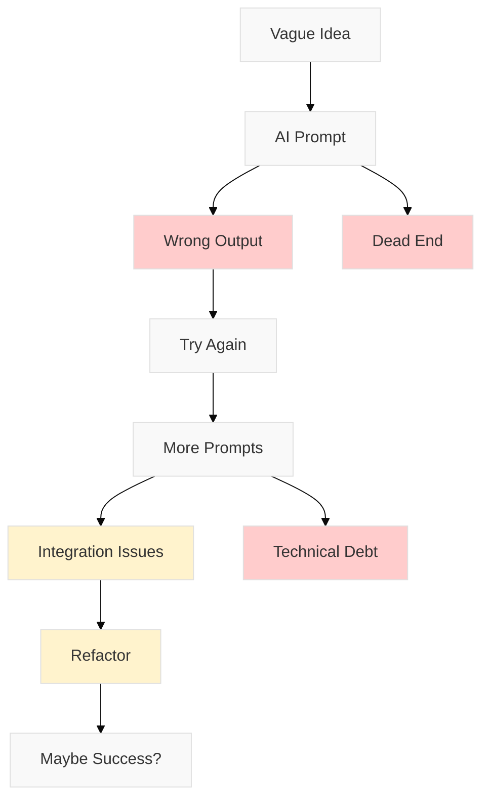
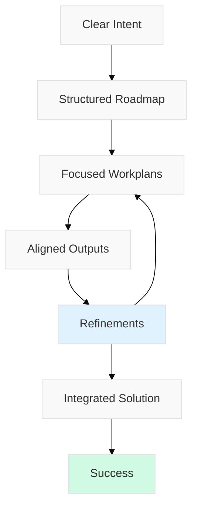

# Specflow is structure for building with software agents

## Build with Purpose and Precision

Use the **open Specflow** method to turn intent into software through structured planning and iterative execution with software agents.

[**Get Started**](getting-started.md) | [**Learn Why**](why-plan-first.md)

---

## The Core Philosophy

> "Plan first, act second. Every great building starts with a blueprint. Every successful software project starts with a plan."

Specflow is about using today's SWE agents **effectively**. By structuring your approach, you can ensure that every prompt, every task, and every output serves your goals. 

---

## Two Approaches to Building with AI

The difference between success and frustration comes down to structure and decisions that compound. Unplanned development eventually leads to chaos while Specflow brings clarity and predictable results. 

### ❌ Without Structure: Chaos

### ✅ With Specflow: Clarity

---

## The Process

The process is both deceptively simple and powerful. Each step builds on the previous one creating a clear path from concept to completion. 

1.  **Intent: Define goal** (What & Why)
2.  **Roadmap: Plan phases** (Milestones)
3.  **Tasks: Break down** (Human + AI)
4.  **Execute: Build together** (Systematic)
5.  **Refine: Iterate & learn** (Improve)

---

## Why Specflow?

Outside of prototyping, vibe driven approaches to building software with SWE Agents often result in:

* **Misaligned outputs** that don't match your intent.
* **Wasted time** on iterations that miss the mark.
* **Fragmented results** from uncoordinated efforts.
* **Lost context** between different development phases.

**Specflow solves these problems by:**

* **Structured Planning**: Clear progression from idea to implementation.
* **Human-AI Collaboration**: Optimal task distribution between humans and agents.
* **Iterative Refinement**: Continuous improvement throughout the process.
* **Context Preservation**: Maintain alignment with original intent.