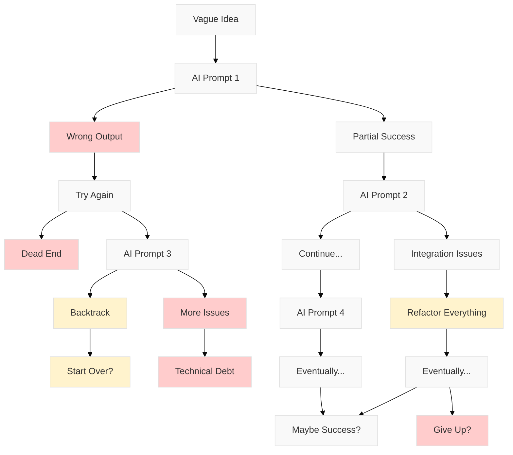
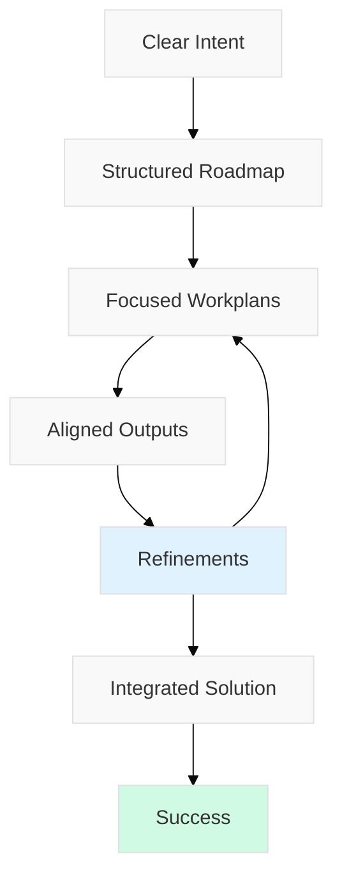

# Why Plan First, Act Second Wins
## The philosophy that powers effective agent-first software development

### The Blueprint Principle

> "Every great building starts with a blueprint. Every successful software project starts with a plan."

In the rush to leverage AI code-gen capabilities, it's tempting to jump straight into prompting and generating code. But this approach often leads to:

- **Wasted iterations** as you try to steer AI toward your vision
- **Technical debt** from hastily accepted solutions
- **Misaligned features** that solve the wrong problems
- **Integration nightmares** when pieces don't fit together

---

### The Cost of Pure Improvisation

#### Without Planning: The Vibe Driven Approach

While intoxicating, [Vibe Coding](https://x.com/karpathy/status/1886192184808149383) is a reactive approach that treats SWE agents like a magic box. Throw in requests and hope for the best. The result? A meandering path filled with deadloops and backtracking.

#### With Specflow: The Highway Approach

Flexible planning creates a highway to your destination. You know where you're going, how to get there, and what success looks like. You still have to drive, but you're not lost.

---

### The Power of Structured Thinking

#### 1. Clarity Compounds
When you articulate your intent clearly:
- You discover edge cases early
- You identify dependencies upfront
- You set measurable success criteria
- You align stakeholder expectations

#### 2. Context is King
AI agents excel when given proper context. Planning provides:
- **Historical context**: What led to this decision?
- **Technical context**: What constraints exist?
- **Business context**: Why does this matter?
- **Future context**: What comes next?

#### 3. Efficiency Through Intention
Counterintuitively, spending time planning **saves** time overall:

| Activity | Without Planning | With SpecFlow | Time Saved |
|----------|-----------------|---------------|------------|
| Initial Planning | 0 hours | 2 hours | -2 hours |
| Prompt Creation | 8 hours | 3 hours | +5 hours |
| Rework & Fixes | 12 hours | 2 hours | +10 hours |
| Integration | 6 hours | 1 hour | +5 hours |
| **Total** | **26 hours** | **8 hours** | **18 hours (69%)** |

---

### Illustrative Example: Building a Task Mgmt API

#### ❌ The Unplanned Approach
> **Total Time:** 7+ days of confusion

- **Day 1**: "AI, create a task management API" -> Result: Basic CRUD endpoints, no authentication.
- **Day 2**: "Add user authentication" -> Result: Authentication added, but breaks existing endpoints.
- **Day 3**: "Fix the endpoints and add teams" -> Result: Teams added, but permission system is confused.
- **Day 4-7**: Endless fixes, refactoring, and "one more thing" requests...

#### ✅ The Specflow Approach
> **Total Time:** 8 hours (1 day)

- **Hour 1-2**: Define Intent & Create Roadmap (Multi-tenant, team features, RBAC, OpenAPI).
- **Hour 3-8**: Execute plan systematically (Data models, Auth/Authz, API endpoints, Docs).
- **Result**: Complete, integrated system.

---

### The Neuroscience of Planning

Research shows that planning activates the prefrontal cortex - the brain's executive center. When we engage in planning activities, this region lights up in brain scans, but in a focused and efficient way. 

#### 🧠 Better Decision-Making
Planning engages the part of your brain responsible for weighing options and thinking ahead. Instead of reacting impulsively, you tap into your brain's ability to simulate different scenarios and choose the best path forward.

#### 💡 Reduced Mental Overload
Ever feel mentally exhausted from constant decision-making? Planning reduces this "cognitive load" dramatically. By making decisions upfront, you free your brain to focus on execution rather than constantly figuring out what to do next.

#### 🎯 Higher Success Rates
Your brain is wired to anticipate problems - planning activates this natural ability. Research shows that "if-then planning" (if X happens, I'll do Y) significantly improves goal achievement by preparing your brain for obstacles before they appear.

#### 📈 Accelerated Learning
Structured planning creates feedback loops that enhance learning. Your brain processes information more efficiently when it has a framework to organize new knowledge against.

> **The Bottom Line**: When we plan first, we're not just being organized - we're literally using our brains the way evolution designed them to work. The prefrontal cortex evolved specifically for this kind of forward-thinking, and Specflow taps directly into this biological advantage.

---

### Common Objections (And Why They're Wrong)

- **"Planning Slows Me Down"**: Reality: Planning *feels* slow because it's front-loaded work. But it dramatically accelerates everything that follows.
- **"Requirements Always Change"**: Reality: Specflow embraces change through iterative refinement. A plan isn't carved in stone - it's a living document that evolves with your understanding.
- **"AI Should Figure It Out"**: Reality: AI is a powerful tool, not a mind reader. The quality of output directly correlates with the quality of input. Better planning = better prompts = better results.

---

### The Specflow Advantage

When you plan first:
- **You control the narrative** - AI follows your lead, not the other way around.
- **You build with confidence** - Each step reinforces your vision.
- **You ship faster** - Less rework means quicker delivery.
- **You sleep better** - Knowing your project is on solid foundations.

### Start Today

Ready to experience the power of Specflow development?

1. **Define your intent** - What are you really trying to build?
2. **Create a roadmap** - Break it into manageable phases
3. **Execute systematically** - Let your plan guide your prompts
4. **Refine continuously** - Learn and adjust as you go