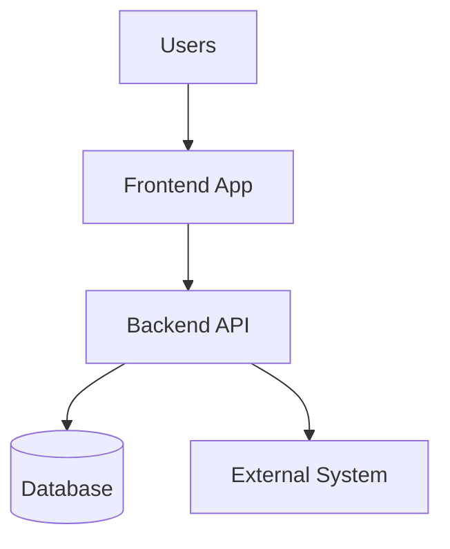
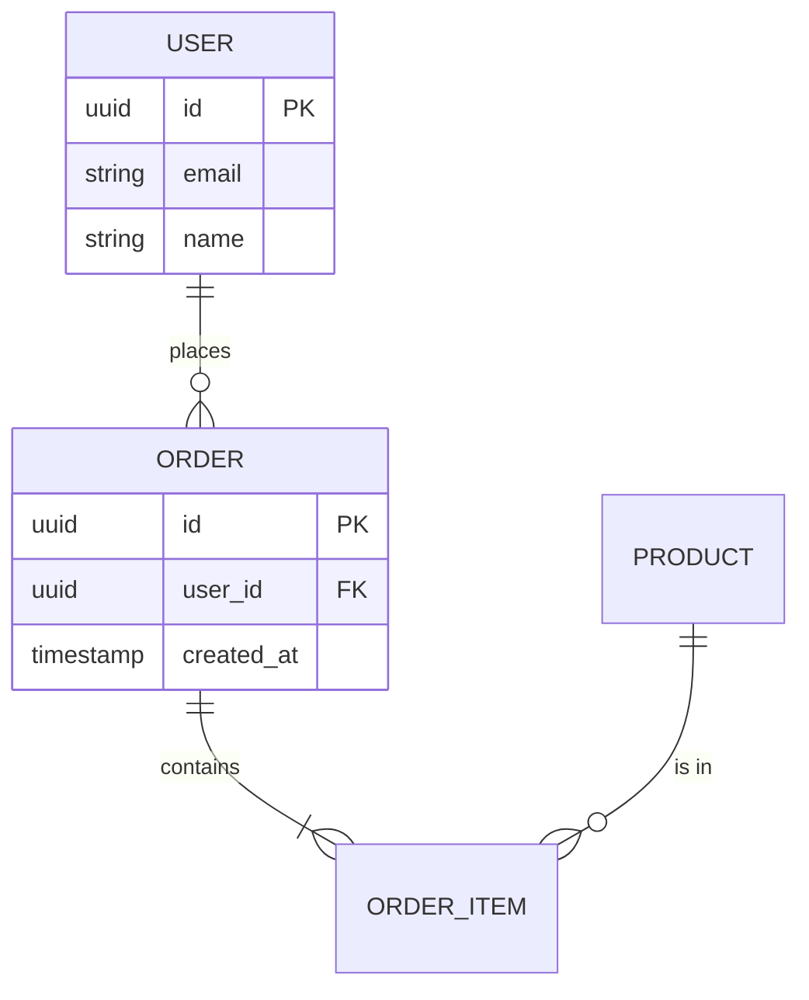

# DESIGN DOCUMENT

> **Purpose:** Define HOW the system will be built — architecture, technical decisions, and development standards.
> **Input:** Scope.md (read completely first)
> **Next step:** Generate Tracker.md


## Document Information

| Field | Value |
|-------|-------|
| **Project Name** | [From Scope.md] |
| **Version** | 1.0 |
| **Last Updated** | [YYYY-MM-DD] |
| **Author(s)** | [Name(s)] |
| **Status** | Draft / In Review / Approved |
| **Based On** | Scope.md v[X.X] |

---

## 0. CONSTRAINTS SUMMARY [REQUIRED — AI reads this first]

> **Purpose:** Fast-read reference for AI sessions. Captures the most critical constraints so AI agents can load essentials without reading the full document.
> **Keep it under 20 lines. Update whenever §2, §4, §9, or §10 change.**

```
Stack:        [e.g., Python 3.12 / FastAPI 0.115 / PostgreSQL 16]
Pattern:      [e.g., Layered — routes → services → repositories]
Real-time:    [e.g., SSE only — no WebSockets, no Firebase]
Auth:         [e.g., JWT (python-jose) + OAuth2 Google — RBAC via middleware]
Database:     [e.g., PostgreSQL — Alembic migrations — asyncpg driver]
Testing:      [e.g., pytest — 80%+ coverage required — no skipping tests]
Code style:   [e.g., Black + isort — type hints required]
API:          [e.g., REST — /api/v1 — snake_case — ISO 8601 dates]
Security:     [e.g., No secrets in code — .env gitignored — TLS 1.3]
Non-goals:    [e.g., No UI, no ERP integration, no push notifications]
```

> AI agents: if this summary conflicts with lower sections, lower sections win — they are more specific.
> Full details in §2 (Architecture), §4 (Tech Stack), §9 (Standards), §10 (Security).

---

## 1. PROJECT OVERVIEW [REQUIRED]

### 1.1 Project Identity

**Name:** [Project name]
**Type:** [Frontend Only / Backend Only / Fullstack / Mobile / Desktop / CLI / Library / MCP Server / System Integration]

### 1.2 Repository Strategy

**Strategy:** [ ] Monorepo / [ ] Polyrepo

**Rationale:** [Why this strategy — team size, deployment independence, code sharing]

**Structure:** [Folder organization or list of repositories with purpose]

### 1.3 Brief Description

- **What:** [What the system does — 2-3 sentences]
- **Who:** [Primary users]
- **Why:** [Core business value]


## 2. ARCHITECTURE [REQUIRED]

### 2.1 Architecture Pattern

**Primary Pattern:** [e.g., Clean Architecture, Microservices, Layered, Hexagonal, Event-Driven, CQRS, MCP Server]

**Why This Pattern:** [Rationale — what problems it solves for this specific project]

**Pattern Description:** [How the pattern is implemented, key characteristics, deviations from standard]

### 2.2 System Components

| Component | Responsibility | Dependencies |
|-----------|----------------|--------------|
| [Component 1] | [What it does] | [What it depends on] |
| [Component 2] | [What it does] | [What it depends on] |
| [Component 3] | [What it does] | [What it depends on] |

**Component Interaction:** [How components communicate — sync vs async, APIs, message queues, events]

### 2.3 Component Diagrams

Use Mermaid (preferred), textual description, or external link (draw.io, Lucidchart).

**System Context Diagram:**


**Component Diagram:** [Internal structure — component boundaries, protocols, data stores, caching layers]

### 2.4 Layer Separation

**Layer 1: [Name]**
- **Responsibilities:** [What this layer does]
- **Allowed Dependencies:** [What this layer can depend on]

**Layer 2: [Name]**
- **Responsibilities:** [What this layer does]
- **Allowed Dependencies:** [What this layer can depend on]

**Layer 3: [Name]**
- **Responsibilities:** [What this layer does]
- **Allowed Dependencies:** [What this layer can depend on]

**Dependency Rules:**
- Layer X can depend on Layer Y
- Layer A CANNOT depend on Layer B

---

## 3. APP FLOW & NAVIGATION [CONDITIONAL — skip if no UI]

### 3.1 Page/Screen Inventory

| Page/Screen | Route/Path | Purpose | Auth Required | Related Feature |
|-------------|-----------|---------|---------------|-----------------|
| [Login] | [/login] | [User authentication] | No | [F-001] |
| [Dashboard] | [/dashboard] | [Main overview after login] | Yes | [F-002] |
| [Detail View] | [/items/:id] | [View/edit single item] | Yes | [F-003] |
| [Settings] | [/settings] | [User preferences] | Yes | [F-004] |
| [Admin Panel] | [/admin] | [System administration] | Yes (Admin) | [F-005] |

> List ALL pages/screens. No guessing how navigation works.

### 3.2 Navigation Structure

**Primary Navigation:** [Main menu items — always visible]
- [Dashboard] → /dashboard
- [Items] → /items
- [Reports] → /reports

**Secondary Navigation:** [Contextual menus — visible within sections]
- [Item detail tabs: Overview, History, Settings]

**Utility Navigation:** [Header/footer actions]
- [Profile, Notifications, Logout]

**Navigation Pattern:** [Sidebar / Top bar / Bottom tabs (mobile) / Hamburger / Breadcrumbs]

### 3.3 User Flows

> Document the primary user journey for each key feature.

**Flow 1: [Feature Name]** (maps to F-XXX)
```
[Start Page] → [Action] → [Page 2] → [Action] → [Result Page]
```

1. User lands on [Page] → sees [what]
2. User clicks [action] → navigates to [Page]
3. User fills [form/data] → submits
4. System [validates/processes] → shows [success/error]
5. User redirected to [Page]

**Flow 2: [Feature Name]** (maps to F-XXX)
```
[Start] → [Action] → [Page] → [Decision] → [Branch A or B]
```

> Repeat for each critical user flow.

### 3.4 Routing Strategy

- **Framework:** [React Router / Vue Router / Next.js App Router / Angular Router / etc.]
- **Pattern:** [File-based / Configuration-based / Convention-based]
- **Auth Guards:** [How protected routes are handled — redirect, middleware, HOC]
- **Error Routes:** [404 page, error boundary, unauthorized page]
- **Deep Linking:** [Supported? URL structure for shareable links]

---

## 4. TECH STACK [REQUIRED]

### 4.1 Frontend Stack (if applicable)

> For Mobile: use §4.6 instead.

- **Language:** [e.g., TypeScript 5.3]
- **Framework:** [e.g., React 18.2, Vue 3.4, Angular 17]
- **UI Library:** [e.g., Material-UI v5, Tailwind CSS 3.4, shadcn/ui]
- **State Management:** [e.g., Redux Toolkit 2.0, Zustand, Pinia, Context API]
- **Build Tools:** Bundler: [Vite 5.0 / Webpack 5] | Package Manager: [npm / pnpm / yarn]

**Key Dependencies:**

| Package | Version | Purpose |
|---------|---------|---------|
| [Package 1] | [Version] | [What it's used for] |
| [Package 2] | [Version] | [What it's used for] |

### 4.2 Backend Stack (if applicable)

- **Language:** [e.g., Python 3.12, Node.js 20 LTS, C# .NET 8, Go 1.22]
- **Framework:** [e.g., FastAPI 0.109, Express 4.18, ASP.NET Core 8.0]
- **API Type:** [ ] REST / [ ] GraphQL / [ ] gRPC / [ ] WebSockets / [ ] MCP Protocol / [ ] Other
- **Authentication:** See §10.1

**Key Dependencies:**

| Package | Version | Purpose |
|---------|---------|---------|
| [Package 1] | [Version] | [What it's used for] |
| [Package 2] | [Version] | [What it's used for] |

### 4.3 Database & Storage

**Primary Database:**
- Type: [PostgreSQL / MySQL / MongoDB / SQL Server] | Version: [X.X] | Purpose: [Main application data]

**Secondary Database (if applicable):**
- Type: [Redis / Elasticsearch] | Version: [X.X] | Purpose: [Caching, search]

**File Storage:** [AWS S3 / Azure Blob / Local filesystem] — [What types of files]

**Database Design:**
- Approach: [ ] ORM-first / [ ] Database-first
- Schema versioning: [Alembic / Flyway / EF Migrations / Prisma Migrate]
- Migration strategy: [ ] Expand-Contract / [ ] Dual-write / [ ] Big-bang
- Rollback: [How to revert migrations]

### 4.4 Infrastructure & Cloud

**Hosting:**
- Provider: [AWS / Azure / GCP / Vercel / Self-hosted] | Region: [Primary + DR]
- Compute: [VMs / Serverless / Containers] | Scaling: [Auto / Manual / Fixed]

**Containers (if applicable):**
- [ ] Docker | [ ] Kubernetes | [ ] Managed (ECS/Cloud Run) | [ ] None
- Base images: [e.g., node:20-alpine] | Registry: [ECR / ACR / Docker Hub]

**CI/CD:**
- Platform: [GitHub Actions / GitLab CI / Azure DevOps]
- Deployment strategy: [Blue-green / Rolling / Canary]
- Rollback: [Automated / Manual]

**IaC:** [Terraform / CloudFormation / Pulumi / None] | State: [Backend location]

### 4.5 Key Dependencies

> Code-level dependencies. For external service integrations, see §13.

| Dependency | Version | Purpose | Alternative Considered |
|------------|---------|---------|----------------------|
| [Name] | [Version] | [Why critical] | [What else was considered] |

**Update Policy:** [How and when dependencies are updated]

### 4.6 Mobile Stack (if applicable)

> Only if Project Type (§1.1) is "Mobile". Otherwise remove.

**Platform Strategy:** [ ] Native iOS / [ ] Native Android / [ ] Cross-platform (RN/Flutter) / [ ] Hybrid

| Platform | Language/Ver | Min Version | UI Framework | Key Dependencies |
|----------|-------------|-------------|--------------|------------------|
| iOS | [Swift 5.9] | [iOS 15+] | [SwiftUI/UIKit] | [Packages] |
| Android | [Kotlin 1.9] | [API 26+] | [Compose/XML] | [Packages] |

**Mobile Considerations:**
- Offline: [Strategy] | Storage: [SQLite/Realm] | Sync: [Bi-directional/Push]
- Push Notifications: iOS [APNs/FCM] | Android [FCM]
- Distribution: iOS [App Store/TestFlight] | Android [Play Store]
- Performance: Startup < [X]s | FPS ≥ 60 | Memory < [X]MB

---

## 5. DATA MODEL & API CONTRACT [REQUIRED]

### 5.1 Database Schema

> Document ALL tables/collections. This is the source of truth for data structure.

#### Table: [table_name]

| Column | Type | Nullable | Default | Constraints | Description |
|--------|------|----------|---------|-------------|-------------|
| id | UUID / SERIAL | No | gen_random_uuid() | PK | Primary key |
| [column_name] | [VARCHAR(255) / INT / BOOLEAN / TIMESTAMP / etc.] | [Yes/No] | [Default value] | [FK, UNIQUE, CHECK] | [What it stores] |
| [column_name] | [Type] | [Yes/No] | [Default] | [Constraints] | [Description] |
| created_at | TIMESTAMP | No | NOW() | — | Record creation time |
| updated_at | TIMESTAMP | No | NOW() | — | Last modification time |

**Indexes:**
- `idx_[table]_[column]` on [column(s)] — [Purpose: search, sort, FK lookup]

> Repeat for each table.

#### Table: [table_name_2]

| Column | Type | Nullable | Default | Constraints | Description |
|--------|------|----------|---------|-------------|-------------|
| ... | ... | ... | ... | ... | ... |

### 5.2 Entity Relationships



> Replace with your actual entities. Show cardinality (one-to-one, one-to-many, many-to-many).

### 5.3 API Endpoints

> Document ALL endpoints. This is the contract between frontend and backend.

#### [Resource Group: e.g., Users]

| Method | Path | Description | Auth | Request Body | Response | Status Codes |
|--------|------|-------------|------|-------------|----------|--------------|
| GET | /api/v1/users | List all users | Bearer | — | `{ data: User[], total: int }` | 200, 401, 403 |
| GET | /api/v1/users/:id | Get user by ID | Bearer | — | `{ data: User }` | 200, 401, 404 |
| POST | /api/v1/users | Create user | Bearer (Admin) | `{ email, name, role }` | `{ data: User }` | 201, 400, 401, 409 |
| PUT | /api/v1/users/:id | Update user | Bearer | `{ name?, role? }` | `{ data: User }` | 200, 400, 401, 404 |
| DELETE | /api/v1/users/:id | Delete user | Bearer (Admin) | — | `{ success: true }` | 200, 401, 403, 404 |

#### [Resource Group: e.g., Orders]

| Method | Path | Description | Auth | Request Body | Response | Status Codes |
|--------|------|-------------|------|-------------|----------|--------------|
| ... | ... | ... | ... | ... | ... | ... |

> Repeat for each resource group.

### 5.4 API Conventions

- **Base URL:** [e.g., /api/v1]
- **Versioning:** [URL path / Header / Query param]
- **Pagination:** [Cursor-based / Offset-based] — params: `?page=1&limit=20` or `?cursor=abc`
- **Filtering:** [Query params: `?status=active&role=admin`]
- **Sorting:** [`?sort=created_at&order=desc`]
- **Error Format:**
```json
{
  "error": {
    "code": "VALIDATION_ERROR",
    "message": "Human-readable message",
    "details": [{ "field": "email", "issue": "already exists" }]
  }
}
```
- **Date Format:** [ISO 8601: `2024-01-15T10:30:00Z`]
- **Naming:** [camelCase / snake_case for JSON fields]

---

## 6. FRONTEND GUIDELINES [CONDITIONAL — skip if no UI]

### 6.1 Design Tokens

> These are the locked design constraints. All UI code must use tokens, not raw values.

**Colors:**

| Token | Value | Usage |
|-------|-------|-------|
| `--color-primary` | [#3B82F6] | Primary actions, links, active states |
| `--color-primary-hover` | [#2563EB] | Primary hover state |
| `--color-secondary` | [#6B7280] | Secondary actions, less emphasis |
| `--color-success` | [#10B981] | Success states, confirmations |
| `--color-warning` | [#F59E0B] | Warnings, caution states |
| `--color-error` | [#EF4444] | Errors, destructive actions |
| `--color-bg-primary` | [#FFFFFF] | Main background |
| `--color-bg-secondary` | [#F9FAFB] | Secondary/card background |
| `--color-text-primary` | [#111827] | Primary text |
| `--color-text-secondary` | [#6B7280] | Secondary/muted text |
| `--color-border` | [#E5E7EB] | Borders, dividers |

**Typography:**

| Token | Value | Usage |
|-------|-------|-------|
| `--font-family` | [Inter, system-ui, sans-serif] | All text |
| `--font-mono` | [JetBrains Mono, monospace] | Code, technical content |
| `--text-xs` | [12px / 0.75rem] | Captions, labels |
| `--text-sm` | [14px / 0.875rem] | Secondary text, metadata |
| `--text-base` | [16px / 1rem] | Body text |
| `--text-lg` | [18px / 1.125rem] | Subheadings |
| `--text-xl` | [20px / 1.25rem] | Section headings |
| `--text-2xl` | [24px / 1.5rem] | Page headings |
| `--text-3xl` | [30px / 1.875rem] | Hero/display text |

**Spacing Scale:**

| Token | Value | Usage |
|-------|-------|-------|
| `--space-1` | [4px / 0.25rem] | Tight spacing (inline elements) |
| `--space-2` | [8px / 0.5rem] | Compact spacing (form elements) |
| `--space-3` | [12px / 0.75rem] | Default inner padding |
| `--space-4` | [16px / 1rem] | Standard spacing |
| `--space-6` | [24px / 1.5rem] | Section spacing |
| `--space-8` | [32px / 2rem] | Large spacing |
| `--space-12` | [48px / 3rem] | Page-level spacing |

**Other Tokens:**

| Token | Value |
|-------|-------|
| `--radius-sm` | [4px] |
| `--radius-md` | [8px] |
| `--radius-lg` | [12px] |
| `--radius-full` | [9999px] |
| `--shadow-sm` | [0 1px 2px rgba(0,0,0,0.05)] |
| `--shadow-md` | [0 4px 6px rgba(0,0,0,0.1)] |
| `--shadow-lg` | [0 10px 15px rgba(0,0,0,0.1)] |
| `--z-dropdown` | [100] |
| `--z-modal` | [200] |
| `--z-toast` | [300] |

### 6.2 Component Standards

**Component Library:** [Custom / Material-UI / shadcn/ui / Ant Design / etc.]

**Naming Convention:**
- Components: [PascalCase — `UserProfileCard.tsx`]
- Props: [camelCase — `isLoading`, `onSubmit`]
- CSS classes: [BEM / CSS Modules / Tailwind / Styled Components]

**Component Composition Patterns:**
- [Compound Components / Render Props / Hooks / HOC — specify which and when]
- [Container/Presentational split: yes/no]

**Shared Components Location:** [e.g., `src/components/ui/` for base, `src/components/shared/` for domain-shared]

**Component Documentation:** [Storybook / Docz / None] — [Required for shared components: yes/no]

### 6.3 Responsive Design

**Approach:** [ ] Mobile-first / [ ] Desktop-first

**Breakpoints:**

| Name | Min Width | Target Devices |
|------|-----------|----------------|
| `sm` | [640px] | Mobile landscape |
| `md` | [768px] | Tablets |
| `lg` | [1024px] | Laptops |
| `xl` | [1280px] | Desktops |
| `2xl` | [1536px] | Large screens |

**Layout Patterns:**
- Grid system: [CSS Grid / Flexbox / Framework grid]
- Container max-width: [1280px / 1440px]
- Page padding: [16px mobile / 24px tablet / 32px desktop]

### 6.4 UI Patterns

**Forms:** [Validation approach: inline/on-submit/on-blur] | [Error display: below field / toast / summary]
**Tables:** [Pagination / Virtual scroll / Load more] | [Row actions: inline / dropdown / modal]
**Modals:** [Confirmation pattern: modal / inline / toast] | [Max width: sm/md/lg]
**Notifications:** [Toast position: top-right / bottom-right] | [Auto-dismiss: X seconds] | [Types: success/error/warning/info]
**Loading States:** [Skeleton / Spinner / Progress bar] | [Where: page-level / component-level / button-level]
**Error States:** [Empty state design] | [Error boundary behavior] | [Retry mechanism]
**Empty States:** [Illustration + CTA / Simple message] | [When: no data / no results / first use]

---

## 7. DEVELOPMENT WORKFLOW [REQUIRED]

### 7.1 Environments

| Environment | Purpose | Deploy Trigger | URL |
|-------------|---------|----------------|-----|
| **Development** | Local testing | Manual | localhost |
| **Staging** | Pre-production validation | Auto (staging branch) | [URL] |
| **Production** | Live system | Manual approval | [URL] |

**Configuration:** [How config differs per environment — env vars, feature flags, etc.]

### 7.2 Branch & Release Strategy

**Strategy:** [Git Flow / GitHub Flow / Trunk-Based / Custom]

**Branches:**
- `main`: [Production-ready / Always deployable]
- `develop`: [Integration branch — if Git Flow]
- `feature/[id]-[description]`: [Feature development]
- `hotfix/[id]-[description]`: [Production fixes]

**Branch Protection:** `main` requires PR approval + passing tests + no direct commits

**Release Process:** [How releases are created, tagged, deployed. Versioning strategy: semver]

### 7.3 Quality Gates

**Pipeline Stages:**
1. Lint & format check
2. Unit tests
3. Build
4. Integration tests
5. Security scan
6. Deploy to environment
7. Smoke tests

**Thresholds:**
- Code review: [N] approvals required
- Code coverage: ≥ [X]%
- Critical vulnerabilities: 0 allowed
- Build time: < [X] min
- API response (p95): < [X] ms

---

## 8. CORE PRINCIPLES [REQUIRED]

### 8.1 Design Philosophy

1. **[Principle 1]:** [Description and why it matters]
2. **[Principle 2]:** [Description]
3. **[Principle 3]:** [Description]

**Design Priorities (Ranked):**
1. [e.g., Security]
2. [e.g., Performance]
3. [e.g., Maintainability]
4. [e.g., Developer Experience]

### 8.2 Trade-offs

**[Trade-off 1]:**
- Chosen: [What] | Over: [What we gave up] | Rationale: [Why] | Consequences: [Impact]

**[Trade-off 2]:**
- Chosen: [What] | Over: [What] | Rationale: [Why] | Consequences: [Impact]

### 8.3 Non-negotiable Rules

These CANNOT be violated without explicit architectural approval:

1. **[Rule]** — Reason: [Why] — Enforced by: [How — linter, code review, test]
2. **[Rule]** — Reason: [Why] — Enforced by: [How]
3. **[Rule]** — Reason: [Why] — Enforced by: [How]

---

## 9. CODING STANDARDS [REQUIRED]

### 9.1 Code Style

- **Style Guide:** [e.g., Airbnb JS, PEP 8, Google Java]
- **Linter:** [Tool + config location]
- **Formatter:** [Tool + config location]
- **Auto-format on save:** [Yes/No]
- **Project-specific exceptions:** [Deviations from style guide, or "None"]

### 9.2 File Organization

**Principle:** [Group by feature / Group by layer / Hybrid]

**Folder Structure:**
```
/
├── src/
│   ├── [top-level organization]/
│   │   └── [describe pattern]
│   ├── shared/
│   └── infrastructure/
├── tests/
├── docs/
└── config/
```

**Rules:**
- [Rule 1: e.g., "Shared code in shared/"]
- [Rule 2: e.g., "Maximum 3 levels of nesting"]
- [Rule 3: e.g., "Co-locate tests with source files"]

### 9.3 Documentation Requirements

- **Code:** Comment WHY not WHAT. Clear naming over comments.
- **Public APIs:** [JSDoc / docstrings / XML comments] — description, params, return, exceptions
- **API Documentation:** [OpenAPI/Swagger 3.0] | Location: [/docs/api] | Auto-gen: [Yes/No]

### 9.4 Accessibility Standards [CONDITIONAL — skip if no UI]

- **Level:** [ ] WCAG 2.1 A / [ ] AA / [ ] AAA
- **Keyboard:** All interactive elements keyboard accessible, visible focus indicators, logical tab order
- **Screen Reader:** Semantic HTML, ARIA labels, alt text for images
- **Contrast:** ≥ 4.5:1 normal text, ≥ 3:1 large text. No info by color alone.
- **Testing:** [axe DevTools / WAVE / Lighthouse] | Screen readers tested: [NVDA / VoiceOver]

### 9.5 Internationalization [CONDITIONAL — skip if single language]

- **Supported locales:** Launch: [en-US, es-ES] | Planned: [de-DE, ja-JP]
- **Approach:** [i18next / ICU MessageFormat / gettext] | Storage: [JSON / PO files]
- **Fallback:** [en-US]
- **Externalized strings:** All user-facing text. No hardcoded strings.
- **RTL support:** [Yes/No]
- **Format handling:** Dates: [Library] | Numbers: [Locale-aware] | Currency: [Locale-aware]

---

## 10. SECURITY GUIDELINES [REQUIRED]

### 10.1 Authentication & Authorization

**Authentication:** [JWT with RS256 / OAuth 2.0 / Session-based / SAML]

**Token/Session Management:**
- Expiration: [Access: 15 min, Refresh: 7 days]
- Storage: [Access in memory, refresh in httpOnly cookies]
- Rotation: [Key rotation policy]

**Authorization Model:** [RBAC / ABAC / Claims-based]

| Role | Permissions | Description |
|------|-------------|-------------|
| [Role 1] | [Key permissions] | [Who has this role] |
| [Role 2] | [Key permissions] | [Who has this role] |

### 10.2 Data Protection

- **In Transit:** TLS 1.3 minimum
- **At Rest:** [Algorithm + key management: e.g., AES-256 with Azure Key Vault]
- **PII:** [Storage policy, retention, deletion]
- **Passwords:** [Hashing: bcrypt cost factor 12 / Argon2]
- **Payment Info:** [Never stored / Tokenized / Encrypted]
- **API Keys/Secrets:** [Storage method, rotation frequency]

### 10.3 API Security

- **Input Validation:** Strict schema validation, reject unexpected fields, sanitize input
- **Rate Limiting:** Auth: [X] req/[timeframe] | Unauth: [X] req/[timeframe]
- **CORS:** [Allowed origins]
- **Security Headers:** CSP, X-Frame-Options: DENY, X-Content-Type-Options: nosniff, HSTS

### 10.4 Secrets Management

- **Development:** [.env (gitignored)]
- **Production:** [Azure Key Vault / AWS Secrets Manager / HashiCorp Vault]
- **Rotation:** [Frequency and process]
- **Detection:** [git-secrets / truffleHog] | Pre-commit hook: [Yes/No]
- **Never commit:** Secrets, API keys, passwords, private keys

---

## 11. PERFORMANCE STANDARDS [REQUIRED]

### 11.1 Performance Targets (SLOs)

| Metric | Target | Priority |
|--------|--------|----------|
| **Uptime** | [99.9%] | Critical |
| **API Response (p95)** | [< 500ms] | Critical |
| **Page Load (FCP)** | [< 2s] | High |
| **Error Rate** | [< 0.1%] | Critical |

**Measurement:** [APM tool, uptime monitor, RUM tool]

### 11.2 Required Optimizations

**Database:** Appropriate indexes | No N+1 | Connection pooling | Cache expensive reads
**Frontend:** Code splitting | Lazy loading images | CDN for static assets | Minification + compression
**API:** Response compression (gzip/brotli) | Pagination (max [X]/page) | Server-side filtering/sorting
**Background Jobs:** Operations > [X]s must be async | Retry with exponential backoff

### 11.3 Caching Strategy

| Layer | Technology | TTL | Use Cases |
|-------|-----------|-----|-----------|
| Browser/CDN | [CloudFront / Service Worker] | [1-24h] | Static assets, public responses |
| Application | [Redis / Memcached] | [5-60min] | Session data, API responses |
| Database | [Query cache / materialized views] | [Varies] | Frequently queried data |

**Guidelines:** Cache reference data + expensive computations. Never cache PII or rapidly changing data.

### 11.4 Monitoring & Alerting

- **APM:** [Tool] | **Logs:** [Tool] | **Uptime:** [Tool] | **Error Tracking:** [Sentry / Rollbar]

| Alert | Condition | Severity | Action |
|-------|-----------|----------|--------|
| [Alert name] | [Threshold + duration] | [Critical/High] | [Response action] |

### 11.5 Disaster Recovery [CONDITIONAL — skip for small/non-critical projects]

- **RTO:** [X hours] (max time to restore) | **RPO:** [X hours] (max data loss)
- **Backup:** DB: [Full daily, incremental 6h] → [Storage location] | Config: [On change] → [Git + backup]
- **Failover:** [Multi-region: Yes/No] | [Auto-failover: Yes/No]
- **Runbooks location:** [/docs/runbooks or wiki link]

---

## 12. TESTING STRATEGY [REQUIRED]

### 12.1 Testing Levels

| Level | Scope | Coverage Target | Run Frequency |
|-------|-------|-----------------|---------------|
| **Unit** | Functions, methods, classes | ≥ [X]% | Every commit |
| **Integration** | Multiple components together | All critical workflows | On PR |
| **E2E** | Complete user workflows | Critical journeys only | Nightly / pre-deploy |
| **Performance** | Load, stress testing | [Tool: k6/JMeter] | Weekly / pre-release |

### 12.2 Coverage Requirements

- Overall: ≥ [X]% | Critical business logic: ≥ 90% | New code: ≥ [X]%
- Exclusions: Generated code, config files, test files
- Tool: [Jest / pytest-cov / JaCoCo] | Reports: [CI pipeline / SonarQube]

### 12.3 Testing Tools

- **Frontend:** Unit: [Jest/Vitest] | Component: [Testing Library] | E2E: [Playwright/Cypress]
- **Backend:** Unit: [pytest/JUnit/xUnit] | API: [Supertest/REST Assured] | DB: [Test containers]
- **Security:** SAST: [SonarQube] | DAST: [OWASP ZAP] | Dependencies: [Snyk/Dependabot]

### 12.4 CI/CD Integration

- **On Commit:** Unit tests + lint + security scan + coverage
- **On PR:** All above + integration tests + E2E smoke tests + coverage threshold check
- **On Deploy (Staging):** Full E2E + performance tests
- **On Deploy (Production):** Smoke tests + monitor error rates for [X min] + auto-rollback if error rate > [X]%

**Test Data:** [How generated/maintained] | **DB State:** [Seed/clean between tests] | **External APIs:** [How mocked]

---

## 13. EXTERNAL INTEGRATIONS [OPTIONAL — remove if none]

### 13.1 Third-party APIs

**[Service Name]:**
- Purpose: [What for] | API: [REST/GraphQL] | Auth: [API key/OAuth] | Rate Limits: [X req/timeframe]
- Docs: [Link] | Cost: [Pricing model]
- Endpoints: `GET /endpoint1` [Purpose], `POST /endpoint2` [Purpose]

> Repeat for each integration.

### 13.2 External Services

| Service | Purpose | Critical? | Fallback Strategy |
|---------|---------|-----------|-------------------|
| [Service 1] | [Purpose] | Yes/No | [What happens if unavailable] |

### 13.3 Integration Patterns

- **Sync:** Timeout: [X]s | Retry: [Strategy] | Error handling: [Behavior]
- **Async:** Queue: [RabbitMQ/SQS] | Retry: [Backoff policy] | Dead letter: [How handled]
- **Webhooks:** Security: [How authenticated] | Idempotency: [How handled]

### 13.4 MCP Servers [CONDITIONAL — only for AI/MCP integrations]

| Server | Purpose | Protocol | Key Tools | Auth | Critical? |
|--------|---------|----------|-----------|------|-----------|
| [Name] | [Capabilities] | [stdio/SSE/HTTP] | [tool_1, tool_2] | [Method] | [Yes/No] |

---

## 14. ARCHITECTURE DECISION RECORDS (ADRs) [REQUIRED]

> Document significant decisions with context and rationale. ADRs are immutable — create new ones to supersede old ones.

### ADR-001: [Title]

**Date:** YYYY-MM-DD
**Status:** Accepted / Deprecated / Superseded by ADR-XXX
**Deciders:** [Roles]

**Context:** [Problem that needs a decision — forces, constraints, requirements]

**Decision:** [State clearly in 1-2 sentences]

**Rationale:** [Why this is the best option — benefits, alignment with constraints]

**Consequences:**
- Positive: [Benefits]
- Negative: [Downsides]
- Neutral: [Implications]

**Alternatives Considered:**
- [Alternative 1]: Rejected because [reason]
- [Alternative 2]: Rejected because [reason]

**Implementation Notes:** [Configuration, migration steps, patterns to follow, pitfalls to avoid]

> Repeat for ADR-002, ADR-003, etc.

---

## 15. TECHNICAL DEBT REGISTRY [CONDITIONAL — existing projects only]

| ID | Issue | Category | Impact | Effort | Priority | Notes |
|----|-------|----------|--------|--------|----------|-------|
| TD-001 | [Description] | [Arch/Perf/Sec/Maint] | H/M/L | H/M/L | P0/P1/P2 | [Context] |
| TD-002 | [Description] | [Category] | H/M/L | H/M/L | P0/P1/P2 | [Context] |

---

## 16. ARCHITECTURE EVOLUTION PLAN [CONDITIONAL — existing projects only]

### Current vs Target

```
Current:  [AS-IS pattern/state]
    ↓
Target:   [TO-BE pattern/state]
```

**Rationale:** [Why this evolution improves the system]
**Migration Strategy:** [Gradual / Big-bang / Strangler Fig]

### Migration Phases

1. **Foundation** ([X weeks]): [Key deliverables]
2. **Refactoring** ([X weeks]): [Key deliverables]
3. **Migration** ([X weeks]): [Key deliverables]
4. **Optimization** ([X weeks]): [Key deliverables]

### Migration Risks

| Risk | Impact | Mitigation |
|------|--------|------------|
| [Risk 1] | [Impact] | [Strategy] |

---

## 17. TEAM DECISIONS [OPTIONAL — multi-developer projects]

> **Purpose:** Lightweight log of inter-session and inter-developer decisions not yet formalized as ADRs.
> Append-only. Each entry is one line. Move to ADR §14 when decision is stable and significant.
> AI agents: read this section to avoid duplicating work or contradicting recent team decisions.

| Date | Developer | Decision | Affects |
|------|-----------|----------|---------|
| [YYYY-MM-DD] | [dev-id] | [Brief decision — e.g., "GET /warehouses returns stock_total and product_count summary"] | [§5 API / §5 Schema / §10 / etc.] |
| [YYYY-MM-DD] | [dev-id] | [e.g., "Table stock_movements created for audit history — see migration 003"] | [§5 Schema] |

---

## NEXT STEPS

1. **Generate Tracker.md** → Use `prompts/4-tracker.prompt.md` with design.md + scope.md
2. **Begin sessions** → AI reads design.md FIRST (constraint-first principle)
3. **Keep updated** → Add ADRs for new decisions. Update tech stack on version changes. Update §0 whenever constraints change. Use git history as changelog.

---

## VALIDATION CHECKLIST

- [ ] §0 Constraints Summary: stack, pattern, auth, testing, non-goals — under 20 lines
- [ ] §1 Project Overview: Identity, repo strategy, description
- [ ] §2 Architecture: Pattern with rationale, components, diagrams, layer separation
- [ ] §3 App Flow: Page inventory, navigation, user flows, routing (if UI)
- [ ] §4 Tech Stack: All stacks with versions, key dependencies
- [ ] §5 Data Model: Full schema (all tables/columns), ER diagram, all API endpoints, conventions
- [ ] §6 Frontend Guidelines: Design tokens, component standards, responsive, UI patterns (if UI)
- [ ] §7 Workflow: Environments, branch strategy, quality gates, CI/CD pipeline
- [ ] §8 Principles: Philosophy, trade-offs, non-negotiable rules
- [ ] §9 Coding Standards: Style, file organization, documentation
- [ ] §10 Security: Auth, data protection, API security, secrets
- [ ] §11 Performance: SLOs, optimizations, caching, monitoring
- [ ] §12 Testing: Levels, coverage, tools, CI/CD integration
- [ ] §13 Integrations: All external APIs and services documented (if any)
- [ ] §14 ADRs: At least 2-3 key architectural decisions documented
- [ ] Aligns with Scope.md constraints (§6) and features (§4)
