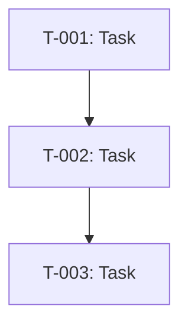

# TRACKER DOCUMENT

> **Purpose:** Global task registry — all implementation tasks derived from strategy documents.
> **Input:** Design.md + Scope.md
> **Updated:** Continuously as work progresses
> **Owner:** AI-generated, human-maintained

**Note:** Generate this document using `prompts/4-tracker.prompt.md`. Do not fill manually.

---

## Project Metadata

| Field | Value |
|-------|-------|
| **Project Name** | [From Scope.md] |
| **Last Updated** | [YYYY-MM-DD] |
| **Total Tasks** | [N] |
| **Completed** | [N] ([X]%) |
| **In Progress** | [N] |
| **Not Started** | [N] |
| **Blocked** | [N] |

---

## Status Legend

| Status | Symbol | Description |
|--------|--------|-------------|
| Not Started | ⚪ | Task is ready to begin |
| In Progress | 🟡 | Actively being worked on |
| Complete | ✅ | Finished with evidence |
| Blocked | 🚫 | Cannot proceed — blocker documented |

---

## Progress by Phase

| Phase | Total | ⚪ | 🟡 | ✅ | 🚫 |
|-------|-------|---|---|---|---|
| Phase 1: Foundation | [N] | [N] | [N] | [N] | [N] |
| Phase 2: Core Features | [N] | [N] | [N] | [N] | [N] |
| Phase 3: Enhancement | [N] | [N] | [N] | [N] | [N] |
| Phase 4: Deploy | [N] | [N] | [N] | [N] | [N] |

---

## Task Format

> **Granularity:** Each task is a **vertical slice** — crosses all necessary layers (API, service, data) and includes its own tests. One task = one session = one PR.
>
> **Anti-patterns to avoid:**
> - Horizontal decomposition: "User model" + "User service" + "User endpoint" as separate tasks — wrong. Should be "User registration" (1 task, all layers + tests).
> - Tests as a separate task: "Write tests for X" must be merged into the X task itself.

### T-XXX: [Task Title]

**Story:** As a [role], I want to [action], so that [benefit] *(only for feature tasks from Scope §4 — omit for technical/infrastructure tasks)*
**Status:** ⚪ Not Started | **Priority:** Critical / High / Medium / Low
**Estimated Effort:** [e.g., 0.5 day, 2 days] | **Actual Effort:** [filled when complete]
**Dependencies:** [T-YYY, T-ZZZ] or None
**Blockers:** [Description if blocked, or "None"]
**References:**
- Design.md §X.Y — [Specific constraint or decision]
- Scope.md §4 F-XXX — [Feature/capability]

**Acceptance Criteria:**
> Tests should validate these criteria directly — if a criterion can't be tested, rewrite it.
> Cover: happy path + error/validation path + edge cases.
- [ ] [Specific, testable criterion with measurable outcome]
- [ ] [Criterion 2]
- [ ] [Criterion 3]

**Evidence of Completion:** *(filled when complete)*
- [ ] PR: [URL] | Commit: [hash] | Tests: [result]

**Notes:** [Context, decisions, or lessons learned]

---

## Phase 1: Foundation

> **Goal:** [From Scope.md §3 Phase 1 Goal]
> **Features:** [F-XXX IDs from Scope.md §3]

### T-001: [Task Title]

[Use Task Format above]

> Repeat for all Phase 1 tasks.

---

## Phase 2: Core Features

> **Goal:** [From Scope.md §3 Phase 2 Goal]
> **Features:** [F-XXX IDs]

> Repeat for all Phase 2 tasks.

---

## Phase 3: Enhancement

> **Goal:** [From Scope.md §3 Phase 3 Goal]
> **Features:** [F-XXX IDs]

> Repeat for all Phase 3 tasks.

---

## Phase 4: Deploy

> **Goal:** [From Scope.md §3 Phase 4 Goal]

> Repeat for all Phase 4 tasks.

---

## Dependencies Graph

> Replace with actual task dependencies.

---

## Velocity Tracking

| Week | Tasks Completed | Total Effort (days) | Notes |
|------|----------------|---------------------|-------|
| Week 1 | [IDs] | [days] | [Notes] |

---

## CHANGE LOG

| Date | Changes | Updated By |
|------|---------|------------|
| [YYYY-MM-DD] | Initial tracker generated | AI |

---

## NEXT STEPS

1. **Work sessions** → Use `prompts/5-session.prompt.md` to select tasks from tracker
2. **Update tracker** → After each session, update task statuses and evidence
3. **Generate Handoff** → Use `templates/5-handoff.template.md` for knowledge transfer

---

## VALIDATION CHECKLIST

- [ ] All features from Scope.md §4 have corresponding tasks
- [ ] Tasks grouped by Scope.md §3 Roadmap phases
- [ ] Each task has: status, priority, effort estimate, dependencies, acceptance criteria
- [ ] Each task is a vertical slice (not a horizontal layer)
- [ ] Tests are included in each task (no standalone "write tests for X" tasks)
- [ ] Each task fits in a single session (1-6h) — if larger, break it down
- [ ] Acceptance criteria are specific and testable (not vague)
- [ ] Dependencies are logical (no circular dependencies)
- [ ] References link to specific Design.md and Scope.md sections
- [ ] Progress by Phase table populated
- [ ] Dependencies graph reflects actual task ordering
